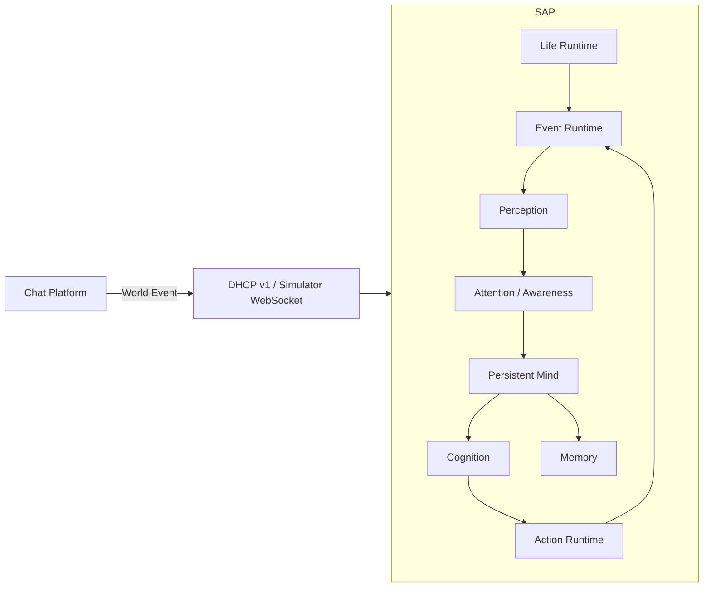
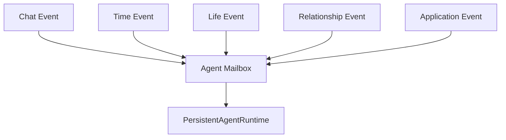
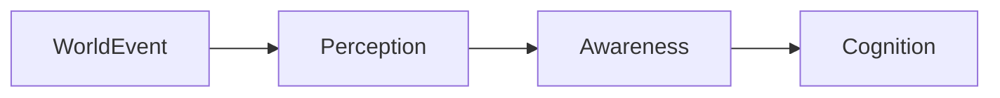
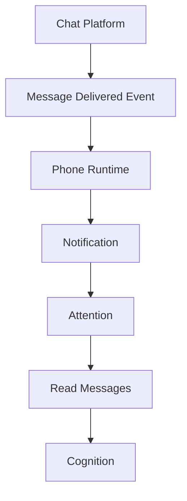
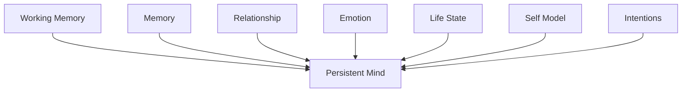
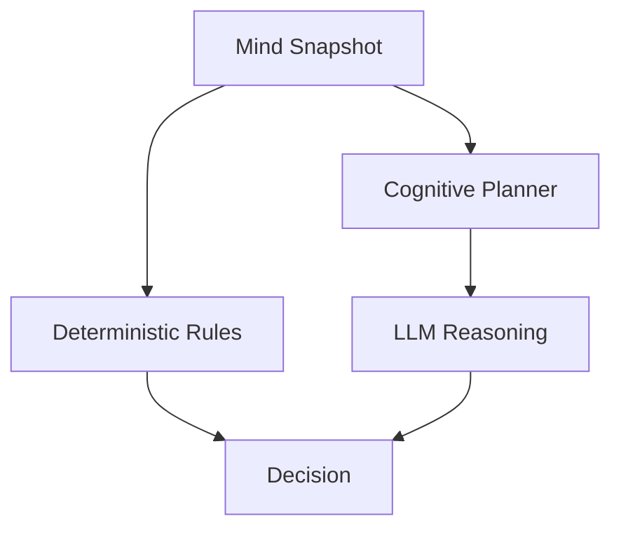
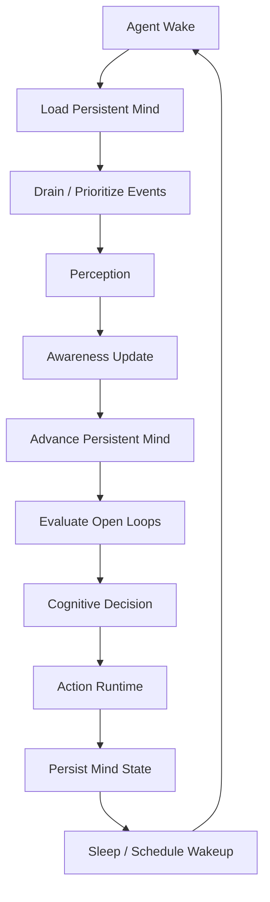
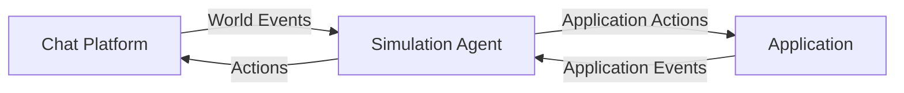
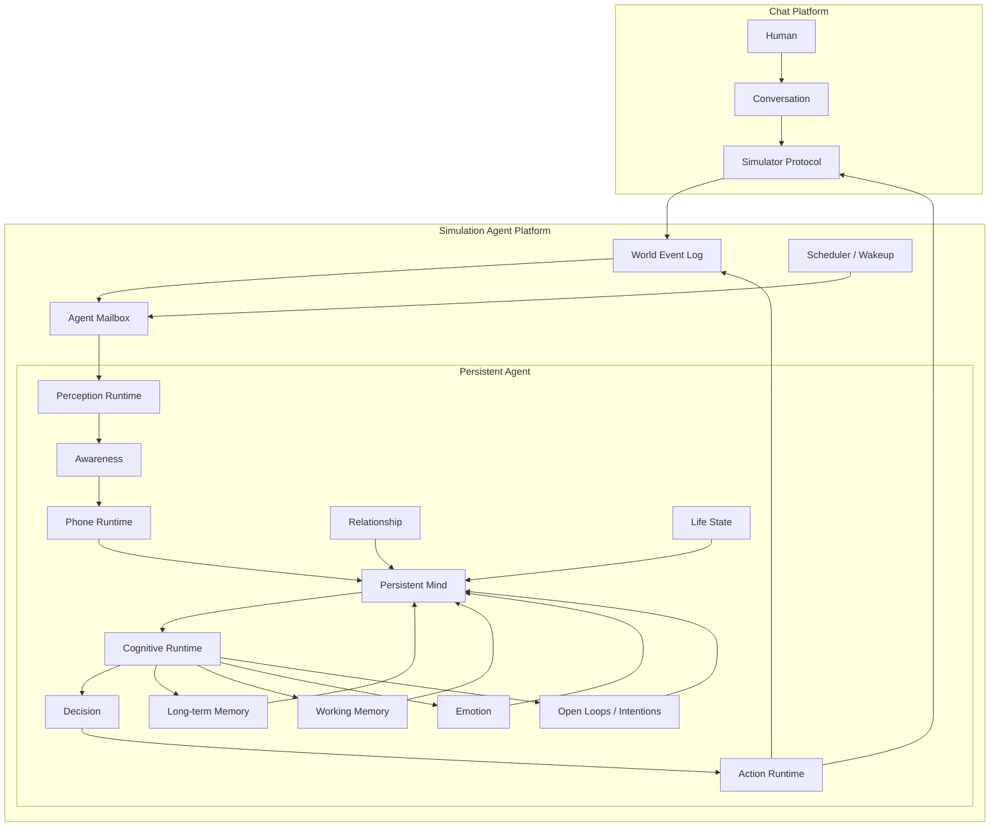

# Simulation Agent Platform V11
## Persistent World-Driven Agent Runtime 重构方案

> **目标：在完全保持 `simulation-agent-platform` 与 `chat-platform` 生态互联模式的前提下，重构仿真 Agent 内部运行时，使 Agent 从“收到消息后处理消息”的 ChatBot 执行模型，升级为“持续存在于世界中的独立数字人”执行模型。**
>
> 本方案基于当前上传的 `simulation-agent-platform` 源码进行设计。核心原则是：**不改变 Chat Platform ↔ Simulation Agent Platform 的生态边界、不改变 Agent 作为 Chat Platform participant/user 的身份、不改变 WebSocket/HTTP 互联契约；只重构仓 2 内部的 Agent Runtime、认知链、事件处理、注意力、工作记忆、行动和自主行为。**

---

# 1. 重构目标与非目标

## 1.1 总体目标

当前平台已经具备 `WorldEvent / Perception / Attention / WorkingMemory / Memory / Relationship / Emotion / Life / Intention / RealityLedger / PersonActor` 等重要基础设施。

本次重构不重新发明这些能力，而是调整它们的**控制关系**：



目标不是让 Agent 每次回复更长，而是让 Agent 具备：

1. 连续存在性；
2. 世界事件感知；
3. 注意力选择；
4. 自主决定是否查看消息；
5. 自主决定什么时候认知；
6. 自主决定是否回复；
7. 自主决定什么时候回复；
8. 连续对话理解；
9. 开放意图与未完成事务；
10. 主动行为；
11. 时间与生活状态；
12. 关系与情绪对行为的长期影响。

## 1.2 明确不改变的内容

### 1.2.1 Chat Platform 与 Agent Platform 的边界

保持：

```text
chat-platform
    │
    │ Agent 作为 Participant/User
    │
    │ World Event / Simulator Protocol
    ▼
simulation-agent-platform
```

Chat Platform 不获得：

- Agent Memory；
- Agent Emotion；
- Agent Relationship Graph；
- Agent Life State；
- Agent Cognition；
- Agent Internal State。

### 1.2.2 对外生态互联

保持现有：

- Simulator WebSocket；
- DHCP v1；
- `ChatWorldPort`；
- `ApplicationRuntimePort`；
- `SimulatorAccessPort`；
- HTTP/HMAC 服务间调用；
- Agent 作为 Chat Platform participant；
- Application / Game / Invitation 等生态能力。

本次重构禁止通过修改 Chat Platform 数据模型来解决 Agent 内部问题。

### 1.2.3 Agent 的外部身份

对 Chat Platform 而言：

```text
Human == Participant
Agent == Participant
```

Agent 内部行为不泄漏到 Chat Platform。

---

# 2. 当前架构诊断

## 2.1 当前已有正确基础

当前源码已经存在以下关键抽象：

```text
WorldEvent
PerceptionRuntime
AttentionService
PhoneState
WorkingMemory
CognitiveSession
BrainAgent
MessagePipeline
PendingMessageState
Relationship
Emotion
Life / Scheduler
RealityLedger
PersonActor
ChatSimulatorConnector
```

因此本次不是从零开发。

## 2.2 当前主要架构问题

### 2.2.1 “世界事件”与“消息处理”仍然耦合

当前主链仍然存在：

```text
Chat Message
    ↓
AgentRuntime.submit
    ↓
PersonActor
    ↓
onChatMessageDelivered
    ↓
读取 Message Content
    ↓
Perception
    ↓
Brain
    ↓
Reply
```

这会让：

```text
CHAT_MESSAGE_DELIVERED
```

在运行时退化为：

```text
PROCESS_USER_MESSAGE
```

### 2.2.2 消息内容被过早读取

正确语义应该是：

```text
Message Delivered
    ↓
Notification
    ↓
Attention
    ↓
Agent decides whether to inspect
    ↓
ReadMessagesCapability
    ↓
Message Content
```

而不是：

```text
Message Delivered
    ↓
直接读取内容
    ↓
Perception
```

### 2.2.3 连续消息没有形成真正 Cognitive Turn

当前批处理只能解决单个请求中的多条消息。

不能解决：

```text
request 1: 今天好累
request 2: 老师讲得好快
request 3: 我都没听懂
```

应该增加：

```text
Event Stream
    ↓
Conversation Turn Aggregator
    ↓
等待消息稳定
    ↓
一次 Cognitive Turn
```

### 2.2.4 CognitiveSession 仍偏向“最后一条消息状态”

当前：

```text
currentFocus
currentThought
currentIntention
```

容易在每条消息到来时覆盖。

需要升级成：

```text
MindState
    ├── Focus
    ├── Working Threads
    ├── Open Loops
    ├── Current Intentions
    ├── Attention State
    ├── Emotional State
    ├── Social State
    └── Pending Actions
```

### 2.2.5 Brain 仍以“处理用户消息”为中心

需要从：

```text
processUserMessage(...)
```

升级为：

```text
advanceMind(...)
```

用户消息只是触发 Mind 更新的一个输入。

---

# 3. V11 核心架构

## 3.1 核心原则

### 原则 P1：Message is an Event

聊天消息永远是：

```text
WorldEvent
```

而不是：

```text
AgentCommand
```

### 原则 P2：Event ≠ Perception

世界发生：

```text
user sent message
```

不代表 Agent 已经看见。

### 原则 P3：Perception ≠ Attention

Agent 感知到：

```text
notification exists
```

不代表 Agent 一定把注意力放过去。

### 原则 P4：Attention ≠ Cognition

Agent 注意到：

```text
someone contacted me
```

不代表马上思考。

### 原则 P5：Cognition ≠ Response

Agent 思考后可能：

```text
REPLY
WAIT
IGNORE
DEFER
ACT
READ_MORE
CHANGE_TOPIC
```

### 原则 P6：Response is an Action

回复消息属于：

```text
ActionRuntime
```

不是 Cognitive Runtime 的最终返回值。

---

# 4. Persistent Agent Runtime

## 4.1 新的核心抽象

建议新增：

```text
PersistentAgentRuntime
```

负责维护一个逻辑上持续存在的 Agent。

```java
interface PersistentAgentRuntime {

    void accept(WorldEvent event);

    void wake(WakeupReason reason);

    AgentSnapshot snapshot();

    void recover(AgentSnapshot snapshot);
}
```

## 4.2 Runtime 不绑定 HTTP Request 生命周期

禁止：

```text
HTTP Request
    ↓
new Runtime
    ↓
process
    ↓
destroy
```

使用：

```text
AgentIdentity
    ↓
Persistent Logical Runtime
    ↓
Event Queue
    ↓
State
```

物理实现可以采用：

- Actor；
- mailbox；
- event loop；
- persistent state；
- scheduler wakeup。

不要求一个 Agent 永远占用线程。

---

# 5. Agent Mailbox

## 5.1 Mailbox 是 Runtime 的入口



## 5.2 Mailbox 事件结构

```java
record WorldEvent(
    String eventId,
    String agentId,
    Instant occurredAt,
    EventType type,
    EventSource source,
    EventPriority priority,
    Map<String, Object> references
) {}
```

聊天消息：

```json
{
  "type": "CHAT_MESSAGE_DELIVERED",
  "references": {
    "conversationId": "c1",
    "messageIds": ["m1"]
  }
}
```

禁止在事件中直接携带完整聊天正文。

---

# 6. Event → Perception → Awareness

## 6.1 三阶段模型



## 6.2 Perception

Perception 只回答：

> 世界发生了什么？

例如：

```text
CHAT_MESSAGE_DELIVERED
→ phone notification exists
```

而不是：

```text
用户说：“今天好累”
```

## 6.3 Awareness

Awareness 决定：

```text
NOT_AWARE
SUBCONSCIOUS
AWARE
FOCUSED
```

建议保留当前已有枚举，并让它成为真正的状态机。

---

# 7. Phone Runtime

## 7.1 手机是 Agent 与 Chat World 的媒介

这是实现“消息只是世界事件”的关键。



## 7.2 消息查看必须是 Action

定义：

```java
ReadMessagesAction
```

而不是 AgentRuntime 内部直接读取消息。

例如：

```java
interface PhoneCapability {

    NotificationSnapshot notifications();

    MessageBatch readMessages(
        String conversationId,
        ReadPolicy policy
    );
}
```

只有执行：

```text
READ_MESSAGES
```

之后，消息正文才进入 Agent cognition。

---

# 8. Conversation Turn Aggregator

## 8.1 解决连续消息问题

增加：

```text
ConversationTurnAggregator
```

负责：

```text
m1
m2
m3
```

形成：

```text
CognitiveTurn
```

## 8.2 Turn 状态

```text
OPEN
QUIET_WAIT
SEALED
PROCESSING
COMPLETED
```

## 8.3 推荐算法

```text
收到 m1
 ↓
创建 Turn T1
 ↓
等待短暂 quiet window
 ↓
收到 m2
 ↓
扩展 T1
 ↓
收到 m3
 ↓
扩展 T1
 ↓
quiet window 到期
 ↓
seal T1
 ↓
Agent Cognition
```

注意：

这不是简单 debounce。

Turn 是否结束应该综合：

- 时间间隔；
- 消息数量；
- 用户 typing 状态；
- 消息语义是否完整；
- Agent 当前状态；
- 是否正在执行其它动作。

---

# 9. Persistent Mind

## 9.1 Mind 是 V11 的核心



## 9.2 MindState

建议：

```java
class MindState {

    AttentionState attention;

    FocusState focus;

    List<WorkingThread> workingThreads;

    List<OpenLoop> openLoops;

    List<Intention> intentions;

    EmotionalState emotion;

    SocialContext social;

    LifeContext life;

    Instant lastCognitiveAt;
}
```

---

# 10. Open Loop / Intention

## 10.1 为什么需要 Open Loop

真人经常：

```text
“等会儿回他”
“晚上告诉他”
“刚才忘了问”
“下班后再看”
```

这些不是 Memory，而是：

```text
Open Loop
```

## 10.2 模型

```java
class OpenLoop {

    String id;

    OpenLoopType type;

    String relatedAgent;

    String conversationId;

    String description;

    Trigger trigger;

    LoopPriority priority;

    LoopStatus status;
}
```

状态：

```text
OPEN
DEFERRED
ACTIVATED
COMPLETED
EXPIRED
ABANDONED
```

---

# 11. Cognitive Decision

## 11.1 Brain 的职责重新定义

原：

```text
processUserMessage()
```

新：

```text
CognitiveDecision decide(MindSnapshot snapshot)
```

## 11.2 Decision 类型

```text
DO_NOTHING
WAIT
OBSERVE
READ_MESSAGES
THINK
REPLY
INITIATE_CONVERSATION
PERFORM_ACTION
DEFER
CREATE_INTENTION
```

## 11.3 LLM 的位置

LLM 是 Cognition 的工具，而不是 Agent Runtime 本身。



---

# 12. 回复不再是默认行为

## 12.1 必须允许“不回复”

Agent 每次 Cognition 后必须产生：

```text
decision
```

而不是：

```text
response
```

例如：

```json
{
  "decision": "DEFER",
  "reason": "currently_busy",
  "nextWakeupAt": "2026-09-18T18:30:00Z"
}
```

## 12.2 回复动作

只有：

```text
Decision = REPLY
```

才进入：

```text
ResponseComposer
→ ActionRuntime
→ ChatWorldPort
```

---

# 13. ResponseComposer

## 13.1 Composer 不负责决定是否回复

职责：

```text
Decision
+
ConversationContext
+
Relationship
+
Emotion
+
Style
→
MessageAction
```

## 13.2 避免重复表达

增加：

```text
ResponseContinuityGuard
```

检查：

- 最近回复；
- 当前 topic；
- 已表达观点；
- 已经问过的问题；
- 重复句式；
- 重复情绪标签。

---

# 14. Memory 重构

## 14.1 五层 Memory

```text
L0 Awareness
L1 Working Memory
L2 Recent Conversation
L3 Episodic Memory
L4 Semantic / Self Memory
```

### L0 Awareness

当前是否知道某事。

### L1 Working Memory

当前正在思考什么。

### L2 Recent Conversation

最近对话。

### L3 Episodic

“昨天发生了什么”。

### L4 Semantic / Self

长期事实、人格、人生经历。

## 14.2 Memory 不应该替代 Working Memory

禁止：

```text
每次 cognition
→ vector search
→ 找最近聊天
→ 当成当前意识
```

应该：

```text
Working Memory
      ↓
Recent Conversation
      ↓
必要时 Memory Retrieval
```

---

# 15. Emotion 重构

Emotion 不应该是：

```text
message
 ↓
情绪分析
 ↓
emotion
```

而应该：

```text
World Event
+
Life State
+
Relationship
+
Memory
+
Current Mind
↓
Emotion Transition
```

情绪应该具有：

```text
intensity
valence
arousal
decay
cause
duration
```

并且自然衰减。

---

# 16. Relationship 重构

Relationship 不应该只用于 Prompt。

它必须影响：

```text
attention priority
response probability
response latency
self-disclosure
initiative probability
memory salience
emotion impact
```

例如：

```text
陌生人：
notification priority = low

亲密关系：
notification priority = high
```

同一条：

```text
“在吗？”
```

不应该对所有人产生相同的 Agent 行为。

---

# 17. Life Runtime

## 17.1 Life 是行为上下文

Agent 的当前：

```text
睡眠
工作
学习
休息
娱乐
外出
忙碌
```

必须影响：

```text
attention
response latency
availability
initiative
emotion
```

## 17.2 Scheduler 不直接让 Agent 聊天

Scheduler 产生：

```text
LIFE_EVENT
WAKEUP
INTENTION_TRIGGER
```

再进入 Agent Mailbox。

---

# 18. Agent Tick

不建议高频持续调用 LLM。

采用：

```text
Event-driven
+
Wakeup-driven
+
Low-frequency Life Tick
```

## 18.1 唤醒来源

```text
WorldEvent
Timer
OpenLoop
LifeSchedule
RelationshipTrigger
ApplicationEvent
```

## 18.2 唤醒后

```text
Wake
 ↓
Load Mind
 ↓
Process pending events
 ↓
Update awareness
 ↓
Evaluate intentions
 ↓
Decide
 ↓
Schedule next wakeup
```

---

# 19. Agent 主循环



---

# 20. Chat Message 完整生命周期

## 20.1 用户发送三条消息

```text
m1 今天好累
m2 老师讲得好快
m3 我都没听懂
```

## 20.2 Chat Platform

只产生：

```text
CHAT_MESSAGE_DELIVERED
```

## 20.3 Agent

```text
Event
 ↓
Phone notification
 ↓
Attention
```

Agent 可能正在工作：

```text
→ 暂时不查看
```

## 20.4 Agent 后续醒来

```text
OpenLoop / Life transition
 ↓
Inspect Phone
 ↓
ReadMessages
 ↓
得到 m1,m2,m3
```

## 20.5 Cognition

一次理解：

```text
Topic = today's class
Emotion = tired/frustrated
User intent = complaining
Conversation turn = one coherent unit
```

## 20.6 Action

最终可能：

```text
REPLY
```

也可能：

```text
WAIT
```

也可能：

```text
IGNORE
```

---

# 21. Chat Platform 兼容层

## 21.1 保持原有 Simulator Protocol

禁止为了 V11 修改：

```text
chat-platform
```

的 Agent 内部模型。

## 21.2 新增能力只通过现有边界表达

例如：

```text
ReadMessagesCapability
SendMessageCapability
PresenceCapability
ApplicationCapability
```

都属于：

```text
SimulatorAccessPort
```

或者已有 capability 层。

## 21.3 Chat Platform 不知道 Agent 是否“看过”

可以知道：

```text
message sent
message delivered
message read
```

但：

```text
“Agent 当前正在想什么”
```

不应该暴露。

---

# 22. Application / Game 生态保持不变

Agent 仍然可以：

```text
Chat
 ↓
Application Invitation
 ↓
Application
 ↓
Game Session
```

Agent Platform 内部看到：

```text
APPLICATION_EVENT
```

而不是特殊地把 Application 当成聊天。

这样：



---

# 23. 类结构建议

## 23.1 Runtime

```text
runtime/
├── PersistentAgentRuntime
├── AgentMailbox
├── AgentScheduler
├── AgentWakeup
├── AgentSnapshot
└── AgentRecovery
```

## 23.2 World

```text
world/
├── WorldEvent
├── WorldEventType
├── EventSource
├── EventPriority
└── EventEnvelope
```

## 23.3 Perception

```text
perception/
├── PerceptionRuntime
├── AwarenessState
├── AwarenessTransition
├── PerceptionContext
└── PerceptionResult
```

## 23.4 Mind

```text
mind/
├── MindState
├── WorkingMemory
├── WorkingThread
├── FocusState
├── OpenLoop
├── Intention
└── MindSnapshot
```

## 23.5 Cognition

```text
cognition/
├── CognitiveRuntime
├── CognitiveDecision
├── DecisionType
├── CognitivePlanner
├── ReasoningContext
└── ResponseContinuityGuard
```

## 23.6 Action

```text
action/
├── ActionRuntime
├── Action
├── ActionResult
├── SendMessageAction
├── ReadMessagesAction
├── OpenApplicationAction
└── ScheduleWakeupAction
```

---

# 24. 现有代码迁移策略

## 24.1 第一阶段：不改外部接口

保持：

```text
ChatSimulatorConnector
DHCP v1
ChatWorldPort
ApplicationRuntimePort
SimulatorAccessPort
```

只增加内部：

```text
AgentMailbox
PersistentAgentRuntime
```

## 24.2 第二阶段：改消息进入方式

旧：

```text
onChatMessageDelivered
→ process(message)
```

新：

```text
onChatMessageDelivered
→ accept(WorldEvent)
```

## 24.3 第三阶段：禁止 Runtime 直接读取正文

把：

```text
chatWorld.messages(...)
```

从 Agent 主流程中移除。

改成：

```text
ReadMessagesAction
```

## 24.4 第四阶段：引入 Turn Aggregator

所有：

```text
CHAT_MESSAGE_DELIVERED
```

先进入：

```text
ConversationTurnAggregator
```

## 24.5 第五阶段：Brain 改为 Mind Decision

旧：

```text
processUserMessage()
```

新：

```text
advanceMind()
decide()
```

## 24.6 第六阶段：Action 化

回复：

```text
return String
```

改成：

```text
ActionPlan
```

---

# 25. 兼容迁移原则

## 25.1 禁止 Big Bang Rewrite

不要一次删除：

```text
BrainAgent
MessagePipeline
WorkingMemory
CognitiveSession
```

采用：

```text
Adapter
→ Shadow Mode
→ Dual Run
→ Cutover
→ Cleanup
```

## 25.2 Shadow Mode

旧链：

```text
Message → Old Brain
```

新链：

```text
Event → New Mind
```

新链先：

```text
decision only
```

不发送真实消息。

比较：

```text
decision
latency
context
memory
action
```

---

# 26. 数据一致性

## 26.1 Agent State

建议：

```text
AgentState
AgentMindState
AgentEmotionState
AgentRelationshipState
AgentLifeState
OpenLoop
PendingAction
```

保持 Agent ID 维度隔离。

## 26.2 Event Idempotency

所有 WorldEvent：

```text
eventId
```

必须唯一。

Runtime 保存：

```text
processedEventIds
```

或者使用持久化 inbox。

## 26.3 顺序

同一个 Agent：

```text
Mailbox FIFO
```

但是不同 Agent：

```text
parallel
```

---

# 27. 并发模型

## 27.1 Agent 内部单线程逻辑

推荐：

```text
one Agent = one logical actor
```

同一个 Agent 的状态更新：

```text
serialized
```

避免：

```text
m1 → cognition
m2 → cognition
```

同时修改：

```text
WorkingMemory
Emotion
Relationship
MindState
```

## 27.2 LLM 异步

LLM 调用可以异步，但必须通过：

```text
CognitiveJob
```

回到 Agent mailbox。

禁止异步线程直接修改 Agent state。

---

# 28. 可观测性

每个 Cognitive Cycle 必须生成：

```text
cycleId
agentId
wakeReason
eventsConsumed
awarenessChanges
memoryReads
decisions
actions
llmCalls
duration
```

示例：

```json
{
  "cycleId": "c-123",
  "agentId": "a-1",
  "wakeReason": "CHAT_NOTIFICATION",
  "eventsConsumed": 4,
  "decision": "READ_MESSAGES",
  "llmCalls": 0
}
```

下一次：

```json
{
  "cycleId": "c-124",
  "wakeReason": "OPEN_LOOP",
  "eventsConsumed": 0,
  "decision": "REPLY",
  "llmCalls": 1
}
```

---

# 29. 测试体系

## 29.1 连续消息测试

输入：

```text
m1
m2
m3
```

要求：

```text
1 Cognitive Turn
```

而不是：

```text
3 Cognitive Turns
```

## 29.2 忽略测试

Agent：

```text
busy
```

收到消息：

```text
decision = IGNORE
```

不能自动回复。

## 29.3 延迟回复测试

Agent：

```text
busy until 18:00
```

收到消息：

```text
DEFER
```

18:00：

```text
WAKE
→ READ
→ COGNITION
→ REPLY
```

## 29.4 连续话题测试

```text
m1 今天好累
m2 老师讲得好快
m3 我都没听懂
```

要求：

```text
topic = today_class
```

而不是：

```text
topic = each message independently
```

## 29.5 重复回复测试

检查：

```text
same semantic response
same question
same emotional phrase
```

连续重复率必须下降。

---

# 30. 验收指标

## 30.1 Conversation Continuity

目标：

```text
连续消息 → 一个 coherent turn
```

## 30.2 Response Independence

Agent 可以：

```text
不回复
延迟回复
主动回复
```

## 30.3 World Awareness

Agent 可以：

```text
事件发生
但没有感知
```

## 30.4 Memory Continuity

当前认知必须优先使用：

```text
WorkingMemory
```

而不是每次从长期 Memory 重建。

## 30.5 Life Continuity

Agent 在：

```text
工作
睡觉
娱乐
外出
```

时行为必须不同。

---

# 31. V11 目标架构总图



---

# 32. 最终运行语义

V11 最终必须满足：

```text
用户发消息
        ↓
世界发生事件
        ↓
Agent 不一定知道
        ↓
Agent 可能收到通知
        ↓
Agent 可能注意
        ↓
Agent 可能查看手机
        ↓
Agent 才获得消息内容
        ↓
Agent 决定是否现在思考
        ↓
Agent 决定做什么
        ↓
可能回复
可能等待
可能忽略
可能主动做别的事情
        ↓
Agent 世界继续运行
```

而不是：

```text
用户发消息
 ↓
Agent.processUserMessage()
 ↓
LLM
 ↓
reply
```

---

# 33. 实施顺序

## Phase 1：Runtime 基础

1. AgentMailbox
2. PersistentAgentRuntime
3. EventInbox
4. AgentSnapshot
5. Recovery
6. Idempotency

## Phase 2：消息世界化

1. 移除 Agent 主流程直接读取 Message Content；
2. Message Delivered 只产生 Event；
3. Phone Notification；
4. ReadMessagesAction；
5. Awareness。

## Phase 3：连续意识

1. MindState；
2. WorkingThread；
3. OpenLoop；
4. Intention；
5. Turn Aggregator。

## Phase 4：认知重构

1. `processUserMessage` 降级为 compatibility adapter；
2. `advanceMind`；
3. `CognitiveDecision`；
4. `ActionPlan`；
5. LLM 作为 reasoning tool。

## Phase 5：主动行为

1. Wakeup；
2. Life Trigger；
3. OpenLoop Trigger；
4. Relationship Trigger；
5. Proactive Action。

## Phase 6：旧链清理

确认：

```text
Old Message Pipeline
```

已经没有核心职责后，再删除重复实现。

> **实况（2026-09-18）：这个条件今天尚未满足，所以本期没有做那次删除。**
> 四个开关全部处于 `enabled=false / shadow=true`（Cutover 还没发生），老链仍然是
> **唯一真的在回话的那条路** —— `AgentRuntime.advanceMind` 还在读 `MessagePipeline`
> 的注意力与 Brain 决策，`V11TurnSealJob` 还在走 `AgentRuntime.process()` 这个委托适配器，
> `BehaviorTickJob` 还在 shadow 期让她开口。此时删除不是清理，是停机。
> 逐项的**解锁条件**、切流 runbook 与回滚方式见 `V11-implementation-plan.md` 的 §Phase 6。

---

# 34. 最终原则

整个 Simulation Agent Platform 后续所有代码设计必须遵守：

### P1

> **Chat Platform 是 Agent 所处的世界之一，而不是 Agent 的控制器。**

### P2

> **消息是世界事件，不是 Agent 指令。**

### P3

> **事件发生不等于 Agent 感知。**

### P4

> **感知不等于注意。**

### P5

> **注意不等于阅读。**

### P6

> **阅读不等于回复。**

### P7

> **回复只是 Agent 的一种行动。**

### P8

> **Agent 的生命不因聊天请求开始，也不因回复完成而结束。**

### P9

> **Agent Runtime 的核心对象是 Persistent Mind，而不是 User Message。**

### P10

> **Chat Platform ↔ Simulation Agent Platform 的生态边界保持稳定；真人感全部在 Agent Platform 内部实现。**

---

# 35. 目标状态

最终形成：

```text
                     ┌──────────────────────┐
                     │        World         │
                     │                      │
                     │ Chat / Apps / Time   │
                     │ Life / Relationships│
                     └──────────┬───────────┘
                                │
                           World Events
                                │
                                ▼
                     ┌──────────────────────┐
                     │ Persistent Agent     │
                     │ Runtime              │
                     │                      │
                     │ Perception           │
                     │ Awareness            │
                     │ Working Memory       │
                     │ Emotion              │
                     │ Relationship         │
                     │ Life                 │
                     │ Intention            │
                     │ Long-term Memory     │
                     │ Cognition            │
                     └──────────┬───────────┘
                                │
                         Cognitive Decision
                                │
                  ┌─────────────┼─────────────┐
                  │             │             │
                WAIT           READ          ACT
                  │             │             │
                  │             ▼             │
                  │         Cognition         │
                  │             │             │
                  └─────────────┼─────────────┘
                                ▼
                           Action Runtime
                                │
                     ┌──────────┼──────────┐
                     ▼          ▼          ▼
                   Speak      Move       Wait
                     │
                     ▼
                 World Event
```

**这就是本次重构的最终目标：不改变 Luxera 两个平台之间已经建立的生态互联方式，只把 Simulation Agent Platform 内部从“消息驱动的 Agent”彻底重构为“世界驱动、持续存在、拥有自身意识与行为节奏的 Agent”。**
