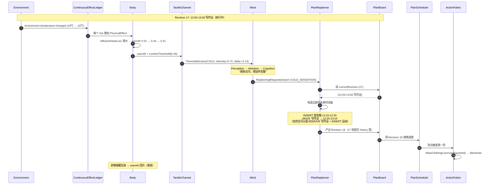
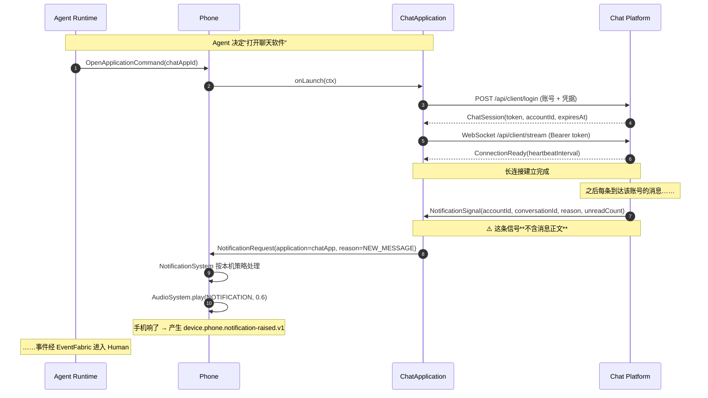
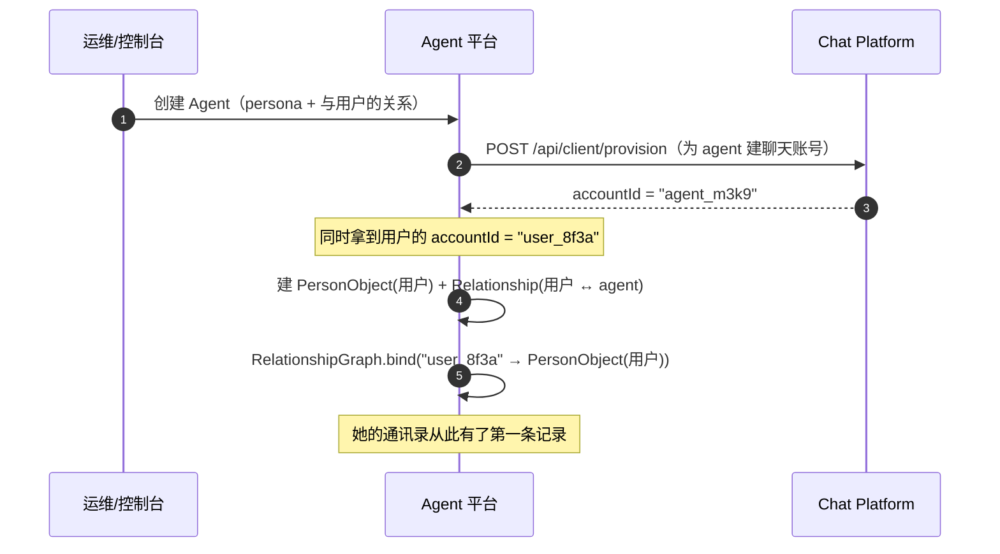

# Simulation Agent Platform V2.2
# 面向对象、多态、可扩展世界模型详细设计方案

> 文档版本：V2.2
> 上一版：V2.1（面向对象、多态、可扩展世界模型详细设计方案）
> 设计定位：**World-driven Human Simulation / 面向对象仿真 Agent 平台**
> 技术基线：Java 17 / Spring Boot 2.7 / PostgreSQL 15（与现有两仓一致；V2.1 写的 "Java 21+" 是笔误，本项目全部代码在 JDK 17 上编译）
> 核心设计思想：**对象化现实世界、接口化边界、多态化行为、事件化因果、可版本化计划**

---

## 0. 本版相对 V2.1 的变更（逐条）

V2.1 的骨架是对的（Human/World 二分、Boundary 单向门、多态取代枚举），但**细节缺失严重**：
它定义了 `WorldEventType` 这个字段，却没有给出**到底有哪些事件类型、各自什么语义**；
它把"打断"写成了一句 "进入 Replanning"，却没有说清楚重排之后计划表**长什么样**。
本版把这两块补全，并按产品要求修正了通知链路与世界分类。

| # | V2.1 的写法 | V2.2 的写法 | 为什么改 |
|---|---|---|---|
| 1 | 只定义了 `EventTypeId` 字段，没列事件目录 | **§5.4 给出完整事件目录**：三类共 46 个核心事件类型，每个写明命名空间/名称/payload 字段/语义/生产者/消费者/示例 | 用户指出："不了解的人看完完全不知道都有哪些 event，然后分别有什么用" |
| 2 | "打断 → 进入 Replanning"（一句话） | **§3.5.6 完整重排语义**：重排产出**新 Revision**，可删除/插入/移动/改时长；被中断的计划**不保证回来** | 用户指出："不是简单把当前在做的计划 event 更新剩余时间然后立马执行一个计划 event，他是真的改变了计划表" |
| 3 | 通知逻辑散落在 §4.14.2 / §4.15 | **§6 独立成章**：免打扰在聊天平台侧判定、通知信号**不含正文**、每条消息**各自通知**（不聚合） | 用户给出了完整的端到端描述，V2.1 只写了结论没写链路 |
| 4 | World 只有 "Digital Device World / Digital World" 两个名字 | **§4 明确二分语义**：device world 的**方法可被 agent 直接调用**（skill/tool/MCP）；digital world **不可修改**，只能感知 | 用户指出："一类是 digital device world，这个是模拟设备世界，这个 world 里面的类对象方法是可以被 agent 直接触发执行的……还有一个 world 是 digital world，这个是 agent 所处环境，是无法被其修改触发的" |
| 5 | §4.2.4 只给了 `Jacket` 一个例子 | **§3.2.5 衣物对象化完整设计**：保暖值/防水/透气/穿着部位 + 穿衣如何持续影响保暖值 | 用户指出："衣服可能也要抽象成对象，多穿衣服也是一个 event，能够持续影响 body 的保暖值" |
| 6 | §4.3 五感只有接口名 | **§3.2.2 五感逐条设计**：每个通道的物理量、量程、衰减、与现实机器人的对接点 | 用户指出："body 应该仿真人的情况，听觉、视觉、嗅觉、味觉、触觉……将来甚至可以将 human 概念接入到我们的真实机器人" |
| 7 | 未提"类消息队列" | **§5.1 明确定义**：Human 与 World 零交互，中间是类消息队列（EventFabric），内部**三种数据结构**（不是三个队列） | 用户指出："human 和 world 完全没有交互，因此不应该出现 phoneOS 和 cognition 交互的情况，而是 human 和 world 之间有一个类似消息队列的设定" |
| 8 | Plan 是 Queue 的反面，但没说用什么 | **§3.5.3 给出数据结构**：`PlanBoard = 版本化时间轴 + 按 start_at 索引 + 约束图` | 用户指出："像计划表这种可能用队列还不好实现，你得想想什么数据结构实现能很好满足要求" |
| 9 | 没有聊天账号 ↔ 人物对象的绑定 | **§3.4.6 / §6.5 定义 `ConversationAccountBinding`** | 用户指出："至于聊天账号 Id 对应的是谁，这是 agent 自己聊天的时候需要构建的关系网" |
| 10 | §4.14 只有 `ChatPlatformGateway` 一个接口 | **§6.3 给出完整客户端接口清单**，与真人使用微信的逻辑一一对应；并说明**聊天平台前端与 agent 用同一套后端接口**及其授权解法 | 用户指出："甚至于你可以让聊天平台前端和 agent 调用的是同一套聊天平台后端接口（但这里要解决授权问题）" |
| 11 | 没有说 agent 的**身份、归属与生命周期**存在哪 —— 而 §8.4 的包结构里也没有任何一个包接得住旧 `persona` / `state` / `person` 包 | **§3.6 新章**：`human`（仿真身份）与 `agent_ownership`（平台归属 + 生命周期）拆两张表；`AgentLifecycle` 保留为枚举并写明判据；`Persona` 从存储降级为投影；§3.6.8 给出身份侧完整迁移表 | 这是一次包级审计发现的缺口：`server` 与 `openapi` 仍引用旧包 24 处，按原样删旧包**两个服务编译不过** —— 设计看似完整、迁移路径断在中间 |

---

## 1. 引言

### 1.1 文档目的

本文档定义 Simulation Agent Platform V2.2 的完整详细设计，使开发人员能够**不追问、不猜测**地完成领域对象、接口、运行时、事件系统、计划系统、设备系统、聊天平台接入、数据库以及测试代码的实现。

V2.1 已经论证过为什么不能用枚举建模开放世界（`PlanType` / `EventType` / `ActivityType` / `ActionType` / `DeviceType` / `ApplicationType` 全部禁止）。本版**不再重复论证**，只在必要处引用 V2.1 的原则编号（P1–P6）。本版的重点是**把 V2.1 缺的细节补齐**。

### 1.2 两个产品目标

**目标 A：Agent 使用聊天软件的方式，与真人使用聊天软件的方式一致。**

这不是"接口长得像"，而是**调用顺序与授权路径完全一致**：

```text
真人：  打开微信 → 看到会话列表（谁 + 未读红点）→ 点开某人 → 看到最近 N 条 → 上翻拉更多 → 打字 → 发送
Agent： 打开聊天软件 → 拿到会话列表（账号Id + 未读数）→ 选定账号Id → 拿到最近 N 条 → 翻页拉更多 → 生成文本 → 发送
```

两者**走同一套后端接口**。差别只在授权凭据：真人的凭据是浏览器会话，Agent 的凭据是它自己那个聊天账号的登录会话。聊天平台**不知道、也不需要知道**对面是人还是 Agent。

**目标 B：Agent 的世界用 Java 对象如实建模，而不是用字符串字段假装。**

手机的"通知音量"是一个**数值字段**，不是 `String notificationMode = "vibrate"`；
"聊天软件"是一个**实现了 `DeviceApplication` 接口的对象**，它自己负责登录、建连、收发；
第三方平台软件**自己实现 `DeviceApplication`** 来对接自己的 API，聊天平台也不例外 ——
聊天平台对 Agent 世界而言**没有任何特权**，它只是"恰好由我们自己实现的那个聊天软件"。

> 这条是 V2.2 与现有实现最根本的差别。今天的 `phone/PhoneState.notificationMode` 是一个
> `String`，今天没有任何 `DeviceApplication` 实现，今天聊天正文通过 `ChatWorldPort.messages()`
> 直读数据库。V2.2 要把这三件事分别变成：一个 `AudioVolume` 复合对象、一个 `ChatApplication`
> 类、一次必须经由 `ChatApplication.execute(ReadMessagesAction)` 的调用。

### 1.3 本设计最重要的架构原则

#### P1：Human 是领域对象集合

```text
Human
├── Body   身体：五感、生理状态、稳态、衣物
├── Life   生活：计划表、活动、目标、作息
└── Mind   心智：感知、注意、认知、情绪、记忆、关系、意图、决策
```

Human 内部通过接口协作，**不通过枚举描述人的全部行为**。

#### P2：World 是对象集合，且分成两个语义完全不同的世界

```text
World
├── DigitalDeviceWorld   ← 设备世界：方法可被 Agent 直接调用
│   ├── Phone
│   │   ├── AudioSystem        通知/铃声/闹钟/媒体 四路音量
│   │   ├── NotificationSystem 通知策略与派发
│   │   ├── VibrationSystem    震动
│   │   ├── ScreenSystem       亮屏/锁屏
│   │   └── ApplicationContainer
│   │        ├── ChatApplication       ← 我们自己实现的聊天软件
│   │        ├── CalendarApplication
│   │        └── (第三方自建应用)
│   ├── Computer / Tablet / Watch / Earphone / SmartSpeaker
│   └── Robot                   ← 未来：真实机器人也是 device
└── DigitalWorld         ← 环境世界：**不可被 Agent 修改**，只能感知
    ├── Environment       ← 气温/湿度/光照/风/降水（来自真实气象数据）
    ├── Place             ← 地理位置（决定 Environment 查询点）
    └── WeatherSource
```

**两个世界的判别标准只有一条**：

> **Agent 能不能通过一个 Action 改变它？**
> 能 → DigitalDeviceWorld；不能 → DigitalWorld。

这条标准决定了 `Environment` 归属 DigitalWorld：Agent 不能"让天气变晴"，它只能**感知**天气，
然后决定**自己**做什么（穿衣服、不出门）。同理 `Place` 也不能被直接修改 —— 搬家是一个
`MoveToPlace` Action，它改变的是 Agent 的**位置**，而不是 `Place` 这个对象本身。

#### P3：Human 与 World 之间没有任何直接调用

```text
World  ──→  WorldEvent  ──→  EventFabric  ──→  Human
Human  ──→  ActionCommand ─→  ActionFabric ──→  World
```

**禁止**：

```java
mind.phone().readMessages();          // Mind 直接拿到 Phone
phone.pushNotification(mind);         // Phone 直接推给 Mind
environment.getTemperature().ifCold(() -> body.shiver());  // 环境直接改身体
```

**必须**：

```java
// World → Human
eventFabric.publish(new TemperatureChangedEvent(...));   // 世界只陈述事实

// Human → World
actionFabric.execute(new ReadMessagesCommand(...));      // 人主动发出命令
```

这条边界是**物理隔离**，不是编码规范：`human/` 包下的任何类**不允许 import** `world/` 包下的任何类，
反之亦然。两者只允许 import `boundary/` 下的 `WorldEvent` / `ActionCommand` / `Capability` 等
**纯接口与 record**。§8.2 有一条 ArchUnit 测试把这条规则钉死。

> **为什么这条如此重要**：现有实现里 `phoneOS`（手机模拟）与 `cognition`（认知）直接互相调用，
> 结果是"消息到达"和"她意识到消息到达"变成了同一件事 —— 因为代码里它们就是同一次方法调用。
> 一旦正文已经在她手里，"她在忙 / 没注意到 / 已读不回"就都只是知道内容之后找的说法。
> 只有把两者physically隔开，"她没注意到"才可能是一个**为真**的状态。

#### P4：开放领域使用多态，固定基础设施才允许有限枚举

**允许枚举**（这些不是开放领域）：数据库锁模式、消息投递模式、日志级别、事务隔离级别、
系统内部有限状态机（如 `ActionStatus = PENDING/RUNNING/SUCCEEDED/FAILED/CANCELLED`）、
网络协议固定值。

**禁止枚举**：Plan 类型、Activity 类型、Event 类型、World Object 类型、Application 类型、
Action 类型、人可以做的事情、人的兴趣、人的生活事件、第三方平台类型。

> **V2.2 补一条澄清**：禁止的是"用**编译期 enum** 作为**领域扩展机制**"，
> 不是"禁止在文档里列出有哪些类型"。
> §5.4 给出了一份**完整的事件目录**（`CoreEventCatalog`），它是
> **可注册、可查询、可展示的运行时数据**，不是 `switch` 的分支条件。
> 新增一个事件类型 = 往 `TypeRegistry` 注册一条定义 + 提供一个 `EventHandler`，
> **不需要修改任何 `switch`、任何 `Serializer`、任何数据库映射**（§9 验收标准 B）。

#### P5：优先"能力接口"，而不是"类型判断"

```java
// 禁止
if (plan.getType() == PlanType.STUDY) { ... }
if (event.getType().equals("TEMPERATURE_CHANGED")) { ... }

// 推荐
plan.getIntent().decompose(context);
capabilityRegistry.resolve(intent.requiredCapabilities());
eventHandlerRegistry.handlersFor(event);          // 按 supports(event) 路由
```

#### P6：平台提供基础实现，但不垄断扩展点

平台自带 `StudyActivity` / `WorkActivity` / `MealActivity` / `SleepActivity` /
`ExerciseActivity` / `CommunicationActivity` —— 但它们**只是默认实现**，不是封闭集合。
第三方可以新增 `LaboratoryExperimentActivity`，**核心 Plan / Scheduler / Runtime 一行不改**。

---

## 2. 系统概述

### 2.1 最终因果闭环

整个仿真 Agent 的运行逻辑统一为下面这一张图。**它是 V2.2 的全部**：

```text
                        ┌───────────────────────────────────────────┐
                        │                  WORLD                    │
                        │                                           │
                        │  DigitalDeviceWorld      DigitalWorld      │
                        │  ┌────────────────┐    ┌───────────────┐  │
                        │  │ Phone          │    │ Environment   │  │
                        │  │  AudioSystem   │    │  temperature  │  │
                        │  │  Notification  │    │  humidity     │  │
                        │  │  Vibration     │    │  light        │  │
                        │  │  Screen        │    │  wind         │  │
                        │  │  Applications  │    │  rain         │  │
                        │  │   ChatApp      │    └───────────────┘  │
                        │  │  Computer ...  │    ┌───────────────┐  │
                        │  └────────────────┘    │ Place         │  │
                        │                        └───────────────┘  │
                        └────────────────┬──────────────────────────┘
                                         │
                                  WorldEvent
                          （只陈述"世界发生了什么"）
                                         │
                                         ▼
                        ┌───────────────────────────────────────────┐
                        │            EVENT FABRIC                   │
                        │            （类消息队列）                  │
                        │                                           │
                        │  ┌─────────────────────────────────────┐  │
                        │  │ A. ContinuousEffectLedger           │  │
                        │  │    持续影响台账（不是队列）          │  │
                        │  │    低温 / 饥饿 / 疲劳 / 持续噪声     │  │
                        │  │    每次 tick 算 Effect(t) 的增量     │  │
                        │  └─────────────────────────────────────┘  │
                        │  ┌─────────────────────────────────────┐  │
                        │  │ B. RealtimeEventQueue               │  │
                        │  │    实时感官事件（优先队列）          │  │
                        │  │    手机响 / 臭味 / 冷 / 疼 / 强光    │  │
                        │  │    排序: urgency → salience → 时间   │  │
                        │  └─────────────────────────────────────┘  │
                        │  ┌─────────────────────────────────────┐  │
                        │  │ C. PlanBoard                        │  │
                        │  │    计划时间轴（版本化，不是队列）    │  │
                        │  │    Revision N: [12:00-13:00 写作业]  │  │
                        │  │    start_at 索引 + 约束图            │  │
                        │  └─────────────────────────────────────┘  │
                        └────────────────┬──────────────────────────┘
                                         │
                                         ▼
                        ┌───────────────────────────────────────────┐
                        │                 HUMAN                     │
                        │                                           │
                        │   Body  ──→  Life  ──→  Mind              │
                        │   （身体是感官世界的接触边界，不思考）     │
                        └────────────────┬──────────────────────────┘
                                         │
                              Intention / Decision
                                         │
                                         ▼
                        ┌───────────────────────────────────────────┐
                        │           PLAN / ACTION                   │
                        │   重排计划表 → 选中一项 → 分解为动作        │
                        └────────────────┬──────────────────────────┘
                                         │
                                  ActionCommand
                          （"我要改变世界"）
                                         │
                                         ▼
                        ┌───────────────────────────────────────────┐
                        │            ACTION FABRIC                  │
                        │   按 capability 路由到具体 World Object    │
                        └────────────────┬──────────────────────────┘
                                         │
                                         ▼
                        ┌───────────────────────────────────────────┐
                        │                  WORLD                    │
                        │        （世界被改变，产生新事件）           │
                        └───────────────────────────────────────────┘
```

**注意闭环上没有捷径**：World 不能直接把状态塞给 Mind，Mind 也不能直接读 World 的字段。
每一次跨边界都是一条**被记录、可审计、可重放**的消息。

### 2.2 一个完整例子：从一条微信消息到一次回复

用产品目标里的场景，把整条链路走一遍。这个例子后面每一章都会引用。

```text
①  用户在小满的聊天窗口里发了一句"在吗"
        ↓
②  聊天平台（仓 1）落库，未读数 +1
        ↓
③  聊天平台检查**它自己**的会话通知设置：
        - 该会话被用户设为"消息免打扰"？ → 是则**到此为止**，不产生任何通知信号
        - 否 → 产生 NotificationSignal（**不含消息正文**）
        ↓
④  NotificationSignal 经 WebSocket 长连接推给小满的 agent 平台
        ↓
⑤  agent 世界里，"聊天软件"对象（ChatApplication）在长连接上收到这个信号
        ↓
⑥  ChatApplication 把信号交给**它所运行在的那台手机**（Phone）
        ↓
⑦  Phone.NotificationSystem 按**手机自己的策略**处理：
        - 读 phone.audioSystem.notificationVolume（比如 0.6）
        - 读 phone.screenState（锁屏）、phone.vibrationSystem
        - 决定：发出声音 + 震动 + 亮屏
        ↓
⑧  Phone 产生一个 SoundStimulus（响铃音色 + 音量 0.6 + 时长 800ms）
        交给它所在世界 → WorldEvent: device.phone.notification-raised.v1
        ↓
⑨  EventFabric 把它放进 **B. RealtimeEventQueue**（实时感官事件）
        ↓
⑩  Human 这一侧：Body 的 AuditoryChannel 收到 SoundStimulus
        → 产生 SensoryStimulus → Perception 解释成"手机发出了微信式通知声"
        → Attention 判断值不值得进入工作认知（她在开会？在睡觉？刚看过手机？）
        ↓
⑪  Mind **此时仍然不知道是谁发的、发了什么**。它只知道"手机响了一下，是聊天软件的"
        ↓
⑫  Mind 决策：现在去看 / 待会儿看 / 不看（已读不回是一个决定，不是 bug）
        ↓
⑬  决定"现在看"→ Decision 产出 ActionCommand：
        OpenApplicationCommand(phoneId, chatAppId)
        → ActionFabric → Phone → ChatApplication.open()
        ↓
⑭  ChatApplication.execute(ListConversationsAction)
        → 经它自己的会话凭据调用聊天平台 [§6.3] GET /api/client/conversations
        → 返回 [{accountId: "user_8f3a", unreadCount: 2, ...}, ...]
        ↓
⑮  Mind 通过 RelationshipGraph 把 accountId 翻译成人物对象：
        "user_8f3a" → Person-42 → "我的用户 / 很亲近的人"
        ↓
⑯  决定看这个人 → ChatApplication.execute(ReadMessagesAction(accountId, cursor, limit=20))
        → 聊天平台返回最近 20 条（**分页由聊天平台控制**，与真人用微信一致）
        ↓
⑰  **正文到此才第一次进入 Mind**
        ↓
⑱  Mind 走完整认知链 → Decision → ChatApplication.execute(SendMessageAction(accountId, "在的"))
        → 聊天平台落库 → 用户收到
```

这条链路上有**四个**必须成立的断言，它们是 §9 的验收标准：

1. **第 ③ 步的免打扰判定发生在聊天平台**，不在 agent 平台。Agent 不决定"要不要被通知"。
2. **第 ④ 步的信号不含正文**。类型层面就不含 —— 不是"我们不读"，是"装不下"。
3. **第 ⑥⑦ 步：声音是手机发出的，不是聊天软件发出的**。聊天软件只说"我有新消息"，
   手机决定"用多大音量响、震不震、亮不亮屏"。
4. **第 ⑰ 步之前，`Mind` 的工作记忆里不得出现 `message.content`**（§9 验收标准 E）。

### 2.3 三个必须区分的概念

初学者最容易把这三件事混为一谈，而它们的混淆正是现有实现最根本的技术债：

| 概念 | 归属 | 含义 | 反例（现有实现） |
|---|---|---|---|
| **消息已被送达** | World（聊天平台） | 世界里的一个事实：这条消息存在了 | — |
| **手机响了** | World（Phone） | 设备的一个物理行为：发出了声音/震动 | — |
| **她注意到了** | Human（Mind） | 她**自己**的一个认知状态 | 现有实现中三者是同一次方法调用 |

V11 已经把这三者拆成了意识阶梯的五级台阶
（`USER_MESSAGE_RECEIVED → NOTIFIED → NOTICED → READ → DEFERRED`），
V2.2 要做的是**把阶梯的两端分别落在 World 和 Human 里**，中间由 EventFabric 连接。

---

## 3. Human（人）

### 3.1 Human 聚合根

```java
package com.luxera.companion.human;

/**
 * Agent 在仿真世界中的完整"人"对象。
 *
 * <p><b>Human 不持有 World 的任何引用。</b>它没有 phone 字段、没有 environment 字段、
 * 没有 chatPlatform 字段 —— 不是"约定不写"，是 §8.2 的 ArchUnit 测试会编译期拦住。
 *
 * <p>Human 与外界的全部接触面只有两个：
 * <ul>
 *   <li>进：{@code EventFabric} 把 {@code WorldEvent} 送进 {@link Body} / {@link Life} / {@link Mind}；</li>
 *   <li>出：{@code ActionFabric} 把 {@code ActionCommand} 送到 World。</li>
 * </ul>
 */
public final class Human {

    private final HumanId id;
    private final Body body;
    private final Life life;
    private final Mind mind;

    /**
     * 处理一封来自世界外部的信。
     *
     * <p>这是 Human 的唯一入口，也是单线程 actor 的执行体 ——
     * 同一个 Human 的事件严格串行，不同 Human 之间完全并行（§7.3）。
     */
    public void accept(HumanEvent event, HumanRuntimeContext ctx) { ... }
}
```

**Human 的 Snapshot 用于跨模块只读**（避免把可变领域对象暴露出去）：

```java
public interface HumanContext {
    HumanId humanId();
    BodySnapshot body();
    LifeSnapshot life();
    MindSnapshot mind();
}
```

上面这段只有轮廓。下面四小节把那三个类型（`HumanId` / `HumanEvent` / `HumanContext`）
和 `accept` 的行为写清楚 —— 它们是 `human` 包对外的**全部**接口面，
漏掉任何一条，接线的人都得自己发明。

#### 3.1.1 `HumanId` —— 一个值类型，不是一个 String

```java
public record HumanId(String value) {
    public HumanId { /* 非空、非空白；格式与 agent_ownership.human_id 一致 */ }
    public static HumanId of(String value) { return new HumanId(value); }
    @Override public String toString() { return value; }
}
```

**为什么值得为它单独写一个类。** 这个系统里有**至少五个不同的 ID**：
`HumanId`（她）、`userId`（谁拥有她）、`ChatAccountId`（聊天平台上的一个账号）、
`PersonId`（她心里的一个人）、`PlanItemId`（计划表上的一项）。
它们在数据库里**全都是 `VARCHAR(36)`** —— 也就是说，把 `userId` 传进一个要
`humanId` 的位置，编译器一句话都不会说，而运行时的表现是"她读到了别人的记忆"。

五个 record 各自包一层，是让这一类错误在**编译期**变成类型错误。
代价是每个边界上多一次 `.value()`，而这个代价在第一次拦下一个错参数时就还清了。

#### 3.1.2 `HumanEvent` —— 到达她面前的东西只有三种

```java
public interface HumanEvent {

    Instant occurredAt();
    String describe();

    /** ① 世界发生了一件事 —— EventFabric 投进来的。 */
    record WorldArrived(WorldEvent event) implements HumanEvent { ... }

    /** ② 心跳到了 —— 唯一一个"什么都没发生, 但她仍要处理"的时刻。 */
    record ClockTicked(Instant at) implements HumanEvent { ... }

    /** ③ 她刚才那个动作有结果了 —— 世界侧的回执。 */
    record ActionCompleted(ActionCommand command, ActionResult result) implements HumanEvent { ... }
}
```

**为什么恰好是这三种，而不是"再来几种"。** 因为任何东西要到达她面前，
只有三条路：外面发生了事（①）、时间到了（②）、她做过的事有了回音（③）。
第四种写法一定是这三者之一的伪装 —— 比如"计划到点了"听起来像第四种，
但它不是一条**到达**她的事件，而是 `PlanSchedulerJob` 调 `Life.advanceTo(now)`
**产生**的一条刺激，那条刺激随后以 ① 的形式到达。

**为什么不是 `sealed`。** 与 §3.4.7 的 `PlanMutation` 同一条理由：Java 17 的
`sealed` 是真的（§1.3 P4 用它），但它**不产生穷尽检查** —— 穷尽检查来自
`switch` 的模式匹配，而后者在 17 还是 preview。所以这里靠的是**三种形状的
语义论证**（上面那段）+ 一条绊线测试（反射数 `HumanEvent` 的实现类个数），
而不是靠编译器。

**为什么 `ActionCompleted` 不被建模成一条 `WorldEvent`。** 因为它是唯一一条
**指向过去**的事件：它说的是"你刚才那个命令。结果是这样"。把它摊平成一条
"世界发生了 X"，`command` 与 `result` 之间那个对应关系就只能靠时间去猜 ——
而她可能同时有两条在飞。这条对应关系是 `Mind.admitActionOutcome(...)`
唯一的输入，不能丢。

#### 3.1.3 `accept` 对三种形状分别做什么

```java
public void accept(HumanEvent event, HumanRuntimeContext ctx) {
    switch (event) { ... }   // 伪代码：实现里是 instanceof 链，见 §3.4.7
}
```

| 形状 | 她做什么 | 不做什么 |
|---|---|---|
| `WorldArrived` | 按事件能力接口路由（`StateEffectEvent`→账本、`SensoryEvent`→队列、`ScheduledEvent`→计划表），再交给 `Body` / `Life` / `Mind` 各自的 handler。**这一步由 `EventFabric` 在做投递时已经同步完成**，`accept` 只是把它纳入 actor 的串行区 | 不判断"这条重不重要" |
| `ClockTicked` | `Body.advance(结算, now)` 推进生理状态；`Life.advanceTo(now)` 已经在心跳的 ① 里跑过；把阈值检测产生的**新刺激**入队（"冷到一定程度"是这里来的） | 不推进时钟（时刻是参数） |
| `ActionCompleted` | `Mind.admitActionOutcome(result, at)` —— 结果进工作记忆；失败的结果还要产生一条"这事没成"的认知 | 不重试（重试是 Mind 的决定，不是 `accept` 的） |

**`accept` 不许读墙钟。** 时刻一律从 `ctx.now()` 取。这条由 §8.2.7 的扫描守住。

#### 3.1.4 `HumanContext` 与三个 Snapshot —— 为什么给快照不给对象

`HumanContext` 是**跨模块只读**面（控制台、运维面、`AgentProfileProjector`）。
它返回的是 `BodySnapshot` / `LifeSnapshot` / `MindSnapshot` 三个**不可变快照**，
不是 `Body` / `Life` / `Mind` 本身。

两个理由，一个比一个硬：

1. **并发**。`HumanActor` 是单线程的，而读的人（HTTP 请求线程）不是。
   把可变的 `Body` 交出去，等于让 HTTP 线程与 actor 线程同时读写同一片状态 ——
   而 `Body.advance()` 里是多步写入，读到半个状态的概率并不小；
2. **方向**。快照是**只读的**，所以"外部模块改了她的状态"这件事在类型上不可能。
   若给的是活对象，某一天就会有人为了"让控制台能修一下她的保暖值"而加上一个
   setter —— 而那条写入**绕过了账本**，于是"她为什么冷"再也答不出来。

快照的代价是每次读要现场构造（不是缓存）。这个代价是明知的、可接受的：
控制台读的是**一个人的当前状态**，不是一万行报表。

### 3.2 Body（身体）

#### 3.2.1 Body 的职责边界

Body 是 **Human 与物理世界的接触边界**。它**不思考**。

Body 负责四件事，一件都不多：

1. **接收外部物理影响** —— `apply(PhysicalEffect)`；
2. **维护生理状态** —— `PhysiologicalState`（体温、保暖、疲劳、饥饿……）；
3. **产生感官刺激** —— `drainSensoryStimuli()`，把物理世界翻译成神经信号；
4. **判断生理阈值** —— 当某个量越过阈值时，产生一条**需要她注意**的刺激。

```java
public interface Body {
    BodyId id();
    BodyStateSnapshot snapshot();
    void apply(PhysicalEffect effect);
    List<SensoryStimulus> drainSensoryStimuli();
}
```

**为什么"判断阈值"在 Body 而不是 Mind？**

因为"冷"是一个**生理事实**，不是认知判断。Body 判定 `warmth < comfortThreshold` 并产生
一个 `ThermalStimulus(intensity)`；至于"要不要去穿衣服"，那是 Mind 的事。
把阈值判断放在 Body，好处是**阈值可以随身体状态变化**（发烧的人怕冷、运动后的人不怕冷），
而这个变化本身也是生理事实。

#### 3.2.2 五感（SensoryChannel）

五感是 Body 与外部世界的**全部信息入口**。V2.2 要求每条通道都按"真实物理量"设计，
而不是"一个字符串标签" —— 因为**未来的目标是接入真实机器人**（用户明确要求）。

```java
/**
 * 一条感官通道。
 *
 * <p>通道自己决定"我能收到什么样的刺激"以及"我把它衰减成什么样"。
 * 例如听觉通道有频率响应曲线，视觉通道有视野与亮度适应 ——
 * 这些不是装饰，它们是"她为什么没听见"的**可解释来源**。
 */
public interface SensoryChannel {
    SensoryChannelId id();
    void receive(SensoryStimulus stimulus);
    List<SensoryStimulus> drain();          // 被 Perception 取走
}
```

| 通道 | 物理量 | 量程与单位 | 现实对接点（未来机器人） | 典型刺激 |
|---|---|---|---|---|
| `AuditoryChannel` 听觉 | 声压级、频率 | 0–120 dB，20–20000 Hz | 麦克风阵列 + 声源定位 | 手机铃声、说话声、雨声、脚步声 |
| `VisualChannel` 视觉 | 亮度、色彩、方位 | 0.001–100000 lux，视野 180° | 摄像头 + 目标检测 | 屏幕亮起、天黑、有人走近 |
| `OlfactoryChannel` 嗅觉 | 气味浓度、种类 | 0–1 归一化 | 电子鼻（气体传感器阵列） | 饭香、烟味、臭味、雨后土腥味 |
| `GustatoryChannel` 味觉 | 五味强度 | 0–1 归一化 | 电子舌 | 甜/咸/酸/苦/鲜（今天只在"吃饭"活动中有值） |
| `TactileChannel` 触觉 | 温度、压力、材质、痛觉 | ℃ / N / 分类 | 电子皮肤 | 冷、热、震动、被触碰、疼 |

**关键设计：`TactileChannel` 同时承接"外部触碰"和"内部生理越界"。**

用户明确要求："像前面 environment 导致保暖值变化，这里变化产生的 diff 和低于适中值的程度
也能形成一个实时 event"。所以 `TactileChannel` 有两个来源：

```java
// 来源一：外部物理接触（比如手机震动）
tactileChannel.receive(new VibrationStimulus(...));

// 来源二：内部生理越界（HomeostasisModel 生成的）
tactileChannel.receive(new ThermalStimulus(
        ThermalStimulus.Sensation.COLD,
        intensity: 0.72,                      // 越界程度
        delta: -0.15,                         // 这一步掉了多少
        source: SourceRef.of(bodyId, "warmth")));
```

**两个来源产生的都是 `SensoryStimulus`，Mind 侧看不出区别** —— 这正是要的效果：
"她觉得冷"这件事，**原因是内部还是外部，她自己是分不清的**（真人也分不清）。

#### 3.2.3 生理状态（PhysiologicalState）

**不使用 `enum BodyState`**，而使用**属性对象**：

```java
public final class PhysiologicalState {

    // ── 温度相关 ────────────────────────────────
    private double coreTemperature;   // 核心体温 ℃，正常 36.5，范围 34–42
    private double warmth;            // 保暖值 0–1，1 = 正好，0 = 极冷
    private double wetness;           // 潮湿程度 0–1，影响保暖效果

    // ── 能量相关 ────────────────────────────────
    private double energy;            // 体力 0–1
    private double fatigue;           // 疲劳 0–1
    private double hunger;            // 饥饿 0–1
    private double thirst;            // 口渴 0–1
    private double sleepPressure;     // 睡眠压力 0–1（醒着时单调递增）

    // ── 健康相关 ────────────────────────────────
    private double pain;              // 疼痛 0–1
    private double stress;            // 压力 0–1
    private double heartRate;         // 心率 bpm
    private double breathing;         // 呼吸频率 次/分

    // ── 舒适相关 ────────────────────────────────
    private double comfort;           // 综合舒适度 0–1（由上面几项算出，只读派生量）
}
```

**为什么这些字段不是枚举？** 因为它们的取值是**连续的**。
"她很累"和"她有点累"是同一个字段的不同值，而不是两个枚举常量。
把它们做成枚举，会导致 `TIRED` / `VERY_TIRED` / `EXHAUSTED` 这种无限膨胀的分类，
而每一级之间的边界又完全是拍脑袋定的。

**未来可以继续增加**：`bloodSugar`、`oxygenSaturation`、`menstrualCycle`……
**不需要修改任何 enum、任何 switch、任何数据库迁移**（字段在 JSONB 里）。

#### 3.2.4 稳态（HomeostasisModel）

稳态是 Body 的**内部动力学**。它是 `Environment` 与 `PhysiologicalState` 之间的**唯一桥梁** ——
这也是为什么 Environment 不直接产生"你很冷"这个 Mind 事件：

```text
Environment（DigitalWorld）
    ↓  只有一个事实：气温 16℃、湿度 78%、风速 3m/s
WorldEvent: environment.temperature-changed.v1
    ↓
EventFabric → ContinuousEffectLedger
    ↓
Body 每个 tick 计算：
    effectiveHeatLoss = f(气温, 风速, 湿度, 衣物保暖值, 活动强度)
    warmth -= effectiveHeatLoss * Δt
    ↓
warmth = 0.28（低于 comfortThreshold = 0.45）
    ↓
ThresholdDetector 触发
    ↓
TactileChannel.receive(ThermalStimulus(COLD, intensity = 0.72, delta = -0.15))
    ↓
Mind 收到"冷"
```

衣物在这里起作用 —— **穿羽绒服 → `thermalInsulation` 大 → `effectiveHeatLoss` 小**：

```java
public record ClothingSet(List<WearableObject> worn) {

    /** 综合保暖系数 = Σ(各件保暖值 × 覆盖部位权重)，上限 1.0 */
    public double thermalInsulation() { ... }

    /** 综合防水系数，决定 wetness 增长速度 */
    public double waterproofLevel() { ... }

    /** 透气系数，决定运动时是否闷热 */
    public double breathability() { ... }
}
```

#### 3.2.5 衣物对象化（WearableObject）

用户明确要求："衣服可能也要抽象成对象，多穿衣服也是一个 event，能够持续影响 body 的保暖值"。

```java
/**
 * 可以被穿在身上的世界对象。
 *
 * <p>注意 {@code WearableObject} 同时是一个 {@code WorldObject} —— 它属于 World
 * （放在衣柜里、可以买、可以丢），而不是 Body 的一部分。Body 只是**引用了**当前
 * 穿在身上的那些。
 *
 * <p>这条区分很重要：{@code WearClothingCommand} 是一个**改变世界的动作**
 * （衣服从"衣柜里"变成"身上"），而不是"给身体加个字段"。
 */
public interface WearableObject extends WorldObject {

    /** 保暖值 0–1。羽绒服 0.85，短袖 0.05。 */
    double thermalInsulation();

    /** 防水等级 0–1。雨衣 0.9，棉袄 0.1。 */
    double waterproofLevel();

    /** 透气性 0–1。运动时影响闷热。 */
    double breathability();

    /** 覆盖的身体部位，决定寒风从哪里钻进来。 */
    Set<BodyPart> covers();

    /** 穿上。由 Body 调用，衣服自己记录"被谁穿着"。 */
    void equip(Body body);

    /** 脱下。 */
    void remove(Body body);
}
```

平台自带实现（**只是默认插件，不是封闭集合**）：

```text
DownJacket   羽绒服  thermalInsulation 0.85, waterproof 0.3,  breathability 0.2, covers {TORSO, ARMS}
Raincoat     雨衣    thermalInsulation 0.15, waterproof 0.90, breathability 0.1, covers {TORSO, ARMS}
TShirt       短袖    thermalInsulation 0.05, waterproof 0.0,  breathability 0.95, covers {TORSO}
Gloves       手套    thermalInsulation 0.30, waterproof 0.4,  breathability 0.5, covers {HANDS}
Scarf        围巾    thermalInsulation 0.35, waterproof 0.2,  breathability 0.6, covers {NECK}
Hat          帽子    thermalInsulation 0.25, waterproof 0.3,  breathability 0.5, covers {HEAD}
```

第三方可以新增 `LaboratoryCoat` / `Hanfu` / `SpaceSuit`，**核心系统不需要 `enum ClothingType`**。

**穿衣是一个持续影响事件**，不是一次性赋值：

```text
12:15  Mind 决定"穿羽绒服"
       → WearClothingCommand(jacketId)
       → ActionFabric → Wardrobe（一个 WorldObject）→ jacket.equip(body)
       → WorldEvent: body.clothing-changed.v1
       → EventFabric → ContinuousEffectLedger 新增一条：
             衣物保暖效果，持续生效直到脱下
       → 下一个 tick 的 effectiveHeatLoss 立即变小
       → warmth 开始回升（不是瞬间变 1.0）
```

> **这正是用户要的效果**："多穿衣服也是一个 event，能够持续影响 body 的保暖值" ——
> 影响是**渐进的**（warmth 每个 tick 回升一点），而不是"穿上就暖和了"。

### 3.3 Life（生活）

Life 不定义"Agent 能做什么"，它定义 **"Agent 的生活如何组织"**。

```text
Life
├── PlanBoard        计划表（§3.5，本设计的核心）
├── GoalSystem       长期目标
├── Routine          作息规律（几点睡、几点起）
├── ActivityContext  当前活动上下文
├── CurrentActivity  正在做的事
└── LifeHistory      生活史
```

#### 3.3.1 Activity 采用多态

```java
public interface Activity {

    ActivityId id();

    /** 人类可读的标题，用于界面与日志："写作业"、"做实验"。 */
    String title();

    ActivityStatus status();

    /** 预估时长。真实的结束时间由运行时决定，这个只是预估。 */
    ActivityDuration estimateDuration();

    ActivityContext context();

    /** 开始执行前的准备：需要什么资源、在什么地点、需不需要全神贯注。 */
    ActivityExecution prepare(ActivityExecutionContext context);

    /**
     * 这个活动需要 Agent 具备什么能力？
     *
     * <p>这是 {@code CapabilityRegistry} 的查询键 —— 有了它，
     * 平台不需要 {@code if (activity instanceof LaboratoryExperimentActivity)}。
     */
    Set<CapabilityId> requiredCapabilities();
}
```

平台自带的默认实现（**只是插件**）：

| 实现 | 注意力占用 | 可打断性 | 说明 |
|---|---|---|---|
| `SleepActivity` | 0.95 | 0.02 | 睡着了几乎叫不醒 |
| `StudyActivity` | 0.75 | 0.30 | 写作业时不想被打扰 |
| `WorkActivity` | 0.85 | 0.20 | 上班 |
| `MealActivity` | 0.40 | 0.65 | 吃饭时被打扰无所谓 |
| `ExerciseActivity` | 0.60 | 0.50 | 运动 |
| `RestActivity` | 0.20 | 0.90 | 休息时恰恰有空回消息 |
| `CommunicationActivity` | 0.50 | 0.70 | 主动聊天 |

第三方可以实现自己的：

```java
public final class LaboratoryExperimentActivity implements Activity {
    private ExperimentId experimentId;
    private List<EquipmentId> requiredEquipment;
    // ...
}
```

**核心 Plan / Scheduler / Runtime 一行不改**（§9 验收标准 A）。

### 3.4 Mind（心智）

#### 3.4.1 Mind 的结构

```text
Mind
├── Perception     把感官刺激解释成"我感知到了什么"
├── Attention      决定哪些感知值得进入工作认知
├── Cognition      理解 / 推理 / 解释 / 预测 / 计划 / 决策
├── Emotion        情绪状态与情绪反应
├── Memory         情景记忆 / 语义记忆 / 共享记忆 / 关系记忆 / 自我记忆
├── Relationship   她认识谁、和谁什么关系、对应哪个聊天账号
├── Intention      她想要什么（开放对象）
└── Decision       她决定做什么（结果对象，不是枚举）
```

#### 3.4.2 Mind 不直接访问 World

**禁止**：

```java
mind.phone().readMessages();                       // Mind 拿到了 Phone 对象
mind.chatApplication().getConversations();         // Mind 拿到了 Application 对象
mind.environment().getTemperature();               // Mind 拿到了环境
```

**必须**：

```text
Mind → Decision → ActionCommand → ActionFabric → Phone → ChatApplication
```

这条规则的**唯一例外**是 `Mind` 持有**人物对象**与**关系** —— 因为"她认识谁"是她自己的知识，
不是世界的一部分。但注意：她知道的是 `PersonObject`，**不是** `ChatAccount`。
两者的绑定关系见 §3.4.6。

#### 3.4.3 Perception（感知）

Perception 把 `SensoryStimulus` 翻译成 `Percept`：

```text
SoundStimulus(frequency=880Hz, volume=0.6, pattern="notification-ding", duration=800ms)
    ↓ Perception
Percept(
    modality  = AUDITORY,
    content   = "手机发出了微信式通知声",
    source    = 手机（她认得出这是自己手机的声音）,
    salience  = 0.68,
    urgency   = 0.55
)
```

**关键：Percept 里没有"是谁发的"、"发了什么"、"重不重要"。**

这三个问题分别属于 `Relationship`（是谁）、`ChatApplication`（发了什么，需要主动去读）、
`Attention`（重不重要）。Perception 只做**解释**，不做**判断**。

```java
public interface Percept {

    PerceptId id();

    Modality modality();             // AUDITORY / VISUAL / OLFACTORY / GUSTATORY / TACTILE

    /** 一句人类可读的"我感知到了什么"。会进入 LLM context。 */
    String content();

    /** 显著度 0–1：这个刺激本身有多突出（响度、亮度、强度）。 */
    double salience();

    /** 紧迫度 0–1：需不需要立刻处理（疼痛、危险 = 高）。 */
    double urgency();

    SourceRef source();
    Instant occurredAt();
}
```

#### 3.4.4 Attention（注意）

Attention 决定**"当前哪些感知值得进入工作认知"**。它是"她没注意到"这个状态的**唯一合法来源**。

```java
public final class AttentionService {

    /**
     * 从一批 Percept 中挑出进入工作认知的那些。
     *
     * <p>打分只用**两个**量，其余全部由它们派生：
     * <ul>
     *   <li>{@code salience} —— 这条刺激本身有多显著（来自 Percept）</li>
     *   <li>{@code situationFactor} —— 她此刻的处境折扣（来自 AttentionContext）</li>
     * </ul>
     *
     * <p><b>边界铁律</b>：{@code salience} 是<b>消息的属性</b>，
     * 处境是<b>她的属性</b>。两边都打折就是双罚 —— 一个深夜的勿扰消息被罚两次，
     * 于是"她没看见"既无法解释也无法调参。这条在 V11 Phase 2 已经被踩过一次。
     */
    public AttendedPercept attend(List<Percept> percepts, AttentionContext ctx) { ... }
}
```

**输出 `AttendedPercept`** —— 只有被注意到的感知才会进入 Cognition：

```java
public record AttendedPercept(
        Percept percept,
        double attentionScore,   // = salience × situationFactor, 严格相等
        String reason,           // "她在睡觉, 这条消息不足以叫醒她"
        Instant attendedAt) {}
```

##### 打分是一个乘法，不是一串判断

`attentionScore = salience × situationFactor` —— 这是一个**恒等式**，不是"大概这么算"。
`AttentionDoublePunishmentTest` 用三条把它钉死：

| 测试 | 断言 |
|---|---|
| `分数恰好是 显著度 × 一次处境折扣 —— 严格相等` | 用 `assertEquals(..., 0.0)`，**误差容限是 0** |
| `处境变一半, 分数也正好变一半 —— 它是一个乘法, 不是一串判断` | 线性，不是分段 |
| `处境不是被乘了两次` | 处境只出现在乘积的一个位置上 |

**为什么强调"是一个乘法"**：如果把它写成一串 `if`（"在睡觉就乘 0.3，在写作业就乘 0.5……"），
那么"她又睡觉又在写作业"这种组合下会发生什么就没有人能回答了，而代码会给一个答案。
写成乘法之后，处境只能**影响一个数** `situationFactor`，而这个数只有**一个出口**。

##### 三处对 V2.1 草稿的修正（都是实现时发现的，逐条记下来）

| V2.1 草稿 | 实现 | 为什么改 |
|---|---|---|
| `salience` = "消息连发条数、关系数值、时间戳算出来的" | `Percept.salience` 只用**刺激本身**的属性；条数、关系、时间戳归 `AttentionContext` | 那三样都**同时**是"消息的属性"和"她的处境"。让它们两边都出现，就是同一个事实计两次 —— 正是上面那条铁律禁止的事，只不过是以字段的形式藏进来的 |
| `phoneNotificationFactor`（"手机免打扰 → 0.0"） | 组件仍叫 `notificationFactor`（因为"意愿"本来就不止一个来源），含义改成"**她此刻愿不愿意被手机打断**" | **手机静音时那条刺激根本不会产生**（§4.3.3：没音量就没声音，没有声音就没有 `SensoryEvent`，也就没有 Percept）。在这里再乘一个 0 是**同一个事实计两次**。设备那一半归 World，它作用在"刺激有多强"上，而不是"她要不要理"上 |
| `AttentionContext.admissionThreshold`（门槛是**处境的一个字段**） | 门槛是**服务的策略**：`AttentionService.threshold`；`AttentionContext` 上只留一个 `DEFAULT_THRESHOLD` 常量 | 同一个旋钮两个来源：调了 context 上那个，判定却按 service 上那个走，**不报错、不警告** —— 症状是"我把门槛调到 0 了，她怎么还是没注意到"，只能靠读实现来回答。这与本节那条铁律**是同一种病**。测试 `门槛只有一个来源` 除了断言服务默认值等于那个常量，还**反过来扫 `AttentionContext` 的 record 组件名**，钉住"门槛不许再回到处境上" |

`situationFactor` 内部是三个因子相乘，**而这三个因子都待在处境这一侧**：

```java
public double situationFactor(SourceRef source) {
    double free      = 1.0 - taskAttention;      // 她在忙吗
    double willing   = notificationFactor;       // 她愿意被打断吗
    double closeness = clamp01(relevance.of(source));   // 这个来源与她多近
    return clamp01(free * willing * closeness);
}
```

注意 `Relevance` 是**函数而不是标量** —— 同一批感知里，来自她主人的那一条与一个她没见过的账号的那一条，折扣不该相同；
做成标量就等于宣布"所有来源一视同仁"，而那正好抹掉她认识谁这件事。
它整体被夹在 `[0, 1]`：处境**只能压低注意力，不能抬高** —— 一个能抬高刺激的处境因子会让"她没注意到"无法归因
（测试 `处境因子永远不可能把感知抬上去` 逐个取值钉住这一点）。

##### `Modality`（感官通道）是**合法**的枚举

这是 P4 判据下最硬的一个例子，值得写下来，因为不写清楚，下一个人会拿同一句话
去论证它也该是值对象：

> 不是"我们平台支持五种"，是**"人只有五种"**。

世界上多一亿台设备也不会让人长出第六种感官。真有人接入了磁感应，
那不是第三方扩展 —— 那是**修改"人"的定义**，必须改平台源码，**而且这是对的**。

`Modality` 里有一个 `UNKNOWN`，它不是偷懒兜底：没有它，
"她今天没反应"与"她那台设备发的东西她根本接不到"在行为分析里**长得一模一样**。
它的 `weight()` 是 0、贡献 0，但**仍然被记下**。

> `boundary` 那侧用 `String` 表示通道名，与这里用枚举**不是不一致**：
> 两层各有各的形状。boundary 是序列化层，它要能**承载未知通道而不崩**；
> 这里是解释层，"我听到了"的前提是"我有耳朵"。

#### 3.4.5 Cognition（认知）

Cognition 负责理解、推理、解释、预测、计划、决策。LLM 在这里以 `ReasoningEngine` 的身份参与，
**但 LLM 不是整个世界**：

```java
public interface ReasoningEngine {
    ReasoningResult reason(ReasoningContext context);
}
```

**LLM 的定位（V2.2 强化 V2.1 §4.27）**：

| 环节 | 谁做 | 说明 |
|---|---|---|
| **决定做什么** | 确定性引擎（`MindDecisionPlanner`） | 纯规则、无 I/O、无时钟，输入全是流水线已算出的事实 |
| **怎么说** | LLM | 只在"已经决定要说"之后才被调用 |
| **提出候选计划** | LLM | 开放性问题 |
| **校验计划排不排得下** | 确定性引擎（`PlanValidator`） | 算术与图问题 |

> V11 Phase 4 已经把这条顺序定下来了，并且写进了 `advanceMind` 的 javadoc：
> "以前是先问模型要不要回，再解释它的答案；现在是先有'她决定做什么'这个值，
> 模型只在已经决定要说之后才被调用。" V2.2 继承这条，并把同样的纪律推广到计划重排。

#### 3.4.6 Relationship 与聊天账号绑定（**V2.2 新增**）

用户明确要求：

> 至于聊天账号 Id 对应的是谁，这是 agent 自己聊天的时候需要构建的关系网
> （当然我们创建 agent 的时候会填写用户与 agent 的关系，因此可以直接先创建一条
> 聊天账号 Id 作为用户在 agent 世界中的人物对象的信息之一）。

**三个概念必须分开**：

| 概念 | 归属 | 含义 |
|---|---|---|
| `ChatAccountId` | World | 聊天平台上的账号标识（`"user_8f3a"` / `"agent_m3k9"`）。**它就是一个字符串**。 |
| `PersonObject` | Human (Mind) | 她心里的"一个人"。有名字、有性格印象、有情感。 |
| `Relationship` | Human (Mind) | 她与某个 `PersonObject` 的关系（同学/好友/导师）。 |

**绑定关系由她自己维护**：

```java
/**
 * 聊天账号 → 人物对象 的绑定。
 *
 * <p><b>这是她自己的知识，不是世界的知识。</b>聊天平台不知道、也不该知道
 * "user_8f3a 在她心里是'很亲近的人'"。反过来，她也可能认识一个
 * 还没有聊天账号的人（现实中的邻居），那是一个没有绑定的 PersonObject。
 */
public final class RelationshipGraph {

    /** 她认识的所有人。 */
    private Map<PersonId, PersonObject> persons;

    /** 她与每个人的关系。 */
    private Map<PersonId, Relationship> relationships;

    /**
     * 聊天账号 → 人物对象。一个人可能有多个账号（小号），
     * 一个账号也只对应一个人。
     */
    private Map<ChatAccountId, PersonId> accountBindings;

    /** 她看到一个陌生账号时的反应：这是谁？我认识吗？ */
    public Optional<PersonObject> resolve(ChatAccountId accountId);

    /** 她第一次见到一个账号，可以在聊天过程中逐步建立认识。 */
    public void bind(ChatAccountId accountId, PersonId personId, BindReason reason);

    /** 创建 Agent 时预置的绑定：用户（她的主人）。 */
    public static RelationshipGraph bootstrap(PersonaSpec persona, ChatAccountId ownerAccount);
}
```

**创建 Agent 时的初始化流程**：

```text
①  创建一个 PersonObject：用户
        name     = 用户昵称
        relation = 由 persona 指定（"朋友" / "恋人" / "同学"……）

②  创建 Relationship(user ↔ agent)，带上初始的亲密值

③  创建绑定：ChatAccountId(user 的聊天账号) → PersonObject(user)
        ↑ 这一步用 chat-platform 的 CompanionDirectoryPort 拿到 ownerUserId 对应的账号

④  之后新出现的账号（她加了新朋友），绑定由她在聊天过程中**逐步建立**
        —— 第一次见到一个陌生账号时，她只知道"有个不认识的人找我"
        —— 见过几次、聊过之后，她会形成对这个人的印象并建立绑定
```

**两处实现时定下的细节**（与草稿的写法不同，理由记在这里）：

| 细节 | 实现 | 为什么 |
|---|---|---|
| `ChatAccountId` **这个类型住在 `human.mind.relationship`**，而不是 World 一侧 | ArchUnit 禁止 `human → world`，所以 World 侧只携带裸 `String`，`ChatAccountId` 只能住在 human 这侧 | 文档把"账号"归给 World 是**对的**（它确实是聊天平台的概念），但**类型只能住在 human 这侧** —— 因为要用它的代码在 Mind 里。这不是妥协：`ChatAccountId` 在这里的角色恰恰是"**她心里的**那个账号标识"，而不是"平台上的那个账号" |
| `BindReason` **不是枚举** —— `kind` 是 `String` + 五个公开常量 | 与 `IntentionPriority` 同理（§3.4.7） | "她是怎么认识这个人的"必须能被将来的接入方式扩展。`inferred`（从别人的话里推出来的）已经是一个例子，而它不是设计之初列出来的 |

**`resolve` 对陌生账号返回空，是这一节最重要的一条语义**：

```java
Optional<PersonObject> resolve(ChatAccountId accountId);   // 不认识 → Optional.empty()
```

它**不是**"查不到就建一个"。返回空之后，她在认知里看到的是
"有个不认识的人找我" —— 而这正是 §3.4.6 开头那句"通讯录是她自己长出来的"
在执行层面的唯一落点。返回一个默认 PersonObject 会把这句话变成一句空话。

> **这条设计的产品意义**：她的"通讯录"是**她自己长出来的**，不是从聊天平台同步下来的。
> 这与真人一致 —— 你手机里的备注名是你自己起的，微信不告诉你这个人是谁。

#### 3.4.7 Intention（意图）与 Decision（决策）

**Intention 是开放对象**：

```java
public interface Intention {

    IntentionId id();
    String description();                              // "把今天的实验做完", 不是 "RESEARCH_EXPERIMENT"
    IntentionPriority priority();                      // 她有多想要 —— 见下, 不是枚举
    Feasibility evaluate(IntentionContext context);    // 这件事**此刻**做得了吗

    default Set<String> requiredCapabilities() { return Set.of(); }
    default List<PlanIntent.ActionIntent> actions(IntentionContext context) { return List.of(); }
    default String  activityType()      { return "life.activity.other"; }
    default boolean movableInTime()     { return true; }
    default Duration expectedDuration() { return Duration.ofMinutes(30); }
    default PlanIntent toPlan()         { return new IntentionPlanIntent(this); }
    default String describe()           { return "[" + priority().describe() + "] " + description(); }
}
```

LLM 可以产生「我想去实验室把今天的实验做完」→ 转换成 `ResearchExperimentIntent`
→ 再形成 `PlanItem`。

**三处必须写下来的实现细节**：

| 细节 | 理由 |
|---|---|
| `evaluate` 收的是 **`IntentionContext`**，草稿写的是 `evaluate(WorldSnapshot world, HumanSnapshot human)` | 那个签名**违反 §3.4.2 的边界** —— `WorldSnapshot` 是 World 侧的类型，Mind 拿不到它，也不该拿到。`IntentionContext` 是 Mind 侧的一份**扁平视图**：`(now, availableCapabilities, humanSummary, locationLabel, knownPlaces, attributes)`。世界的事实要有资格进来，必须先被翻译成"她知道的说法"（"外面 3 度" → `humanSummary` 里那句"今天冷"） |
| `toPlan()` **有默认实现**（`IntentionPlanIntent`） | 实现一个新意图的人只需要回答"我想要什么"和"这做得了吗"，**不需要知道计划表长什么样**。要覆盖它很罕见，而覆盖的人应当先问自己"为什么我的意图需要知道计划侧的细节" |
| `Intention` **不含时间窗口** | "什么时候做"是排定之后的事。一个自带时间窗口的意图在重排时**无法被挪动** —— 而它本来只是"想做"，不是"约好了" |
| `activityType()` 的默认值 `"life.activity.other"` 与 `PlanIntent#activityType()` **两处各写一遍** | 这是**刻意的重复**：把那个常量提升成跨包公共常量，会让 `human.mind.intention` 与 `human.life.plan` 多一条编译期依赖，而这条依赖只为省一个字符串。所以这里明写出来 —— 重复的代价是"两处可能写岔"，那就把这个代价写进注释 |

##### `IntentionPriority` 是 record，不是枚举

```java
public record IntentionPriority(int level, String label) implements Comparable<IntentionPriority> {
    public static final IntentionPriority TRIVIAL   = new IntentionPriority(10, "可做可不做");
    public static final IntentionPriority ROUTINE   = new IntentionPriority(40, "想做的事");
    public static final IntentionPriority IMPORTANT = new IntentionPriority(70, "有承诺或截止时间");
    public static final IntentionPriority CRITICAL  = new IntentionPriority(95, "不能让路的事");
    public static final int SIGNIFICANT_GAP = 15;      // 多大的差距才算"真的更想要"
}
```

**为什么不是枚举**：接入一个新应用，"她想做的事"就有了新种类，而枚举只能由平台作者改。
所以它是**一个数 + 一句人话**（与 `PlanPriority` 同形的取舍），"多想要"可以被第三方说出新的档位。

`SIGNIFICANT_GAP = 15` 是那个**不显然但必须存在**的常量：没有它，"优先级更高"与
"优先级高一点点"是同一个判断，于是"她为什么为了 A 放弃了 B"会得到一个含糊的答案。
`IntentionPriority.of(75)` 这类构造让新档位不需要枚举常量就能存在。

##### `Decision` 是结果对象，不是枚举 —— 它同时是 Mind 的**唯一出口**

```java
public interface Decision {

    DecisionId id();
    DecisionReason reason();                  // 为什么这么决定（可读，进日志与 LLM context）
    List<ActionIntent> actions();             // 要执行的动作。可以为空 —— 空不是失败, 是"她决定不做"
    List<PlanMutation> planMutations();       // 对计划表的修改。可以为空

    default boolean hasActions()  { return !actions().isEmpty(); }
    default boolean changesPlan() { return !planMutations().isEmpty(); }
    default boolean needsWording() { return hasActions(); }   // 要不要叫语言引擎
}
```

它**形状固定**（`RuleDecision` 是一个普通 record），原因写在接口注释里：**决定是结果，结果只有一种形状**。
第三方要实现自己的决定类型是允许的，只是没有必要。枚举在这里错得更彻底 ——
除了"第三方加不了"，还有一条：**枚举会让"她没处理这个事件"与"她处理了、结论是继续"看起来一样**。

**这张图是 §3.4.2 的落点**：

```
Mind → Decision → ActionCommand → ActionFabric → Phone → Application
```

Mind 里**没有任何一条不经过 `Decision` 就碰到世界的路** —— 它拿不到 Phone、拿不到
Application、拿不到环境。而 `Decision` 不提供"顺手执行一下"的方法，也不持有总线，
于是那条捷径**在类型上不存在**（不是"约定不要用"，是"拿不到"）。

**它刻意不做的两件事**：

| 不做 | 理由 |
|---|---|
| **不执行** | 它是一份"要做什么"的清单，不是执行器。装配成 `ActionCommand` 是别人的事 —— 那个人需要 actorId、幂等键、发出时刻，而这三样都不是"决定"的属性。正因如此，"同一个决定对象能不能被应用两次"才有确定答案（**不能**，见 `PlanMutation` 的版本语义） |
| **不含措辞** | "说什么"由 `LanguageEngine` 在**本对象已经存在之后**才生成。把措辞放进决定里，会让"她已经决定了"这件事的**成立时刻取决于一次网络往返** —— 于是"她 12:03 决定回消息"这句话在 LLM 超时的时候就不成立了 |

`needsWording()` 做成方法而不是让调用方去看 `actions()` 里有没有某种能力键：
后者需要知道具体的能力键叫什么，**而那正是 `human/` 里不许出现的东西**。

`PlanMutation` 是 §3.5.6 里那五种操作的载体（**实现里有六种**，见下）。

##### `PlanMutation` 的六个成员，以及每一处为什么长这样

```java
public sealed interface PlanMutation {

    String reason();                        // 为什么改 —— 必填, 见下
    List<PlanItemId> affectedItems();       // 这条改动动了哪几项（审计用）
    String describe();                      // 一行摘要（日志与时间轴用）

    record Insert(PlanItem item, String reason)                      implements PlanMutation {}
    record Remove(PlanItemId itemId, String reason)                  implements PlanMutation {}
    record Move(PlanItemId itemId, TimeWindow newWindow, String reason) implements PlanMutation {}
    record Resize(PlanItemId itemId, Duration newLength, String reason) implements PlanMutation {}
    record Replace(PlanItemId removed, PlanItem inserted, String reason) implements PlanMutation {}
    record KeepActive(PlanItemId itemId, String reason)              implements PlanMutation {}
}
```

**每一处相对草稿的改动，以及理由**：

| 草稿 | 实现 | 为什么 |
|---|---|---|
| `Insert(PlanItem item, int position)` | `Insert(PlanItem item, String reason)` —— **没有 `position`** | "排在第一位"**不是插入的一个参数**，它是这个 item 的 `window` 起点决定的（用户原话："想立马执行就把其触发事件调成现在"）。带一个 `position` 会让"第一位"有两个来源 —— 位置说一套、窗口说另一套，而调度器只认窗口 |
| 只有两个成员带理由 | **六个全都带 `reason`，且必填**（构造器 `Objects.requireNonNull`） | 理由那句话的最终去处是行为分析时间轴与 LLM context。用户追问"你不是说要去跑步吗"时，系统能给出的答案就来自这里。它必须是**第一人称、面向人的**："有点冷，先加件衣服"，而不是 `"COLD_SENSATION"` —— 后者是把枚举搬回来了，只不过换成了字符串 |
| `Resize` 无约束 | `newLength` 必须为正，**零或负直接抛**，消息里写着"要表达'不做了'请用 `Remove`" | 用"时长改成 0"来表达"不做了"会让**放弃**和**缩短**在数据里长得一样 |
| `Replace` 无约束 | 两端 id 相同时抛，消息里写着"这不是替换，而是就地把一项改掉，那正是本设计要避免的可变模型" | 替换的两端是同一个 id 时，它既不是替换也不是移动 —— 它是一个**可变模型**的伪装 |

**为什么 `Replace` 要单独存在，而不是 `Remove` + `Insert`**：用户把它描述成两步
（"把写作业直接从计划表删掉，然后插入去运动的计划 event"），但语义上**它是一个决定**。
分开之后，"她有几次是**换了个计划**"与"她有几次**砍掉了一个计划**"就无法区分了 ——
而这两个量在行为分析里对应很不同的人格特征：前者是灵活，后者是放弃。

被替换掉的那一项在新 Revision 里被标成 `SUPERSEDED` 而**不是** `CANCELLED` —— 它从来没有被"取消"过。
这也正是 `PlanBoard` 保留全部项（而不是把结束的项剔除）的理由：单个 Revision 里就能看出
"12:00-13:00 本来要写作业，后来换成了运动"。

**为什么 `Move` 与 `Resize` 不合并成一个"改窗口"**：它们是两个不同的决定。
"因为要穿衣服所以晚 10 分钟开始"是 `Move`；"今天的作业比预计的少，只要 40 分钟"是 `Resize`。
合成一个操作会让行为分析分不出这两者。注意 `Move` 的语义是**改起点、保时长**
（`TimeWindow.startingAt` 做的正是这件事），因为用户说的是"启动时间"，而 1 小时没有变。

> **注意 `KeepActive` 的存在**：它是"收到消息但继续写作业"这个决定的表达。
> 没有它，重排器就只能通过"什么都不做"来表达"继续"，而"什么都不做"同时
> 也意味着"我没处理这个事件"—— 两者必须能分开。而且**它必须被记下来**：
> 不留下任何 Revision 的话，"她今天被多少条通知打断过"就**无法回答**，
> 因为没被打断的那些次没有留下痕迹。而"打扰了她但她选择忽略"与"根本没打扰到她"
> 是行为分析里必须分开的两件事 —— 前者说明她的抗干扰能力，后者说明通知根本没送到。

##### 一处必须写清楚的**弱化**：`sealed` 没有换来编译期穷尽检查

草稿在这里写过"写一个 `switch`，编译器会保证六种都被处理"。**实现里做不到**，
而这件事必须记下来，否则下一个人会以为它已经被保证了：

- Java 17 的**模式匹配 `switch` 还是 preview 特性**，本仓库不能使用（见本文开头"技术基线"）。
  所以 `PlanBoard.applyOne` 写的是一条 `instanceof` 链。
- Java 17 **有** `sealed`（它是正式特性），所以 `permits` 是真的、`getPermittedSubclasses()`
  是真的；**但 `sealed` 本身不产生穷尽性检查** —— 检查来自 `switch`，而那个用不了。
- 于是兜底落在**运行期**：`applyOne` 的最后一个 `else` 分支记一条 WARN
  （"不认识的改动类型…如果 `PlanMutation` 新增了成员，请在这里补上对应分支"），
  而不是静默丢弃。

**这个差别是实质性的**：编译期保证会**拒绝构建**，运行期 WARN 只会在**真的有人插入第七种改动时**
才出现 —— 也就是说，加了新成员但忘了改 `applyOne` 的话，构建是绿的、测试是绿的，
只有线上日志里多一行。

**所以补了一条绊线**（`PlanReplanningTest`）：

| 测试 | 它拦住什么 |
|---|---|
| `改动类型是封闭的六种 —— 加第七种时这里必须先失败` | 反射枚举 `getPermittedSubclasses()` 并把数量**写死成 6**。加第七种时构建失败，而失败信息里写着"请**先**去 `PlanBoard.applyOne` 补分支，**再**回来改这个数字" —— 这个顺序是刻意的 |
| `每一种改动都必须带 reason —— 包括将来新加的那种` | 逐成员检查"是 record"且"有一个叫 `reason` 的组件"。这条规则原本只写在 `reason()` 的注释里，而注释不会拦住任何人 |

它不是编译期保证，但它把"构建是绿的"这件事取消了 —— 而这正是原来缺的那一半。
真正的编译期保证要等 Java 21（模式匹配 `switch` 转正），届时这条绊线可以直接删掉。

### 3.5 Plan（计划系统）

#### 3.5.1 Plan 的本质

Plan 的本质**不是** "计划类型是什么"，而是：

> **未来某个时间窗口，我准备完成什么意图？**

因此 Plan 必须与具体活动**解耦**。计划表里存的是"意图 + 时间窗口"，不是"STUDY 类型"。

#### 3.5.2 PlanItem 与 PlanIntent

```java
public final class PlanItem {

    private PlanItemId id;
    private PlanIntent intent;              // 要做什么（多态）
    private TimeWindow window;              // 什么时候做（时间段，不是时刻）
    private Duration expectedDuration;      // 预计多久
    private List<PlanConstraint> constraints;
    private PlanPriority priority;
    private PlanLifecycle lifecycle;        // PENDING/ACTIVE/DONE/CANCELLED/SUPERSEDED
    private PlanOrigin origin;              // 谁安排的：她自己 / 用户 / 系统
    private List<PlanItemId> dependencies;  // 依赖哪些别的项先完成
}
```

```java
/**
 * 计划想要完成的事情。
 *
 * <p>这是整个设计最关键的抽象。它不限制"上课/写作业/做实验/聊天/吃饭/旅行" ——
 * **任何事情都可以成为一个 PlanIntent**。
 */
public interface PlanIntent {

    IntentId id();

    /** 自然语言描述，给她自己看（LLM context）也给界面看。 */
    String description();

    /** 这件事现在做得了吗？缺什么？ */
    IntentFeasibility evaluate(PlanningContext context);

    /** 拆成更细的动作意图。可以返回空列表（说明它是一个原子意图）。 */
    List<ActionIntent> decompose(PlanningContext context);

    /** 如果需要，创建一个 Activity 来执行它。 */
    Optional<Activity> createActivity(PlanningContext context);

    /** 这个意图需要什么能力？（用于 capability 匹配） */
    Set<CapabilityId> requiredCapabilities();
}
```

平台自带的基础 Intent（**是类，不是枚举**）：

| Intent | 用途 | 例子 |
|---|---|---|
| `PerformActivityIntent` | 执行一个 Activity | 写作业、做实验 |
| `ExecuteActionIntent` | 执行一个具体动作 | 发消息、设闹钟 |
| `AttendPlaceIntent` | 去某个地方 | 去实验室、回家 |
| `CommunicateIntent` | 与人交流 | 给用户回消息 |
| `RestIntent` | 休息 | 午睡 |
| `CompositeIntent` | 组合多个意图 | "上午上课 + 下午实验" |
| `GoalProgressIntent` | 推进一个长期目标 | 推进"毕业"目标 |
| `ScheduledEventIntent` | 包装一个 Plannable 事件 | 把"提醒"排进计划 |

#### 3.5.3 PlanBoard 的数据结构（为什么不是队列）

用户明确问："像计划表这种可能用队列还不好实现，你得想想什么数据结构实现能很好满足要求"。

**队列为什么不行**：队列只能表达 `A → B → C` 的顺序。但真实计划是：

```text
12:00 A
12:30 B
13:30 C
```

并且 `B` 可以移动、`C` 可以删除、`A` 上可以插入新的约束、两项可以同时存在。

**V2.2 用三个结构组合**：

```text
PlanBoard
├── currentRevision : PlanRevision          ← 当前生效的完整计划快照（不可变）
│     ├── items : List<PlanItem>            ← 按 start_at 排序
│     ├── constraintGraph : ConstraintGraph ← 项之间的依赖/互斥关系
│     └── revisionId / previousRevisionId / reason / createdAt
│
├── timelineIndex : NavigableMap<Instant, Set<PlanItemId>>   ← start_at 索引
│     └── 支撑 "dueAt(t)" 在 O(log n)，而不是每秒扫描全部计划
│
└── revisionHistory : List<PlanRevision>    ← 历史版本，**永不删除**
      └── 支撑审计 / 回放 / 调试 / 行为分析 / Agent 学习
```

**为什么是"版本化"而不是"可变表"**：

计划的变化不是"更新几行"，而是**"她对未来的一次重新安排"**。这两个东西必须能分开看，
否则用户追问"你不是说要去跑步吗"时，系统无法解释。

```text
Revision 17
12:00-13:00  写作业

        ↓ 12:15 收到冷刺激（实时事件）

Revision 18  (previousRevision = 17, reason = "感到冷, 需要加衣服")
12:15-12:25  穿衣服          ← 插到最前
12:25-13:10  写作业          ← 启动时间被推后，时长不变

        ↓ 她自己想了想，决定今天不写了

Revision 19  (previousRevision = 18, reason = "改主意了, 想运动")
12:15-12:25  穿衣服
12:25-13:25  运动            ← 写作业**被删除**，运动被插入
```

> **旧 Revision 永远保留**（`revisionHistory`）。这是审计、回放、调试、行为分析、
> Agent 学习的基础 —— 没有它，"她为什么改主意了"就无法回答。

#### 3.5.4 约束（PlanConstraint）

约束同样**不使用枚举**：

```java
public interface PlanConstraint {

    ConstraintId id();

    /**
     * 这个约束在当前上下文下，对某个计划项是否成立？
     *
     * <p>返回 {@code Violated} 时**必须**给出一句人类可读的理由 ——
     * 这句话最终会进入她的 LLM context，成为"我为什么没做这件事"的解释。
     */
    ConstraintResult evaluate(PlanItem item, PlanningContext context);

    record ConstraintResult(boolean satisfied, String reason, Severity severity) {}
}
```

平台自带：`TimeWindowConstraint`（时间窗口）、`DurationConstraint`（时长上限）、
`DependencyConstraint`（依赖顺序）、`ResourceConstraint`（资源占用）、
`LocationConstraint`（地点可达）、`EnergyConstraint`（体力够不够）、
`SleepConstraint`（不能占用睡眠时间）、`SocialConstraint`（社交义务冲突）、
`DeadlineConstraint`（截止时间）。

第三方可以加 `LaboratorySafetyConstraint`（实验安全）、`ExamConstraint`（考试期间禁止娱乐）、
`WeatherConstraint`（下雨不外出）、`BudgetConstraint`（预算）。

#### 3.5.5 PlanScheduler

Scheduler **不理解**"写作业"、"上课"。它只理解三样东西：`PlanItem`、`TimeWindow`、`PlanExecution`。

```java
public interface PlanScheduler {

    /** 注册一整个 Revision（替换掉当前的调度）。 */
    void register(PlanRevision revision);

    /** 取消某一项。 */
    void cancel(PlanItemId id);

    /** 用新 Revision 重排。 */
    void reschedule(PlanRevision revision);

    /** 到点了该触发哪些？（走 timelineIndex，不是全表扫描） */
    List<PlanTrigger> dueAt(Instant time);
}
```

**这与现有 `LifeTickJob` 的差别是本质的**：`LifeTickJob` 每 tick 扫描全部 `life_activities`
判断"该结束了吗"；`PlanScheduler.dueAt(t)` 只查索引里 `start_at <= t` 的那一小撮。

#### 3.5.6 计划打断与重排（**V2.2 重写**）

这是用户点名要改的地方。**V2.1 把这件事写得太轻了**，原文只有一句"进入 Replanning"。

##### 用户要的语义（原文）

> 打断当前正在做的计划 event，**不是**简单把当前在做的计划 event 更新剩余时间然后立马执行一个计划 event，
> 再把被中断的计划 event 继续执行，他**是真的改变了计划表**，让 agent **重新思考重排计划表**，
> 然后把穿衣服 event 排在第一位，把写作业的启动时间设定为穿衣服执行结束的时间，
> 但其**也可以完全不再继续写作业**，把写作业直接从计划表删掉，然后插入去运动的计划 event，
> 想立马执行就把其触发事件调成现在，想过段时间就调成想要触发的时候。

##### 三条被明确否定的做法

| 做法 | 为什么被否定 |
|---|---|
| ❌ **暂停/恢复**：`pause()` 记下 `remainingDuration`，处理完再 `resume()` | 这是"任务调度器"的思路。人的计划不是被暂停的进程 —— 她可能**根本不想继续了**。而且 `remainingDuration` 一旦成为持久状态，就与计划表分叉成了**两个真相源** |
| ❌ **原地改**：把 PlanItem 的 `end_at` 往后推 | 计划表从此看不出"发生过打断"。也无法回答"她今天改了几次主意" |
| ❌ **插队执行**：把穿衣插到队首，写完作业再继续 | 这正是用户否定的那条 —— 它假设"写作业必然会继续"，而这个假设是错的 |

##### V2.2 的做法：重排产出**新 Revision**

```java
public interface PlanReplanner {
    PlanRevision replan(ReplanningContext context);
}
```

`ReplanningContext` 包含重排所需的**全部事实**（不包含"当前计划该怎么继续"这种暗示）：

```java
public final class ReplanningContext {

    private Instant now;
    private PlanRevision currentRevision;      // 被打断前的计划（**只读**）
    private Optional<ActiveExecution> active;  // 正在执行的是哪一项（可能没有）
    private HumanSnapshot human;               // 她此刻的身体/心智状态
    private List<UnresolvedEvent> events;      // 哪些事件还没被消化
    private List<PlanConstraint> constraints;  // 全部生效的约束
    private PlanningGoals goals;               // 她的长期目标（重排不能偏离它）
}
```

**重排的输出是一个全新的 `PlanRevision`**，它可以做五件事中的**任意组合**：

| 操作 | 说明 | 用户的例子 |
|---|---|---|
| `INSERT` | 插入新的计划项 | 插入"穿衣服" |
| `REMOVE` | **删除**计划项 | **删掉"写作业"**（用户可以完全不再写） |
| `MOVE` | 改变计划项的触发时间 | **把"写作业"的启动时间设为"穿衣服"执行结束的时间** |
| `RESIZE` | 改变时长 | 写作业从 1h 改成 40min |
| `REPLACE` | 用另一项替换 | 写作业 → 运动 |

**执行中的那一项怎么办？** 三种可能，由重排自己决定：

1. **被替换**（`REPLACE`）：立刻停止，不再恢复。例：写作业写到一半决定去运动。
2. **被推后**（`MOVE`）：立刻停止，新 Revision 里它在更晚的时间段。例：先穿衣服再写作业。
3. **被标记为继续**（`KEEP_ACTIVE`）：不停，新 Revision 里它仍然覆盖 `now`。例：收到无关紧要的消息，继续写作业。

> **注意第 3 种不等于"暂停/恢复"**：这里没有 `remainingDuration` 状态，
> 计划表里始终是一个完整的 `[start_at, end_at]` 时间窗口。她的年龄、她的作息、
> 她的疲劳累积都在继续走 —— 只是她决定不改计划。

##### 完整序例：冷刺激打断写作业



##### 重排的**决定权在哪里**

用户的设计原则 P5 是"能力接口优先于类型判断"，这条同样适用于重排：

```java
// ❌ 禁止：根据事件类型硬编码反应
if (event.typeId().equals("environment.temperature-changed.v1")) {
    insertWearClothesPlan();
}

// ✅ 正确：重排器问"现在该怎么办"，LLM 只负责提出候选
public interface PlanReplanner {
    PlanRevision replan(ReplanningContext context);
}
```

**LLM 与确定性引擎的分工**（V2.1 §4.7.3 的强化）：

| 职责 | 由谁做 | 为什么 |
|---|---|---|
| 提出候选意图（"要不先穿件衣服？"） | **LLM** | 开放性判断，没有固定答案 |
| 解释原因 | **LLM** | 自然语言生成 |
| **时间合法性**（有没有重叠） | **确定性引擎** | 算术问题，LLM 会算错 |
| **依赖合法性**（前置做了吗） | **确定性引擎** | 图问题 |
| **冲突检测**（资源/地点） | **确定性引擎** | 集合运算 |
| **状态迁移**（Revision 链） | **确定性引擎** | 事务问题 |

> 一句话：**LLM 提议"做什么"，引擎决定"排得下排不下"。**
> LLM 的输出**必须**经过 `PlanValidator` 校验才能成为 Revision —— 校验不过的重排被丢弃，
> 并记录一条 `PlanValidationFailed`（**这是可观测的，不是静默丢弃**）。

---

### 3.6 Agent 的身份、归属与生命周期（**V2.2 新增**）

> **这一节是补出来的，不是规划出来的。**
> 起因是一次包级审计：把新架构（`human` / `world` / `boundary` / `registry` / `persistence`）
> 对旧包的引用逐条数出来，发现 `server`(8091) 与 `openapi`(8092) 这两个**服务的启动模块**
> 仍在引用旧包 —— `persona` 20 处、`state` 2 处、`person` 1 处、`runtime` 1 处。
> 而 §8.4 的包结构里**没有任何一个包接得住这些概念**。
>
> 也就是说：按原样删掉旧包，两个服务的启动类会编译不过。
> 设计文档通篇看起来完整，**迁移路径却断在中间** —— 这正是 V2.1 那种
> "定义了结构、没定义内容"的毛病换了一个位置重新出现，所以这里补上，并且写细。

#### 3.6.1 那些旧概念到底是什么

审计不能只看包名，得看它们各自在表达什么。把 24 处引用逐个读下来，实际只有三件事：

| 旧概念 | 它其实在表达 | 属于哪一层 |
|---|---|---|
| `persona.Companion`（`companions` 表） | 这个 agent 是**谁的**、在聊天平台上**是哪个账号**、叫什么、什么状态 | 平台的**归属** |
| `persona.AgentLifecycle`（`companions.status`） | 这个 agent 现在是活着、被暂停、还是被删了 | 平台的**生命周期** |
| `state.AgentState`（`agent_states` 表，十几个 double） | 她的社交能量、情绪亲密度、身体不适…… | **仿真内部状态**（Body + Mind） |
| `persona.Persona`（嵌套 DTO） | 上面所有东西拼成的一个**读模型**，给控制台看 | **投影**，不是存储 |
| `person.PersonService` | 真实用户（人）的记录 | 聊天侧已有（`acc_xxx`），仿真侧是 `PersonObject` |
| `runtime.AgentRuntime` | 拉起/暂停一个 agent 的运行时 | **新的 `runtime/`**（本版重写） |

**三件事被混在两张表里，而它们的变化频率和变化原因完全不同。**

#### 3.6.2 为什么不能继续混着

`companions` 一张表上同时有 `user_id`（谁拥有它）、`chat_account_id`（聊天账号）、
`status`（生命周期）、`birth_date` / `birth_place`（人设）、`deleted_at`。
它们混在一起的代价可以逐条说清：

| 混在一起的后果 | 具体表现 |
|---|---|
| **改仿真内部的东西要动身份表** | 想给她加一个"体温"字段，DDL 落在 `companions` 上 —— 而那张表被聊天侧的 provisioning 读着 |
| **一个列名背两种含义** | `status` 既表示"认知循环暂停了"又表示"用户停用了它"。于是"她为什么不动了"有两个答案，而**数据上只有一个** —— 排查的人只能猜 |
| **归属变更触发仿真重启** | 把 agent 转给另一个用户，是一次 `user_id` 的 UPDATE，却与"重新加载她的身体"在同一个事务里 |
| **删除语义不清** | `deleted_at` 是软删；但软删一个 agent 意味着她的身体、计划、关系网怎么办，表结构上没有任何表达 |

最后一条尤其要紧：**"停用"与"销毁"是两件事**，而旧结构里它们只差一个时间戳。

#### 3.6.3 V2.2 的划分：三张表，三个变化原因

```java
// ① 仿真世界的身份 —— 她是谁
//    persistence/entity/HumanRecord.java  (表 human)
public class HumanRecord {
    private String id;            // humanId —— Human 聚合根的主键
    private String displayName;   // 仅用于日志与调试; 不是聊天平台的昵称
    private LocalDateTime createdAt;
    private LocalDateTime updatedAt;
}

// ② 平台的归属与生命周期 —— 她归谁、现在是什么状态
//    persistence/entity/AgentOwnershipRecord.java  (表 agent_ownership)
public class AgentOwnershipRecord {
    private String  id;
    private String  humanId;              // → human.id, 唯一
    private String  ownerUserId;          // 平台用户 ID (user_xxx) —— 不是聊天账号
    private String  createdByClientId;    // 哪个三方客户端创建的 (null = 平台自建)
    private String  lifecycle;            // AgentLifecycle.wire() —— 只有 active/paused
    private LocalDateTime deletedAt;      // 软删; null = 在 (与 lifecycle 是两个问题, §3.6.5)
    private LocalDateTime createdAt;
    private LocalDateTime updatedAt;
}

// ③ 聊天侧的绑定 —— 她在聊天平台上是谁、她认识谁
//    persistence/entity/ConversationAccountBindingRecord.java  (表 conversation_account_binding)
//    已有, 见 §3.4.6 与 §6.5
```

**②为什么不分进 ①。** 归属是**平台**概念，不是仿真概念 ——
`Human` 聚合根不该知道"我属于哪个用户"，就像一个人不该有一个字段记录自己归谁所有。
把它分出去之后，两件事各自的变化都不再牵动对方：

- 转让 agent = 改 `agent_ownership.owner_user_id`，**不动 `human` 一行**，
  于是仿真不需要重新加载任何东西（她的记忆、身体、计划都还是她的）；
- 给 `human` 加字段 = 加在 `human` 上，与 provisioning、与配额、与计费没有任何关系。

**三个 ID 永不混用**（与 §3.4.6 同一条纪律）：

| ID | 前缀 | 是什么 | 绝不用来 |
|---|---|---|---|
| `humanId` | `hum_` | 仿真世界里的那个人的主键 | 当作聊天账号去调聊天平台 |
| `accountId` | `acc_` / `agent_` | 聊天平台上的账号 | 当作仿真内部主键落库 |
| `personId` | 无前缀 | 她**自己**给某个人编的号（`PersonObject`） | 与 accountId 互推 |

旧实现把 `companions.id` 与 `chat_account_id` 并列放在一行上，
"用错一个"在类型上完全合法（两个都是 `String`），只在运行期表现为
"她给一个不存在的账号发了消息"。**分表 + 分前缀之后，这件事在写代码时就能看出来。**

#### 3.6.4 生命周期：一个**可以**用枚举的地方，而且只有两档

```java
package com.luxera.companion.runtime;   // 注意: 不在 human 包里, 理由见下

public enum AgentLifecycle {
    ACTIVE("active"),   // 认知循环在跑
    PAUSED("paused");   // 认知循环停, 世界继续走
}
```

**判据用的是 §1.3 P4 那一句**："这个取值集合是由本设计的内部逻辑决定的，
还是由外部世界的多样性决定的？"

- `ACTIVE / PAUSED` 是**平台自己定义的两个档位**，外部世界不会明天冒出一个第三种，
  也不需要第三方来扩展它 —— **所以它可以是枚举**；
- 对照组：`Activity.type`（"写作业/上班/运动…"）是**开放**的，
  第三方要能加"做实验" —— **所以它必须是多态实现类**。

同一个文档里两种做法并存不矛盾，因为判据是同一条。

> **枚举类型放在 `runtime` 而不是 `human` 包**：生命周期是**平台**概念。
> 放进 human 包就等于让 Human 聚合"知道自己是归谁的、现在是第几档" ——
> 而 §3.6.3 刚说过它不该知道。包的位置在这里是一次事实声明。

#### 3.6.5 为什么只有两档：`DELETED` 不该在这个枚举里

> 这一条是**从已有实现里学回来的**。旧的 `persona.AgentLifecycle` 只落了
> `ACTIVE` / `PAUSED` 两档，而 V11 方案里原本写的是三档（`ACTIVE` / `PAUSED` / `RETIRED`）。
> 旧实现在它的注释里把"为什么砍掉第三档"写清楚了，那段推理是对的，本版照收：
>
> > `RETIRED` 就是 `deleted_at is not null`，它有自己的写入路径和清理逻辑，
> > 再包一层枚举只会让两处状态有互相矛盾的机会。
> > **所以本枚举只回答"活着、但要不要跑"，而"还活着吗"由 `deleted_at` 回答。
> > 两个问题，两个列，不合并。**

所以 V2.2 的生命周期由**两个字段**共同表达，而不是一个四值枚举：

| 问题 | 字段 | 取值 |
|---|---|---|
| 还活着吗？ | `agent_ownership.deleted_at` | `NULL` = 在; 有时间 = 已软删 |
| 活着的话，跑不跑？ | `agent_ownership.lifecycle` | `ACTIVE` / `PAUSED` |

**合起来会坏在哪**：四值枚举允许出现 `lifecycle = ACTIVE` 而 `deleted_at != null` 的行 ——
一个**自相矛盾但类型合法**的状态。谁都能写出来，而读到它的人只能猜哪一半是真的。
两个字段则**没有**这种组合：软删就是软删，运行档就是运行档。

> **本版没有 `ARCHIVED`。** 上一稿的 §3.6.4 里我写过它，删掉的理由是：
> 它没有任何一条写入路径、没有任何一个需求指向它 —— 加一个"看起来合理"的枚举值，
> 与 V2.1 那种"定义了字段却没定义取值"是同一类毛病，只是方向相反。
> 需要的时候再加，加的时候写清楚它与 `PAUSED` 的区别。

**读不出来的时候往哪边兜底**（这条也是从旧实现里学回来的，它值一段话）：

```java
public static AgentLifecycle of(String raw) {
    if (raw == null) return ACTIVE;
    return PAUSED.wire.equalsIgnoreCase(raw.trim()) ? PAUSED : ACTIVE;
}
```

**认不出来的值一律当成 `ACTIVE`。** 这是本设计里唯一一处"往危险的方向兜底"的地方，
而它是刻意的 —— 因为这个方法在**每次认知 tick 之前**都会跑一次，两种错法的代价悬殊：

| 错法 | 后果 |
|---|---|
| 把"暂停"误判成"运行" | 多烧一点 token。**可察觉、可纠正、有上限** |
| 把"运行"误判成"暂停" | **这个 agent 变成哑巴** —— 症状是"她不回我了"，没有报错、没有日志、没有任何指向这个枚举的线索 |

所以只有**字面写着 `paused`** 才停。将来若有人往这一列写别的值（比如 `sleeping`），
默认行为是"照常运行"，而不是静默停机。

#### 3.6.6 `PAUSED` 的语义：停的是认知，不是世界

这一条值得单独立一段，因为它决定 `lifecycle` **不能**由 Human 内部的字段表达：

> **`PAUSED` 不是"停止仿真"，是"她不再产生新的认知 tick"。**

世界照旧：时钟在走、气温在升、聊天平台上的消息在累积、她的计划表上的时刻会到点。
只是**她不看**。恢复之后，`RecoveryRuntime`（§8.4）要处理的第一件事就是
"这段时间里世界发生了什么" —— 而这件事之所以是可处理的，
正是因为**世界从未因为她被暂停而停下来**。

如果 `PAUSED` 是 Human 内部的一个布尔字段，那么"暂停"就变成了"她拒绝处理事件" ——
事件堆在队列里等她醒。两者的区别在恢复的那一刻显形：
**前者要读的是一段世界历史，后者要读的是一个积压的队列。**
前者可以分辨"这三天里下了两场雨"，后者只能看到"有两千条事件"。

> 旧实现的注释里还有一句值得保留的话，因为它把"暂停"与"删除"的分界说得很干净：
> **"暂停"这个词必须按字面理解 —— 它不删任何东西**：记忆、关系、未闭环的念头、
> 待处理的消息队列、手机通知全部原样保留。恢复之后是从暂停的那一刻接着走，
> 而不是从零开始。这正是它与删除的区别，也是它存在的理由。

#### 3.6.7 读模型：`Persona` 从存储降级为投影

旧 `persona.Persona` 是一棵嵌套 DTO（`Identity` / `Relationship` / `Personality` /
`Communication` / `Behavior` / `Life` / `LifeEventDto` / `Residence`），
由 `CompanionService` 手工从好几张表拼出来。

V2.2 保留它**作为一个投影**，但明确它不落库：

```java
// runtime/AgentProfileProjector.java (新)
// 输入: HumanContext + AgentOwnershipRecord + 绑定表
// 输出: AgentProfileView —— 一份只读快照, 没有任何 setter
```

**为什么必须写明它不落库**：手工拼的读模型与写模型分叉，是这类系统里最典型的一类 bug ——
界面上显示"她心情不错"，而她的情绪状态里其实是"疲惫"，
**两个值来自两条不同的计算路径，各自都对，合起来错**。
把它定成投影之后，读模型没有自己的存储，于是"分叉"这件事**在结构上不可能发生**。

代价是每次读要现场投影（比读一张宽表慢）。
这个代价是明知的、可接受的 —— 控制台读的是**一个人的当前状态**，不是一万行报表。

#### 3.6.8 与旧实现的对应（补上 §8.3 缺的那一块）

| 旧 | V2.2 | 迁移动作 |
|---|---|---|
| `companions` 表 | `human` + `agent_ownership` | **拆两表**；`user_id`→`owner_user_id`、`status`→`lifecycle`、`created_by_client_id` 原样；`birth_date`/`birth_place`/`gender` **删除**（它们属于人设，人设是 LLM 提示词的一部分，不是身份） |
| `agent_states` 表 | **拆进 Body 与 Mind** | 那些 double 里，`*_energy` / `physical_discomfort` 是 Body 的生理量；`emotional_closeness` / 情绪类是 Mind 的。**没有一张表接它们** —— 因为它们本来就该分属两个聚合，见 §3.2 / §3.4 |
| `persona.AgentLifecycle` | `runtime.AgentLifecycle` + `agent_ownership.lifecycle` | **枚举原样保留**（两档 `ACTIVE`/`PAUSED` 的推理是对的，§3.6.5 照收），只改挂载点：从 `companions.status` 挪到 `agent_ownership`，并把类型从 `human` 包挪到 `runtime` 包 |
| `companions.deleted_at` | `agent_ownership.deleted_at` | 原样保留 —— **不并进 `lifecycle`**，正是 §3.6.5 那一段的结论 |
| `persona.Persona` | `AgentProfileView`（投影） | 落库取消，改为现场投影 |
| `persona.CompanionService` | `runtime.AgentRegistry`（新） | 重写 |
| `person.PersonService` | `PersonObject` + 绑定表 | 真实用户的记录**聊天侧已有**，仿真侧只留"她对这个人的印象" |
| `runtime.AgentRuntime` | `runtime/HumanActor` + `WorldRuntime` | 重写，见 §8.4 |
| `state.AgentStateRepository` | — | **删除** |

**这张表是这份设计对"迁移"这件事的承诺**：每一行旧结构都有明确归宿，
没有一行是"再看"。§8.3 那张表讲的是**事件与接口**的归宿，
这一张讲的是**身份与状态**的归宿 —— 两张合起来，旧包才可以真的删掉。

#### 3.6.9 由此新增的持久化对象

| 表 | 主键 | 唯一约束 | 说明 |
|---|---|---|---|
| `human` | `id` | — | 仿真身份（已存在） |
| `agent_ownership` | `id` | `human_id` 唯一 | 平台归属 + 运行档 + 软删（新增） |

字段见 §7.2。**"运行档"（`lifecycle`）与"还活着吗"（`deleted_at`）是两列两问**，
理由与代价见 §3.6.5 —— 合起来会允许 `lifecycle = ACTIVE` 而 `deleted_at != null`
这种**类型合法但自相矛盾**的行，而读到它的人只能猜哪一半是真的。

`agent_ownership.human_id` 上那条唯一约束是**有含义的**：
一个 Human 只能被一个用户拥有。共享/多主人不是本版的需求 ——
而如果将来要支持，它需要的是一次真正的领域讨论（谁是"主人"、
并发操作谁优先），不是把这条约束去掉就行。

---

## 4. World（世界）

### 4.1 World 二分

用户对两个世界的定义是本版最重要的修正之一：

> 我觉得应该把 world 的内容分一下类，一类是 **digital device world**，这个是模拟设备世界，
> 这个 world 里面的类对象方法**是可以被 agent 直接触发执行的**，可以以 skill、工具、MCP
> 等形式供 agent 使用，包括 phone、other devices 这些；
> 还有一个 world 是 **digital world**，这个是 agent 所处环境，是**无法被其修改触发的**，
> 比如 environment 就属于 digital world。

**判别标准只有一条**：

```text
Agent 能不能通过一个 ActionCommand 改变它？
    ├── 能   → DigitalDeviceWorld
    └── 不能 → DigitalWorld
```

| | DigitalDeviceWorld | DigitalWorld |
|---|---|---|
| **可修改性** | Agent 可通过 Action 修改 | Agent **不可**修改 |
| **对外暴露** | 每个对象的能力（`Capability`），以 skill / tool / MCP 形式供 Agent 使用 | **只读感知**，通过 WorldEvent 单向流入 |
| **成员** | `Phone`、`Computer`、`Tablet`、`Watch`、`Earphone`、`SmartSpeaker`、`Vehicle`、`Robot`、`Wardrobe`（衣柜）、`DeviceApplication` 的各实现 | `Environment`、`Place`、`WeatherSource` |
| **事件方向** | 双向：Agent 发命令进去，设备产生事件出来 | **单向**：只有事件出来 |
| **典型事件** | `device.phone.notification-raised.v1`、`device.phone.ringtone-started.v1` | `environment.temperature-changed.v1` |

**`Place` 的归属需要解释一下**：Agent 当然可以移动自己（`MoveToPlaceCommand`），
但那改变的是 **Agent 的位置**，不是 `Place` 这个对象。`Place` 本身（"实验室"在哪、
"家"在哪）是世界的固有属性，Agent 不能修改。所以 `Place` ∈ DigitalWorld。

> **`Robot` 的特殊性**：它是唯一同时属于两个世界的对象。
> 作为 device，Agent 可以命令它"走过去"；作为 Agent 在现实世界的 body 代理，
> 它**产生真实世界的感官信号**。用户明确说了这是未来方向：
> "将来甚至可以将 human 概念接入到我们的真实机器人，让机器人接触到真实世界产生的
> 各种听觉信号、视觉信号等等顺利对接上我们这里设定的 body"。
> V2.2 为此**预留**：`Robot` 实现 `Device`，同时实现 `SensorySource` 接口，
> 它产生的刺激直接进入 `Human` 的 `SensoryChannel`（经过 EventFabric，不绕过边界）。

### 4.2 WorldObject 基础

```java
/**
 * 世界里一切东西的根接口。
 *
 * <p><b>Agent 永远拿不到一个 {@code WorldObject} 引用</b>（§7.1 安全设计）。
 * 它只能拿到 {@code CapabilityDescriptor} —— 也就是"这个东西能做什么"。
 * 这条不是靠"约定不写"，是靠模块边界：{@code world/} 包不 export 给 {@code human/}。
 */
public interface WorldObject {

    ObjectId id();

    /** 类型标识（不是 Java class，是可序列化的领域类型）。 */
    DomainTypeId typeId();

    /** 人类可读的名字，用于界面与 LLM context："她的手机"。 */
    String displayName();
}
```

#### 4.2.1 能力的声明

```java
/**
 * 一个对象对外提供的一项能力。
 *
 * <p>能力是 World 对 Human 暴露的<b>唯一</b>东西。Agent 看到的是
 * {@code open_app} / {@code read_messages} / {@code send_message} /
 * {@code wear_clothing} / {@code start_experiment}，而不是"Phone 对象有个 open() 方法"。
 */
public interface Capability<I extends ActionCommand, O extends ActionResult> {

    CapabilityId id();

    Class<I> commandType();

    /** 能力的自描述 —— 这是 LLM 与 MCP 看到的工具定义。 */
    CapabilityDescriptor descriptor();

    O execute(I command, CapabilityContext context);
}
```

`CapabilityDescriptor` 是 **Skill / Tool / MCP 的统一表示**：

```java
public record CapabilityDescriptor(
        CapabilityId id,
        String name,                  // "read_messages"
        String title,                 // "读取聊天记录"
        String description,           // 给 LLM 看的详细说明
        JsonSchema parameters,        // 参数 schema
        JsonSchema returns,           // 返回 schema
        RiskLevel risk,               // 风险等级：读=低，发消息=中，删好友=高
        PermissionLevel required,     // 需要的授权等级
        Set<String> tags) {}
```

### 4.3 DigitalDeviceWorld

#### 4.3.1 Device 抽象

```java
public interface Device extends WorldObject {

    DeviceState state();

    /** 这台设备当前能做什么。 */
    Collection<Capability<?, ?>> capabilities();

    /** 统一的动作执行入口。 */
    ActionResult execute(DeviceAction action, DeviceExecutionContext context);

    /** 设备的电源状态 —— 没电的设备什么都做不了（这也是她生活的一部分）。 */
    PowerState power();
}
```

平台自带设备：`Phone`、`Computer`、`Tablet`、`Watch`、`Earphone`、`SmartSpeaker`、
`Vehicle`、`Robot`。第三方可以新增任何 `Device` 实现（§9 验收标准 C）。

#### 4.3.2 Phone（手机）

**Phone 是一个真正的领域对象，不是一个 Service。**

```java
public final class Phone implements Device {

    private final DeviceId id;
    private final AudioSystem audioSystem;              // 四路音量 + 播放
    private final NotificationSystem notificationSystem; // 通知策略与派发
    private final VibrationSystem vibrationSystem;
    private final ScreenSystem screenSystem;
    private final ApplicationContainer applications;      // 装了什么应用
    private final PowerState power;                       // 电池
    private final PhoneState state;                       // 锁屏/位置/网络
}
```

**为什么必须是对象而不是 Service**：因为手机**有状态**，而且这些状态**会被她自己改变** ——
她把通知音量调小了、她把手机调成静音了、她 Charging 时手机在充电、她睡觉时把手机放在客厅
（`phoneLocation = "living-room"` → 听不见）。这些状态决定了"她能不能听见"，
而"她能不能听见"决定了整条认知链的输入。把它做成 Service 会让这些状态无处安放。

#### 4.3.3 AudioSystem（音频系统）

用户明确要求："我们正常手机有软件通知声音大小、手机铃声声音大小、闹钟声音大小"。

```java
public interface AudioSystem {

    /** 播放一个音频刺激。 */
    void play(AudioStimulus stimulus);

    /** 某一路通道的音量。 */
    AudioVolume volumeOf(AudioChannel channel);

    /** 调整音量 —— 她自己可以调（这是一个 Action）。 */
    void setVolume(AudioChannel channel, AudioVolume volume);

    /** 当前是否静音（静音模式 = 全部通道音量 0，但震动仍可能开着）。 */
    boolean isSilent();
}
```

**四路独立音量**（这是真实手机的行为，也是产品要求）：

| `AudioChannel` | 中文 | 典型值 | 什么事件走这条路 |
|---|---|---|---|
| `NOTIFICATION` | 通知音量 | 0.6 | 收到聊天消息、应用推送 |
| `RINGTONE` | 铃声音量 | 0.8 | 来电 |
| `ALARM` | 闹钟音量 | 0.9 | 她自己设的闹钟（她不会设太小声） |
| `MEDIA` | 媒体音量 | 0.7 | 音乐、视频、语音消息 |

```java
/** 音量是 0–1 的连续值，不是一个 "loud/quiet" 枚举。 */
public record AudioVolume(double level) {
    public AudioVolume {
        if (level < 0 || level > 1) throw new IllegalArgumentException("volume must be 0..1");
    }
    public static AudioVolume of(double level) { return new AudioVolume(level); }
    public boolean isMuted() { return level <= 0.001; }
}
```

> **为什么不用枚举**：真实手机的音量是 16 级（iOS）或 15 级（Android），
> 而且是连续的滑块。用 `LOUD/NORMAL/QUIET/SILENT` 会立刻遇到"她调低了一格"该归到哪一类的问题。

**`AudioSystem.play()` 的产物是一条世界事件**（注意：**不是**直接进入 Mind）：

```java
@Override
public AudioVolume play(AudioStimulus stimulus, Instant at) {
    AudioVolume channelVolume = volumeOf(stimulus.channel());

    // ① 没音量就没声音 —— 也就不该有任何事件。
    //    "手机以 0 音量响了一下"不该把她吵醒, 也不该在行为分析里留下一条"有声刺激"。
    if (channelVolume.isMuted() || stimulus.baseVolume() <= 0) {
        return AudioVolume.MUTED;
    }

    // ② 有效响度 = 通道音量 × 音色基础音量。乘法链, 所以两者都必须落在 0..1
    AudioVolume effective = channelVolume.scaled(stimulus.baseVolume());

    // ③ 按通道陈述世界事件 —— 一路通道一条
    switch (stimulus.channel()) {
        case NOTIFICATION ->
            // 刻意什么都不投: 这一路的事件由 NotificationSystem 投,
            // 因为它还要带上"震了没有"与"几条信号"。两条都投 = 她听到两声
            log.debug("通知音已发出({}), 事件由 NotificationSystem 陈述", effective);

        case RINGTONE -> fabric.publish(RingtoneStarted.of(
                phoneId, stimulus.sourceRef(), effective.level(), at));

        case ALARM -> fabric.publish(AlarmFired.of(
                phoneId, stimulus.sourceRef(), effective.level(), at));

        case MEDIA -> fabric.publish(SoundEmitted.of(
                phoneId, stimulus.channel(), stimulus.soundProfile(),
                effective.level(), stimulus.duration(), at));
    }
    return effective;
}
```

> **这段代码里最值得看的是 `NOTIFICATION` 那一支什么都不做。**
> 通知音确实是扬声器发出的，可从"物理事实"出发投一条 `sound-emitted`、
> 再从"语义"出发投一条 `notification-raised`，结果是**她听到两声** ——
> 而这是一类非常难查的 bug：两条事件都"有道理"，各自的测试都过，
> 只有把耳朵贴到仿真上才发现。
>
> 处置是让**一个通道只由一个地方陈述**：通知走 `NotificationSystem`
> （它才知道"震了没有、几条信号"），其余三路走这里。
> MEDIA 没有专属语义，所以它就是那条兜底的 `device.phone.sound-emitted.v1`。

#### 4.3.4 NotificationSystem（通知系统）

```java
public interface NotificationSystem {

    /** 收到一个通知请求。是否真的响，由本机的策略决定。 */
    void receive(NotificationRequest request);

    /** 当前策略。 */
    NotificationPolicy policy();

    void setPolicy(NotificationPolicy policy);
}
```

```java
public final class NotificationRequest {

    private NotificationId id;
    private ApplicationRef application;     // 是哪个应用要通知（如"聊天软件"）
    private NotificationReason reason;      // 因为什么（新消息 / 来电 / 日程提醒）
    private Instant occurredAt;

    /*
     * ⚠️ 这里禁止出现 messageContent / messagePreview —— 除非聊天软件明确设计了
     * "通知预览"能力，且该能力经过用户配置允许（默认不允许）。
     * 理由见 §2.2 断言 2：正文必须等到她"主动去看"才能进入认知。
     */
}
```

**Phone 侧的通知派发**（§2.2 第 ⑦ 步）：

```java
public final class DefaultNotificationSystem implements NotificationSystem {

    public void receive(NotificationRequest req) {
        // 1. 读本机策略
        NotificationPolicy p = policy();

        // 2. 声音
        if (p.soundEnabled()) {
            audioSystem.play(AudioStimulus.of(
                channel: AudioChannel.NOTIFICATION,
                profile: req.application().notificationSound(),
                baseVolume: 1.0,
                duration: Duration.ofMillis(800)));
        }

        // 3. 震动
        if (p.vibrationEnabled()) {
            vibrationSystem.vibrate(VibrationPattern.SHORT_DOUBLE);
        }

        // 4. 亮屏
        if (screenSystem.isLocked()) {
            screenSystem.wake(ScreenWakeReason.NOTIFICATION);
        }

        // 5. 计入未读数（但**不读内容**）
        state.incrementUnread(req.application());
    }
}
```

> **注意 `NotificationPolicy` 与聊天平台的免打扰是两回事**：
> - **聊天平台的免打扰**（§6.2）决定"**要不要发这个通知信号**" —— 那是**聊天软件的用户设置**；
> - **手机的 NotificationPolicy** 决定"**收到信号后怎么响**" —— 那是**她自己的手机设置**。
>
> 两者都对，且都必须存在。聊天平台说"这条要通知"，她的手机说"我现在静音" —— 结果是她没听见，
> 而这是一个**可以被解释**的状态（"她把手机静音了"），不是 bug。

#### 4.3.5 VibrationSystem / ScreenSystem

```java
public interface VibrationSystem {
    void vibrate(VibrationPattern pattern);
    boolean isEnabled();
    /** 手机在包里/桌上，震动能不能被她感觉到 —— 影响触觉刺激的强度。 */
    double perceptibility(PhoneLocation location, HumanProximity proximity);
}

public interface ScreenSystem {
    boolean isOn();
    boolean isLocked();
    void wake(ScreenWakeReason reason);
    /** 屏幕亮起会产生一个视觉刺激（在暗环境里尤其显著）。 */
    LightStimulus emittedLight();
}
```

#### 4.3.6 DeviceApplication（手机应用）

用户明确要求：

> 手机对象还可以有"手机应用"这个类对象，实现一个表示"手机应用"的接口，
> 然后把要让 agent 能够使用的三方平台软件，让他们自己来实现这个"手机应用"接口的实现类，
> 去对接他们的软件 api，包括我们自己的聊天平台也是同样道理。

```java
/**
 * 手机上的一个应用。
 *
 * <p><b>第三方自己实现这个接口</b>来对接他们自己的 API。
 * 聊天平台也不例外 —— 它对 Agent 世界而言没有任何特权，
 * 它只是"恰好由我们自己实现的 {@code ChatApplication}"。
 */
public interface DeviceApplication {

    ApplicationId id();

    ApplicationDescriptor descriptor();     // 应用名、图标、包名、版本

    ApplicationState state();               // 前台/后台/未启动

    /** 这个应用提供哪些能力（如聊天软件提供 list_conversations / read_messages / send_message）。 */
    Collection<Capability<?, ?>> capabilities();

    ActionResult execute(ApplicationAction action, ApplicationExecutionContext context);

    /** 生命周期：应用被打开 / 切到后台 / 被杀掉。 */
    void onLaunch(ApplicationLaunchContext ctx);
    void onBackground();
    void onTerminate();
}
```

**禁止写成**：

```java
switch (app.getType()) {
    case CHAT:  ...
    case GAME:  ...
}
```

**必须写成**：

```java
app.capabilities()      // 有什么能力，不是"是什么类型"
```

#### 4.3.7 ChatApplication（聊天软件）—— 我们自己的实现

`ChatApplication` 是**一个普通的手机应用**。它没有任何特殊地位。

```java
public final class ChatApplication implements DeviceApplication {

    private final ApplicationId id;
    private final ChatPlatformGateway gateway;     // ← 对聊天平台的唯一认知
    private final ChatSession session;             // 登录后的会话
    private ChatConnection connection;             // WebSocket 长连接

    /*
     * 它负责：登录、建连、收通知、获取会话列表、打开会话、获取聊天记录、发送消息。
     * 它不负责：Mind、Relationship、Emotion、Decision。
     */
}
```

##### 登录与建连（参考微信的客户端行为）



##### 主动读取

```java
// ① 拿会话列表（只有账号 ID + 未读数，**没有正文**）
ChatApplication.execute(ListConversationsAction)
    → GET /api/client/conversations
    → [
         ConversationSummary(accountId="user_8f3a", unreadCount=2, displayName="", avatarUrl=""),
         ConversationSummary(accountId="agent_m3k9", unreadCount=0, ...)
       ]

// ② 选定一个人，拉最近 N 条（分页由聊天平台控制）
ChatApplication.execute(ReadMessagesAction(accountId="user_8f3a", cursor=null, limit=20))
    → GET /api/client/conversations/user_8f3a/messages?limit=20
    → MessagePage(messages=[...20 条...], nextCursor="msg_8821", hasMore=true)
    → **正文到此才第一次进入 Mind**

// ③ 想看更早的，继续翻
ChatApplication.execute(ReadMessagesAction(accountId="user_8f3a", cursor="msg_8821", limit=20))
    → MessagePage(messages=[...更早的 20 条...], nextCursor="msg_7900", hasMore=true)

// ④ 发送
ChatApplication.execute(SendMessageAction(accountId="user_8f3a", text="在的"))
    → POST /api/client/conversations/user_8f3a/messages
```

> **`displayName` 为什么是空的？** 因为"这个人叫什么"是**她自己的知识**（§3.4.6）。
> 聊天平台只给账号 ID。她要用 `RelationshipGraph.resolve(accountId)` 把它翻译成
> "我的用户 / 很亲近的人"。**这与真人一致**：微信给你的是一串 wxid，备注名是你自己起的。

#### 4.3.8 第三方应用接入

第三方要实现自己的应用，只需要：

```java
public final class MyGameApplication implements DeviceApplication {
    // 1. 实现 descriptor() —— 声明应用名
    // 2. 实现 capabilities() —— 声明提供什么能力
    // 3. 实现 execute() —— 把 Action 翻译成对自己 API 的调用
}
```

**然后注册**：

```java
applicationRegistry.register(new MyGameApplication(...));
```

**核心系统一行不改**（§9 验收标准 D）。这条与仓 1 已有的 LAP（应用平台）方向一致 ——
仓 1 的 `ApplicationRuntimePort` 与 `CapabilityView` 已经提供了远端能力目录，
`ChatApplication` 之外的第三方应用可以在此基础上实现 `DeviceApplication` 适配器。

### 4.4 DigitalWorld

#### 4.4.1 Environment（环境）

用户明确要求：

> environment 当前实现是根据 agent 所处地域查询真实环境数据（包括气温、湿度等等），
> 这些数据产生的 event 类型是要对 human 的 body 产生持续的改变的
> ……environment 毕竟是从真实世界获取数据，可以定期执行比如每分钟或每 10 分钟更新一次形成一个 event。

```java
public interface Environment {

    EnvironmentId id();

    /** 当前环境快照。 */
    EnvironmentSnapshot current();

    /** 这个环境属于哪个地方。 */
    PlaceId place();
}

public record EnvironmentSnapshot(
        double temperatureCelsius,     // 气温
        double humidity,               // 相对湿度 0–1
        double windSpeedMetersPerSecond,
        double precipitationMmPerHour, // 降水量
        double cloudCover,             // 云量 0–1
        double illuminanceLux,         // 光照
        double uvIndex,
        double pressureHpa,
        WeatherCondition condition,    // 晴/多云/雨/雪/雾 —— 这个**可以**是枚举，它是有限的气象分类
        Instant observedAt) {}
```

> **`WeatherCondition` 是允许的枚举**：它属于 P4 里"固定基础设施"那一类 ——
> 气象学本身就把天气分成有限几类，而且这个分类**不承担领域扩展职责**
> （新增一种天气不会改变 Agent 能做什么）。

#### 4.4.2 EnvironmentProvider

```java
public interface EnvironmentProvider {

    EnvironmentSnapshot query(Location location, Instant time);
}
```

实现：

| 实现 | 用途 | 说明 |
|---|---|---|
| `WeatherApiProvider` | 生产 | 调真实气象 API（如和风天气 / OpenWeatherMap） |
| `CachedWeatherProvider` | 生产 | 缓存包装，避免把 API 打爆（**默认 10 分钟刷新**，可配） |
| `SimulationEnvironmentProvider` | 测试 | 可编程的假环境，用于测试"降温 → 加衣服"整条链 |
| `RobotEnvironmentProvider` | 未来 | 真实机器人的温度/湿度传感器 |

#### 4.4.3 环境事件如何产生

**每个 tick 不算一条事件** —— 这是用户明确要求的："定期执行比如每分钟或每 10 分钟更新一次
形成一个 event"，同时 V2.1 §7.2.2 也禁止了"每秒产生一堆 TemperatureEvent"。

```text
EnvironmentRefreshJob（默认每 10 分钟，可配 app.simulation.environment.refresh-minutes）
    ↓
provider.query(place, now)
    ↓
与上一次快照比较
    ↓
    ├── 变化超过阈值（如气温变化 > 0.5℃）→ 产生 environment.temperature-changed.v1
    │                                      → 进入 ContinuousEffectLedger（持续影响）
    │
    └── 变化未超阈值 → **什么都不产生**
```

**关键：温度事件进入的是 `ContinuousEffectLedger`，不是实时队列。**

因为温度的影响是**持续的**：16℃ 不是一个"事件"，而是"从现在开始，她每时每刻都在散失热量"。
台账里存的是"当前生效的持续影响"，Body 每个 tick 问它"现在施加多大影响"。

**但是**：当 `warmth` 跌破阈值时，Body 产生的 `ThermalStimulus` **是**实时事件
（走 `RealtimeEventQueue`）—— 因为她需要**立刻**处理"冷"这件事。这是两个不同层的东西。

---

## 5. Boundary —— 类消息队列

### 5.1 定义

用户明确要求：

> human 和 world 完全没有交互，因此不应该出现你现在画的 phoneOS 和 cognition 交互的情况，
> 而是 human 和 world 之间有一个**类似消息队列的设定**，这个类似消息队列的设定（后面统称类消息队列）
> 能够存储各种 world 发生什么导致产生的 event，这些 event 是用来影响和输入到 human 的。

**EventFabric 就是那个类消息队列。它是 World → Human 的唯一通道。**

```java
public interface EventFabric {

    /** 世界投递一个事件。 */
    void publish(WorldEvent event);

    /** 批量投递（一次环境刷新可能产生多个）。 */
    void publishBatch(Collection<WorldEvent> events);

    /** 某个时刻，有哪些事件该被处理了？（调度器用） */
    List<WorldEvent> dueAt(Instant time);
}
```

### 5.2 一个事件统一体，三种传递方式

**关键设计澄清**：三类事件**不是三个类层次**，而是**同一个 `WorldEvent` 被三种不同的
存储/传递结构处理**。分类是通过**能力接口**表达的 —— 一个事件可以同时属于多类。

```java
public interface WorldEvent {

    EventId id();

    /** 类型标识。**不是 enum** —— 见 §5.4 的目录与 §5.4.7 的注册机制。 */
    EventTypeId typeId();

    WorldObjectRef source();

    Instant occurredAt();

    EventPayload payload();

    EventDeliveryPolicy deliveryPolicy();
}
```

```java
/** 类型标识是三元组，不是枚举常量。 */
public record EventTypeId(String namespace, String name, int majorVersion) {

    /** "environment.temperature-changed.v1" */
    @Override
    public String toString() {
        return namespace + "." + name + ".v" + majorVersion;
    }
}
```

三个**能力接口**（注意：它们都 extends WorldEvent，一个事件可以实现多个）：

```java
/** A 类：对 Human 产生**持续影响**的事实。进入 ContinuousEffectLedger。 */
public interface StateEffectEvent extends WorldEvent {
    PhysicalEffect effect();
}

/** B 类：需要**立刻**被感知处理的刺激。进入 RealtimeEventQueue。 */
public interface SensoryEvent extends WorldEvent {
    SensoryStimulus stimulus();
}

/** C 类：与时间轴有关的、可以被**安排**的事情。进入 PlanBoard。 */
public interface ScheduledEvent extends WorldEvent {
    PlanTrigger trigger();
}
```

**一个事件可以同时是多种**：

```java
/**
 * 手机响了 —— 它同时是：
 *   · SensoryEvent    ：需要她立刻听见
 *   · StateEffectEvent：如果她戴着耳机，会对听觉通道产生持续影响（暂时性听阈偏移）
 */
public final class PhoneSoundEmittedEvent
        implements SensoryEvent, StateEffectEvent { ... }

/**
 * 温度变化 —— 它**只是** StateEffectEvent。
 * 它不是实时事件：降温本身不需要她"立刻反应"，
 * 需要立刻反应的是"她的保暖值跌破阈值"（那是 Body 产生的另一条事件）。
 */
public final class TemperatureChangedEvent implements StateEffectEvent { ... }

/**
 * 她自己设的闹钟响了 —— 它同时是：
 *   · SensoryEvent   ：声音要立刻听见
 *   · ScheduledEvent ：它本身来自计划表（"我 7:00 要起床"）
 */
public final class AlarmRingingEvent implements SensoryEvent, ScheduledEvent { ... }
```

> **因此不存在 `EventCategory` 这种封闭枚举**（V2.1 §4.8.3）。
> 一个事件的类别是**它可以被哪些消费者处理**的函数，而不是它被贴上的标签。

### 5.3 三种存储结构（为什么不是三个队列）

用户问："至于这几个 event 你要用几个队列存储，甚至于像计划表这种可能用队列还不好实现，
你得想想什么数据结构实现能很好满足要求"。

**答案：三类事件需要三种完全不同的数据结构，其中只有一种是队列。**

| 类别 | 数据结构 | 为什么不是队列 |
|---|---|---|
| **A. 持续影响** | `ActiveEffectSet`（**集合 + 计算**，不是队列） | 队列是"先进先出、消费掉就没了"。而"外面 16℃"这件事不会因为你处理过一次就消失 —— 它**一直**在生效，直到环境变暖或她穿衣服。队列模型会导致你要么重复入队（每秒一条，撑爆），要么处理一次就丢失（她再也不觉得冷） |
| **B. 实时感官** | `PriorityQueue`（**优先队列**） | 这个**确实是**队列。痛点、危险、铃声之间有优先级，不能纯按到达顺序处理 |
| **C. 计划** | `VersionedTimeline`（**版本化时间轴 + 索引 + 约束图**） | 计划要能被**插入、删除、移动、改时长**，还要能回看历史版本。队列只能表达 `A→B→C` |

#### 5.3.1 A. ContinuousEffectLedger（持续影响台账）

```java
/**
 * 持续影响台账。
 *
 * <p>它不是队列，是一个<b>集合</b>：每条记录代表"从现在开始持续生效的一种影响"。
 * 每个 tick，Body 向台账询问"此刻的总影响是多少"，而不是"队列里下一条是什么"。
 */
public interface ContinuousEffectLedger {

    /** 新增一条持续影响。 */
    void add(ContinuousEffect effect);

    /** 移除一条（如"脱掉羽绒服"、"离开寒冷环境"）。 */
    void remove(EffectId id);

    /** 此刻所有生效影响的合成。这是 Body 每个 tick 调用的唯一方法。 */
    EffectVector currentEffect(Instant now);

    /** 清理已过期的。 */
    void prune(Instant now);
}
```

```java
public interface ContinuousEffect {

    EffectId id();

    Instant startedAt();

    /** 这条影响在 now 时刻的向量（可能随时间衰减）。 */
    EffectVector currentEffect(Instant now);

    boolean expired(Instant now);

    /** 这条影响从哪来（用于解释："因为她穿着羽绒服"）。 */
    EffectSource source();
}
```

**现实中的持续影响清单**（平台自带）：

| 影响 | 来源 | 作用 | 典型时长 |
|---|---|---|---|
| `AmbientTemperatureEffect` | `environment.temperature-changed.v1` | 降低/提升 `warmth`，速率由温差、风速、湿度决定 | 直到环境再变 |
| `ClothingInsulationEffect` | `body.clothing-changed.v1` | **抵消**温度影响，抵消量 = `thermalInsulation()` | 直到脱下 |
| `WetnessEffect` | 降雨 / 涉水 | 提升 `wetness`，**降低**衣物保暖效率 | 直到变干 |
| `HungerAccumulationEffect` | 时间流逝 | 提升 `hunger` | 永久（直到吃饭） |
| `FatigueAccumulationEffect` | 时间流逝 + 活动强度 | 提升 `fatigue` | 直到休息/睡觉 |
| `SleepPressureEffect` | 时间流逝 | 提升 `sleepPressure` | 直到睡觉 |
| `ContinuousNoiseEffect` | 持续噪声源 | 持续刺激听觉，降低认知效率 | 噪声停止 |
| `ContinuousLightEffect` | 强光 / 黑暗 | 影响视觉通道与褪黑素（睡眠压力） | 光照改变 |
| `PainEffect` | 受伤 | 持续疼痛 | 直到痊愈 |
| `IllnessEffect` | 生病 | 提升 `coreTemperature`、`fatigue`，降低 `energy` | 直到痊愈 |

**每个 tick 的计算**（这是 Body 与台账的接口）：

```text
EffectVector v = ledger.currentEffect(now);
// v = { warmthDelta: -0.008/s, fatigueDelta: +0.0004/s, ... }

physiology.warmth   += v.warmthDelta()   * Δt;
physiology.fatigue  += v.fatigueDelta()  * Δt;
physiology.hunger   += v.hungerDelta()   * Δt;
...

// 然后检查阈值
if (physiology.warmth() < comfortThreshold) {
    tactileChannel.receive(ThermalStimulus.cold(intensity, delta));
}
```

> **注意最后这一步的产物才是实时事件（B 类）。**
> 台账（A 类）负责"影响持续存在"，阈值检测负责"把它变成一条她需要处理的事"。
> **这两件事分开是本设计的关键** —— 合在一起就会出现"每隔 10 分钟提醒她一次很冷"
> 这种既不真实又无法调参的行为。

#### 5.3.2 B. RealtimeEventQueue（实时感官事件队列）

```java
/**
 * 实时感官事件队列。
 *
 * <p>这是三兄弟里唯一真正的"队列"。排序不是 FIFO，而是：
 * <pre>
 *   urgency 降序  →  salience 降序  →  occurredAt 升序
 * </pre>
 * 因为"疼痛"应该比"手机响"先被处理，哪怕手机响得更早。
 */
public interface RealtimeEventQueue {

    void enqueue(SensoryEvent event);

    /** 取出下一个该处理的（不一定是最早入队的）。 */
    Optional<SensoryEvent> poll();

    /** 看一眼下一个是什么，不取出。 */
    Optional<SensoryEvent> peek();

    /** 当前积压量 —— 她是"从容"还是"被淹没"，这是一个可观测信号。 */
    int backlog();

    /** 丢弃过期的事件（响了 5 分钟才处理的通知没有意义）。 */
    void dropExpired(Instant now);
}
```

**排序依据**：

| 因素 | 取值 | 说明 |
|---|---|---|
| `urgency` | 0–1 | **由刺激的生产者给**，默认 0.5。见下表 —— 每个具体事件在自己的类里覆写它 |
| `salience` | 0–1 | **由 Mind 算**：刺激本身的突出程度 × 她的处境（音量、关系权重、是否刚看过手机、是否在忙） |
| `occurredAt` | Instant | 同 urgency 时先到先处理 |
| `sequence` | long | 同一刻且同 urgency 时的最终 tie-breaker —— 保证排序**完全确定**，否则"她先看到哪条"会在两次重放里不同 |

**紧迫度的分工要说清楚**：`urgency` 答的是"**能不能等**"（火警不能等，一条消息可以），
它由产生刺激的设备或环境决定 —— 因为设备知道自己的性质，不知道她的处境；
`salience` 答的是"**对她此刻有多重要**"，由 Mind 算 —— 因为 Mind 知道她的处境，
不需要知道刺激的物理性质。**队列排序只能用 `urgency`**：队列在世界侧，
它在 Mind 拿到事件之前就要决定先递哪一条，等 Mind 算完再排就是循环依赖。

**核心目录里的紧迫度取值（全部来自代码，不是估的）**：

| 事件 | urgency | 模态 | 折叠 | 取值理由 |
|---|---|---|---|---|
| `device.phone.alarm-fired.v1` | **0.9** | AUDITORY | 按设备 | 闹钟是唯一"你必须现在醒"的刺激 |
| `body.cold-stimulus.v1` / `heat-stimulus.v1` | **0.9** | TACTILE | — | 体温问题不能等：它会死人，而且不会自己好 |
| `device.phone.ringtone-started.v1` | **0.85** | AUDITORY | 是（同一通电话） | 铃声不会自己停，一直响到被接听或挂断 |
| `body.energy-depleted.v1` | **0.7** | TACTILE | — | 精力耗尽是 0.7 |
| `body.hunger-stimulus.v1` | **0.6** | TACTILE | — | 饿一小时不会出事 |
| `device.phone.unavailable.v1` | **0.6** | TACTILE | 是（按来源） | 没电会一直持续到她充上电 |
| `device.phone.notification-raised.v1` | **0.55** | AUDITORY | **否** | **不折叠是刻意的** —— 用户要求"每一条消息都通知，而不是把多条消息聚合成一条"。折叠键在这里会直接违背产品语义 |
| `environment.rain-started.v1` | ≤ **0.6** | AUDITORY | — | 随雨量增加但**封顶 0.6**：雨声再大也不该把"手机响了"挤出队列头部 |
| `plan.item-due.v1` | 0.3–0.9 | TACTILE | 是（同一项） | `0.3 + 优先级/100 × 0.6`。上限刻意低于 1.0，好让真实的急事压过它 |
| `environment.location-changed.v1` | **0.4** | VISUAL | — | 换地方是背景变化：她会注意到，但不会像警报那样抢注意力 |
| `device.phone.screen-changed.v1` | **0.3** | VISUAL | 按设备 | 屏幕亮灭几乎不该打断她 |
| `device.notification-dropped.v1` | **0.2** | TACTILE | — | **她感知不到它，但行为分析需要它**。<br>模态刻意给 TACTILE 而不是 AUDITORY：给它听觉通道会污染"她刚才听见了什么"这个可观测事实 —— 分析会看到"有一条听觉刺激但她没反应"，从而推断"她听力有问题"，而真相是那条刺激从来没响过。**通道的选择在这里是一次事实声明** |

> 注意 `body.cold-stimulus` 那两条还有"**路径二**"（预测式）：账本外推发现
> "照这个速度你会冷"时也发一条同类型刺激，但 urgency **降一档**（`max(0.2, base − 0.2)`）
> —— "照这个速度你会冷"终究不如"你已经冷了"来得急。
> 这一条是"**同一种感觉可以有不同的急迫程度**"的实例，也是为什么 urgency 是
> 事件实例上的字段而不是类型上的常量。

#### 5.3.3 C. PlanBoard（计划时间轴）

见 §3.5.3。**它不是队列**，是 `版本化时间轴 + start_at 索引 + 约束图`。
计划不会"被消费掉" —— 它会在时间到达时**触发**，触发之后仍然留在历史里。

### 5.4 核心事件目录（**V2.1 缺失、本版补全**）

> **这一节是 V2.1 最大的缺口。** V2.1 定义了 `EventTypeId` 字段却没说什么事件存在，
> 读者看完不知道系统里到底有哪些事件、各自什么语义。
>
> **本节列出平台自带的全部核心事件**。它们是**运行时注册的目录**
> （`CoreEventCatalog`，§5.4.7），**不是 Java enum** —— 新增事件不需要改任何 `switch`、
> 任何 `Serializer`、任何数据库映射（§9 验收标准 B）。
>
> 第三方可以在此之外注册任意新事件（如 `laboratory.experiment-completed.v1`），
> **不需要修改核心代码**。

**读表约定**：

- **类别**：`A` = 持续影响（→ `ContinuousEffectLedger`）、`B` = 实时感官（→ `RealtimeEventQueue`）、
  `C` = 安排（→ `PlanBoard`）。**每条事件恰好属于一类** —— 这个映射是单值的，
  因为三种存储结构各答一个不同的问题（"一直生效的是什么"／"此刻发生了什么"／"未来安排了什么"），
  一条事件不可能同时是三者的答案。目录末有两条例外，逐条写明了原因。
- **payload**：`record` 的字段清单。所有 payload 都 `implements EventPayload`，都是不可变 record。
  写成 TypeScript 风格只为紧凑，实际是 Java 类型。
- **语义**：**什么情况下会产生它**，以及**为什么是这个类型而不是邻近的那个**。
  这一列是本节篇幅最大的部分，因为用户批评的正是"不知道都有哪些 event，然后分别有什么用"——
  "有哪些"由类型名列回答，"有什么用"由这一列回答。
- **生产者 / 消费者**：`→` 表示投递方向。一条没有生产者的条目是留给将来的（会明确标注），
  一条没有消费者的条目是无人认领的（`EventSpec.claimed()` 会返回 `false`）。

> **这份清单的完整性由一条测试保证**，不靠人记得同步 —— 见 §5.4.9。
> 它已经抓到过一次真实的遗漏（`device.phone.sound-emitted.v1`）。

#### 5.4.1 环境域（`environment.*`）—— DigitalWorld

> 环境取的是 agent **真实所在地**的区域数据（气温、湿度、天气、空气质量、日照），
> 每 N 分钟刷新一次。它**不可被她修改** —— 她只能通过加衣服、开空调这类动作
> 去改变"环境作用在她身上的结果"，改不了环境本身。

| 事件类型 | 类别 | payload | 语义 | 生产者 → 消费者 |
|---|---|---|---|---|
| `environment.temperature-changed.v1` | A（WARMTH） | `celsius: double, feelsLike: double, locationId: String, observedAt: Instant` | 抓到的气温与上一次不同。产生一条持续影响：气温低于舒适带时 magnitude 为负，让她**持续失温**，直到她加衣服或气温回升。<br>**这条事件本身不惊动她** —— 惊动她的是账本结算后保暖值跌破阈值时产生的 `body.cold-stimulus`。用户描述的那条链是"环境降温 →（持续）→ 保暖值下降 →（实时）→ 觉得冷"，这条只是链的第一环 | `EnvironmentRefreshJob` → `ContinuousEffectLedger`（入账） |
| `environment.humidity-changed.v1` | A（WETNESS） | `relativeHumidity: double, locationId: String, observedAt: Instant` | 湿度变化。高湿让体感更冷，由 `HomeostasisModel` 把它折算进保暖通道的修正项，**不单独产生冷刺激** —— 否则"又湿又冷"会把她罚两次 | `EnvironmentRefreshJob` → `ContinuousEffectLedger` |
| `environment.weather-changed.v1` | A（COMFORT） | `from: WeatherCondition, to: WeatherCondition, locationId: String` | 天气分类本身变化（晴转雨）。它是一个**组合影响**：下雨同时作用于 `wetness` 与 `comfort` 两条通道，由 Environment 侧拆成两条 `StateEffectEvent` 投递。<br>`WeatherCondition` 是本设计里**少数合法的枚举**之一 —— 它的取值集合由天气 API 的固定分类决定，不由我们的领域扩展决定 | `EnvironmentRefreshJob` → `ContinuousEffectLedger` |
| `environment.rain-started.v1` | B（AUDITORY） | `intensity: double, locationId: String` | 开始下雨。这是一条**实时**刺激：雨声是听到的，而"听到"这件事需要她当下处理（她可能去关窗）。<br>与 `weather-changed` 的分工：后者只改状态，前者会惊动她 | `EnvironmentRefreshJob` → `RealtimeEventQueue` → `AttentionService` |
| `environment.wind-started.v1` | A（WARMTH） | `level: double, locationId: String` | 起风。让体感温度进一步下降，是保暖通道上的负向影响（风寒效应） | `EnvironmentRefreshJob` → `ContinuousEffectLedger` |
| `environment.air-quality-changed.v1` | A（STRESS） | `aqi: int, level: String, locationId: String` | 空气质量变化。差空气带来轻微持续压力，并在极差时产生嗅觉刺激 | `EnvironmentRefreshJob` → `ContinuousEffectLedger` |
| `environment.daylight-changed.v1` | A（MOOD） | `daylightHours: double, sunrise: Instant, sunset: Instant, locationId: String` | 日照时长变化。作用于**情绪底色** —— 这就是"季节性情绪"里的那个"季节"。<br>`sunrise`/`sunset` 两个字段顺带承担了另一个职责：有了它们，"天黑了该开灯"这个判断可以纯算出来，不需要再引入一条照度事件（见本节末的差异说明） | `EnvironmentRefreshJob` → `ContinuousEffectLedger` |
| `environment.snapshot-refreshed.v1` | A（COMFORT） | `snapshot: EnvironmentSnapshot` | 每 N 分钟一次的整份环境快照。它是上面那些"变化"事件的**载体**：每次刷新先投这一条（记录完整现状，供诊断与重放），再投那些**真正有差异**的通道。<br>零差异时只投这一条 —— 于是"环境没变"这件事也是可查的 | `EnvironmentRefreshJob` → `EventStore` / 诊断面板 |
| `environment.location-changed.v1` | B（VISUAL） | `fromPlaceId: String, toPlaceId: String, reason: String` | 她换了个地方（从家到公司）。视觉上她会注意到环境变了，同时触发一次环境重抓 —— 因为**新地方的天气与旧地方无关** | `Place` / 移动动作 → `RealtimeEventQueue`；同时触发 `EnvironmentRefreshJob` 重抓 |

> **为什么"下雨"只有一条 `rain-started` 而不是 started/stopped 一对**：
> "开始下雨"是**实时刺激**（雨声惊动她），而"雨停了"是**移除一条持续影响**，
> 没有独立的感觉内容 —— 它由 `system.effect-cancelled.v1` 统一表达。
> 强行为它造一条事件，会立刻带出一个没有答案的问题："stopped 那条的 magnitude 该是几？"

#### 5.4.2 设备域（`device.*`）—— DigitalDeviceWorld

> 设备世界的成员**可以被她的动作直接触发**，暴露成 skill / tool / MCP。
> 手机是最重要的那个：用户明确要求它有"软件通知声音大小、手机铃声声音大小、闹钟声音大小"。

| 事件类型 | 类别 | payload | 语义 | 生产者 → 消费者 |
|---|---|---|---|---|
| `device.phone.notification-raised.v1` | B（AUDITORY） | `phoneId: String, applicationKey: String, volume: double, vibration: boolean, signalCount: int` | 手机因为某条通知信号而响。产生条件有三：①聊天平台发来了 `NotificationSignal`；②本机通知策略允许（非静音/非免打扰）；③通知音量 > 0。<br>**载荷里没有消息正文，也没有发信人是谁** —— 那是一部真手机在响时她所知道的全部。用户要求："每一条都根据用户在聊天软件设置的通知规则（是否免打扰）来判断是否要通知到用户" | `Phone.NotificationSystem` → `AudioSystem` → `RealtimeEventQueue` |
| `device.phone.ringtone-started.v1` | B（AUDITORY） | `phoneId: String, callerAccountId: String, volume: double` | 有人打电话来，铃声响起。与通知的区别是它**不会自己停** —— 一直响到被接听或对方挂断。因此 urgency 更高，且带 `foldingKey`（同一通电话的重复信号折叠成一条，不叠成一串铃声） | `Phone.AudioSystem`（RINGTONE 通道）→ `RealtimeEventQueue` |
| `device.phone.alarm-fired.v1` | B（AUDITORY） | `phoneId: String, alarmLabel: String, volume: double` | 闹钟响了。三种音量里的第三种 —— 它与前两种**各有独立的音量字段**，因为真人手机上这三个确实是三个滑块，而她完全可能把闹钟开得很大、把通知静音 | `Phone.AlarmSystem` → `RealtimeEventQueue` |
| `device.phone.sound-emitted.v1` | B（AUDITORY） | `phoneId: String, channel: String, soundProfile: String, effectiveVolume: double, durationMillis: long, occurredAt: Instant` | **扬声器发出了一个声音** —— 一个纯粹的物理事实。它是"没有专属语义事件的那一路"的兜底，当前由媒体播放使用。<br>通知/来电/闹钟各自有专属事件（上面三条），因为**"为什么响"决定了她该怎么反应** —— 听见铃声她会去接，听见通知她只会瞥一眼。<br>载荷里**没有来源** —— 因为她听见的只有声音；"那是谁打的电话"要等她去看，而那一步走的是 `chat.read-messages` | `Phone.AudioSystem` → `RealtimeEventQueue` → `AuditoryChannel` |
| `device.phone.screen-changed.v1` | B（VISUAL） | `phoneId: String, screenOn: boolean, brightness: double` | 屏幕亮起或熄灭。**只有当她看得见手机时才是视觉刺激** —— 手机在包里时这条事件仍然会投，但 `AttentionService` 按处境给它极低的 salience（她没有透视眼）。<br>这是"同一刺激因处境不同而重要程度不同"的第一个实例 | `Phone.ScreenSystem` → `RealtimeEventQueue` |
| `device.phone.battery-changed.v1` | A（STRESS） | `phoneId: String, level: double, charging: boolean` | 电量变化。电量极低时产生轻微**持续焦虑** —— 一个现代人才会有的压力源 | `Phone` → `ContinuousEffectLedger` |
| `device.phone.unavailable.v1` | B（TACTILE） | `phoneId: String, reason: String, since: Instant` | 手机不可用了（没电/关机/不在身边）。它的价值在于让"她没回消息"有一个**可查证**的解释 —— 而不是只能被推断成"她不在乎" | `Phone` → `RealtimeEventQueue` / 行为分析 |
| `device.notification-dropped.v1` | B（TACTILE） | `phoneId: String, reason: String, droppedCount: int` | 通知被**本机**策略拦下了（静音/免打扰）。注意拦下它的有两处：聊天平台的 DND 与手机自己的音量 —— 前者根本不产生信号，后者产生了信号但没响。<br>**她感知不到它，但行为分析需要它** —— 与 `system.stimulus-dropped` 同一个论证：没有它，"她没反应"会被读成"她不在乎" | `Phone.NotificationSystem` → 行为分析 / 诊断面板 |
| `device.headphones-connected.v1` | A（ATTENTION_LOAD） | `deviceId: String, kind: String` | 戴上耳机。它会改变**其他听觉刺激的 salience** —— 这正是"同一个刺激对不同处境的人重要程度不同"的第二个实例 | `Device` → `ContinuousEffectLedger` |
| `device.screen-viewed.v1` | B（VISUAL） | `deviceId: String, contentKind: String, durationMs: long` | 她看了一段时间某块屏幕。用于建模"她是不是在忙" | `Device` → `RealtimeEventQueue` |
| `device.generic-state-changed.v1` | A（COMFORT） | `deviceId: String, from: Map, to: Map` | **第三方设备的通用状态变化**。存在的意义是让一个平台还不认识的新设备也能投递事件 —— 载荷是自由 Map，由设备自己解释。<br>这是 P4 在本目录里的体现：**目录不是白名单，只是已知清单**。插件作者不必等平台为他加一条事件类型 | 任意 `Device` 实现 → 由设备自己注册的 `EventHandler` |

#### 5.4.3 身体域（`body.*`）—— Human 内部产生的世界事件

> 这一节要特别说清楚一件事：**体感也是"世界事件"**。
> 它们由 Body 产生，经 `EventFabric` 进入 Mind —— 走的是**同一条边界**。
>
> 为什么：Body 属于 Human，Mind 要感知 Body 的状态，也必须经过一条**显式的通道**。
> 这条设计让"**她没意识到自己饿了**"成为一个合法状态 —— 而不是一个需要靠"所有内部状态
> 都自动等于已知"来绕开的伪问题。真人确实会饿过头才想起来吃饭。

| 事件类型 | 类别 | payload | 语义 | 生产者 → 消费者 |
|---|---|---|---|---|
| `body.warmth-changed.v1` | A（WARMTH） | `from: double, to: double, delta: double, cause: String` | 保暖值发生了一次可感知的变化。**它是账本结算的产物，不是入账** —— 所以它不会反过来再进账本。它存在的意义是给行为分析一条可读的时间线："她 12:15 的保暖值是 0.42，12:25 变成了 0.81" | `HomeostasisModel` → `EventStore` / 行为分析 |
| `body.cold-stimulus.v1` | B（TACTILE） | `warmth: double, comfortLow: double, deficit: double, contributors: List<String>` | **用户描述那条链的终点**："体温降低产生了持续性变更的 event，使得 body 的保暖值下降，进一步导致保暖值远低于合适值产生了触觉实时 event 即觉得冷，然后 agent 需要立马处理这个实时 event"。<br>产生条件是保暖值**跌破**舒适带下沿（**边沿触发，不是每 tick 都发**）—— 否则她会在一分钟内被自己的体温吵死。`contributors` 记录是谁把她弄冷的（"气温 3℃ + 没穿外套"），让这个感觉可解释 | `ThresholdDetector`（TickAware）→ `RealtimeEventQueue` → `Mind` |
| `body.heat-stimulus.v1` | B（TACTILE） | `warmth: double, comfortHigh: double, excess: double` | 保暖值**高于**舒适带上沿（热）。与冷刺激对称 —— 两条事件的存在让"她今天烦躁"既可能来自冷也可能来自热，而不是把两端糊成一个"温度不适" | `ThresholdDetector` → `RealtimeEventQueue` |
| `body.wetness-changed.v1` | A（WETNESS） | `from: double, to: double, cause: String` | 干湿变化。淋雨持续让她变湿，而湿会通过 `HomeostasisModel` 折算成额外的失温 | `HomeostasisModel` → `EventStore` |
| `body.fatigue-changed.v1` | A（FATIGUE） | `from: double, to: double, cause: String` | 疲劳累积。**只增不减**（靠睡眠清），因此它是一条单调的线 —— 而"她今天特别容易走神"这个问题要在它上面找答案 | `HomeostasisModel` → `EventStore` |
| `body.energy-depleted.v1` | B（TACTILE） | `energy: double, threshold: double` | 能量跌破阈值（饿/累到发昏）。与冷刺激同构：边沿触发 | `ThresholdDetector` → `RealtimeEventQueue` |
| `body.hunger-stimulus.v1` | B（TACTILE） | `hunger: double, lastMealAt: Instant` | 饿了。走触觉通道 —— 因为饿是一种**体感**，不是嗅到或看到 | `ThresholdDetector` → `RealtimeEventQueue` |
| `body.clothing-changed.v1` | A（WARMTH） | `worn: List<String>, removed: List<String>, totalThermalInsulation: double` | 穿脱衣物 —— **用户明确要求"衣服也要抽象成对象"的那个落点**："温度低应该让 human 的 body 持续降低保暖值，除非其多穿衣服（因此衣服可能也要抽象成对象）"。<br>它的 `cancellationKey` 是 `body.thermal-insulation` —— **换一件更厚的衣服时，薄的那条的账会被自动挤掉，而不是叠加**。没有这条规则，穿三件 T 恤就比穿一件羽绒服更暖和 | `ClothingSet` → `ContinuousEffectLedger` |
| `body.sleep-pressure-changed.v1` | A（SLEEP_PRESSURE） | `from: double, to: double, hoursAwake: double` | 睡眠压力。醒着时单调上升，睡着后清零。它是"她为什么今天话少"的一个候选解释 | `HomeostasisModel` → `ContinuousEffectLedger` / 唤醒调度 |

#### 5.4.4 心智域（`mind.*`）

> 这五条有意思的地方在于：**它们由 Human 自己产生，却仍然走世界事件那条通道**。
> 原因是它们要影响的东西（注意力、情绪底色、后续刺激的显著度）全都在
> "影响系统"那一侧，而那一侧的入口只有 `EventFabric`。
> 绕过去就等于在 Human 内部开一条影子通道 —— 而阴影里的状态不会出现在任何时间线上。
>
> 这是"Human ⟂ World 零交互"这条原则一个不那么显然的推论：
> **零交互不等于零事件。** Human 内部产生的变化如果要被别的东西看见，
> 它就必须走与外部世界完全相同的那条路 —— 它没有第二条路，
> 也不该因为"本来就是自己产生的"而获得一条捷径。

| 事件类型 | 类别 | payload | 语义 | 生产者 → 消费者 |
|---|---|---|---|---|
| `mind.emotion-shifted.v1` | A（MOOD） | `from: String, to: String, intensity: double, cause: String` | 情绪转移。作用于情绪底色通道，**影响后续所有刺激的 salience** —— 心情差的时候同一条消息显得更烦人，这是真人会有的现象，也是"她今天怎么这么敏感"的唯一解释源。<br>注意 `from`/`to` 是 `String` 而不是枚举：情绪的类别几乎全部由外部的心理学框架决定（今天是 PAD，明天是 OCC），把它做成枚举就是把某个框架焊进平台 | `EmotionEngine` → `ContinuousEffectLedger` / `EventStore` |
| `mind.attention-shifted.v1` | A（ATTENTION_LOAD） | `from: String, to: String, load: double, reason: String` | 注意力转移。她开始专注某件事时，别的刺激的 salience 会下降 —— 这正是"**她在忙所以没回**"在架构里的落点 | `AttentionService` → `ContinuousEffectLedger` |
| `mind.intrusive-thought.v1` | B（TACTILE） | `contentRef: String, intensity: double` | 一个念头自己冒出来（想起某件没做完的事）。**它没有外部来源** —— `sourceObjectId` 为空，而这是它与其他所有刺激最本质的区别：她自己在想事，不是世界在敲门 | `ReasoningEngine` → `RealtimeEventQueue` |
| `mind.decision-made.v1` | A（**不挂通道**，见下） | `decisionId: String, reasonCode: String, narrative: String, actionCount: int, planMutationCount: int` | **她做过一次决定** —— 包括"她决定什么都不做"那一次。没有这条事件时，"她没回那条消息" / "她没看见那条消息" / "回消息的代码还没写"这三件事在数据上**完全一样**；有了它，"她今天做了多少决定、理由分布是什么"才是一个可统计的量。<br>载荷刻意**只带摘要不带正文**：正文属于动作参数，记两处迟早不一致 | `human.mind.decision.DecisionEngine` → `EventStore`；行为分析；前端时间轴 |
| `mind.relationship-bound.v1` | A（**不挂通道**，见下） | `accountId: String, personId: String, personName: String, reasonKind: String, reasonDetail: String` | **她的通讯录里多了一个人。** §3.4.6 那句"她的通讯录是她自己长出来的，不是从聊天平台同步下来的"是一条**可验证的断言**，而验证它靠的正是这条事件 —— bootstrap 那一条不算，其余每一条都是一次真实的建立过程。<br>没有它，通讯录只是一张当前状态快照，而快照区分不了"她自己认识了 12 个人"与"平台同步了 12 个人" | `human.mind.Mind` → `EventStore`；行为分析 |

> **最后两条为什么不挂通道 —— 这是一处尚未收口的地方，明确记在这里。**
>
> 五条 `mind.*` 里，前三条都作用于某条持续影响通道（MOOD / ATTENTION_LOAD / 触觉刺激），
> 后两条则是**纯记录**：`decision-made` 回答"她做过什么决定"，`relationship-bound`
> 回答"她的通讯录是怎么长出来的"。它们不改变任何持续量的结算，因此没有通道可挂。
>
> 于是它们落在 `Category.STATE_EFFECT` 里却**没有 channel** —— 这与本节末尾那张
> "三处已知不一致"表里记的另外两处（`system.clock-tick.v1` /
> `environment.snapshot-refreshed.v1` 用了**占位**通道 `COMFORT`）是**同一个问题**：
> 目录目前的三个类别是按"事件怎么被传递"分的，而这几条**只是要被记下来**，
> 既不结算、也不实时惊动谁。
>
> 收口的方向是加**第四个类别**（暂名 `RECORD` / `AUDIT`）：它不参与账本结算、
> 不进实时队列，只进事件存储与时间线。**本版没有急着加**，但也没有把它当成
> 一两个特例 —— 那样的条目已经有**四条**了，四条已经是一种**类型**。
> 之所以仍然缓一步，是因为这个类别一旦立起来就要回答一串真问题
> （它进不进 `RealtimeEventQueue`？`urgency` 对它有没有意义？
> 重放时它算不算"世界的变化"？），而**为四条事件仓促定下一套分类机制**，
> 与 V2.1 那种"定义了字段却没定义取值"是同一类毛病的镜像。
> 但**它必须写在这里**，而不是留在代码里等人自己发现。

#### 5.4.5 计划域（`plan.*`）—— Human 的日程表

> 用户："还有一类 event 其实是安排 event……可以理解为这类 event 其实是计划表，
> 然后可以随时修改的，而且是时间段类型的，比如有一个写作业的 event，安排在 12:00 持续 1 小时"。

| 事件类型 | 类别 | payload | 语义 | 生产者 → 消费者 |
|---|---|---|---|---|
| `plan.item-scheduled.v1` | C | `itemId: String, intentType: String, windowStart: Instant, windowEnd: Instant, originator: String` | 有一件事被安排进了计划表。**用户在打断场景里要求的那个动作**就落在这里 —— 把"增添衣服"安排到当下、把"写作业"的启动时间设成穿衣服结束的时刻，那就是两条 `plan.item-scheduled`。<br>`originator` 说明这条是谁安排的（她自己／用户的指令／一次重排的产物），因为"是她自己想做的还是被要求的"是行为分析里第一个要问的问题 | `PlanBoard` → `PlanScheduler` / `EventStore` / 前端日程视图 |
| `plan.item-due.v1` | B（TACTILE） | `itemId: String, intentType: String, windowStart: Instant, windowEnd: Instant` | 某一项安排的时间到了。用户："到了 12:00 agent 就会按照当前时间触发这个写作业 event，然后 agent 就处于写作业状态了"。<br>**注意它是 B 而不是 C** —— "已经到点了"这件事需要她**当下处理**（她得决定是开始还是推迟），而"有一件事被安排了"不需要。这个分类差别正是"哪一类事件该进哪个存储结构"的判据在具体事件上的体现 | `PlanScheduler` → `RealtimeEventQueue` → `Mind` |
| `plan.item-finished.v1` | C | `itemId: String, intentType: String, actualStart: Instant, actualEnd: Instant, outcome: String` | 一项安排做完了（或提前放弃）。它会**腾出后面的时间窗口** —— 这是"她写完了作业所以可以早点睡"在架构里的来源 | `PlanScheduler` → `PlanBoard`（释放窗口）/ `EventStore` |
| `plan.item-interrupted.v1` | C | `itemId: String, byStimulus: String, interruptedAt: Instant, elapsedMs: long` | 正在做的事被打断了。用户明确要求打断**不是**"简单把当前在做的计划 event 更新剩余时间然后立马执行一个计划 event，再把被中断的计划 event 继续执行"，而是"**真的改变了计划表，让 agent 重新思考重排计划表**"。<br>因此这条事件之后跟着的必然是一个**新的 `PlanRevision`**，而载荷里的 `elapsedMs` 只是**记录**，不是"剩余时长" —— 计划表里不存在"剩余时长"这个字段，这正是用户要的那个语义。真人也从不"暂停"一件事，她只是重新决定接下来干什么 | `DecisionEngine` → `PlanReplanner` / `EventStore` |
| `plan.revision-created.v1` | C | `revisionId: String, previousRevisionId: String, mutations: List<PlanMutation>, reason: String` | 计划表产生了新版本 —— 用户那句话的落点："**他是真的改变了计划表，让 agent 重新思考重排计划表**"。<br>`mutations` 用的是六种变更（`INSERT`/`REMOVE`/`MOVE`/`RESIZE`/`REPLACE`/`KEEP_ACTIVE`）而不是一个差异快照，因为"她是**移**了这件事还是**删了再建**"在行为分析上完全是两回事。<br>**旧版本永不删除**：因为"她上周三的计划长什么样"必须可回答。`reason` 是一句面向人的第一人称说明（"有点冷，先加件衣服"），不是 `rule:cold-rule triggered` 这种模板 | `PlanBoard` → `PlanScheduler`（重新索引）/ `EventStore` / 行为分析 |

#### 5.4.6 世界对象与系统域（`object.*` / `system.*`）

| 事件类型 | 类别 | payload | 语义 | 生产者 → 消费者 |
|---|---|---|---|---|
| `object.interaction-started.v1` | B（TACTILE） | `objectId: String, kind: String, force: double` | 她的身体碰到了某个世界对象。触觉通道同时接收**外部接触**与**内部稳态越界** —— 这两件事在体验上是同一种感觉，所以走同一条通道 | `WorldObject` → `RealtimeEventQueue` → `TactileChannel` |
| `object.state-changed.v1` | A（COMFORT） | `objectId: String, from: Map, to: Map, cause: String` | 世界对象状态变化的通用事件。与 `device.generic-state-changed` 的分工：后者专指设备，本条约定的是一般对象（门、灯、杯子） | `WorldObject` → 由对象自己注册的 `EventHandler` |
| `system.clock-tick.v1` | A（COMFORT，**占位**） | `tickAt: Instant, sequence: long` | 仿真时钟走了一格。**它的 channel 是占位符** —— 它不改变任何通道，存在的意义是让重放与因果链有一根可对齐的时间轴（`sequence` 是单调的，重放时靠它对齐）。<br>它是**唯一一条"有类型但没有实际影响"的事件**，而这一点必须写在文档里，否则读代码的人会一直去找它的效果 | `SimulationClock` → `EventStore`（时间轴锚点） |
| `system.stimulus-dropped.v1` | B（TACTILE） | `droppedTypeId: String, reason: String, queueSize: int, urgency: double` | 一条刺激因为队列满被丢弃了。**它的价值全部在于让"她没反应"可查证**：没有它，行为分析会看到"她没反应"而推断"她不在乎"，而真相是"那条刺激根本没递到她面前" —— 一个会让整个仿真研究得出**错误结论**的假象。<br>刻意**不**放 `droppedCount` 聚合字段：这是一条**每次丢弃都投一条**的事件，因为"丢了多少条、分别是什么"是诊断要问的第一个问题 | `RealtimeEventQueue` → 行为分析 / 诊断面板 |
| `system.effect-cancelled.v1` | A（COMFORT） | `channel: String, cancellationKey: String, originalTypeId: String` | 一条持续影响被显式撤销（脱掉衣服、雨停了）。**它不是删除，是一次新的入账**（magnitude = 0）—— 因为"她 12:30 之后为什么开始觉得冷"这个问题，只有在历史里能看到"12:30 她脱了外套"时才答得出来 | `ContinuousEffectLedger` → `EventStore` / 行为分析 |
| `system.plan-validation-failed.v1` | C | `proposedBy: String, reason: String, rejectedPlan: Map` | LLM 提出的计划没能通过 `PlanValidator` 的校验。它**不能**被静默丢弃 —— 一个悄悄失败的规划会在行为分析里表现成"她今天什么都没安排"，而真相是"她的规划器一直在报错"。<br>载荷里带 `rejectedPlan` 原文，是为了让下一次重试的提示词里能带上"上一次为什么不行"，而不是让模型盲猜 | `PlanValidator` → `EventStore` / 运维告警 |
| `system.error.v1` | B（TACTILE） | `component: String, errorType: String, message: String` | 某个组件出错了。**它进刺激队列是刻意的** —— 一个真人在自己的手机出问题时确实会感到一阵烦躁，而这让"她今天心情不好"至少有一个可查的原因 | 任意组件 → `RealtimeEventQueue` / 运维告警 |

> **V2.1 草稿里列过、但实现时没有落地的事件**（诚实记录，逐条给理由而不是"忘了写"）：
>
> | V2.1 草稿里的名字 | 去向与理由 |
> |---|---|
> | `environment.precipitation-started/stopped` | 合并为 `weather-changed`（状态）+ `rain-started`（实时）。"雨停了"没有独立的感觉内容，它是一次持续影响的撤销 → `system.effect-cancelled` |
> | `environment.illuminance-changed` | 去掉。免费环境 API 的照度数据不稳定，而"天黑了该开灯"可由 `daylight-changed` 的日出日落时刻纯算出来 |
> | `environment.odor-detected` | 去掉。没有可靠的气味数据源，**造一条永远不产生的事件比没有更糟** —— 它会让目录读者以为嗅觉已实现 |
> | `environment.refresh-failed` | 去掉。**取数失败是运维信息，不是她的经历** —— 落 `system.error` 与降级日志，不进她的世界事件流 |
> | `device.phone.sound-emitted` / `vibrated` / `screen-woke` | `sound-emitted` **保留了**，但降级为"没有专属语义的那一路"的兜底（媒体播放用）；另外三条拆成 `notification-raised` / `ringtone-started` / `alarm-fired` / `screen-changed`。草稿那条把"为什么响"与"响的物理形式"混在一个类型里，于是"通知响了还是电话响了"要靠读 payload 才知道。`vibrated` 未落地：震动是**同一件事的第二种表达**，由 `notification-raised` 载荷里的 `vibration: boolean` 表达，不为它另开一条事件 |
> | `device.phone.battery-low` / `battery-depleted` | 合并为 `battery-changed`。"低"与"耗尽"是同一个量的两个阈值，而阈值该由稳态模型配置，不该焊进类型名 |
> | `device.phone.state-changed` | 由 `device.generic-state-changed` 覆盖（`deviceId` 可以就是手机）—— 不为已知设备另开一条通用事件 |
> | `device.alarm.ringing` / `device.calldial.ringing` | 合进 `device.phone.alarm-fired` / `device.phone.ringtone-started`。草稿把它们放在 `device.*` 的二级域下，但**闹钟与来电是手机的功能，不是独立设备** |
> | `plan.item-triggered` / `plan.item-completed` | 改名 `plan.item-due` / `plan.item-finished`。前者的"triggered"读起来像命令，而事件名必须是已发生的事实；后者的"completed"暗示成功，但提前放弃也是同一件事的结局（由 `outcome` 字段区分） |
> | `plan.validation-failed` | 改到 `system.*` 下。它是**平台内部**的校验失败，不是她日程表里发生的事 |
> | `body.thermal-threshold-breached` / `body.pain-threshold-breached` | 拆成 `cold-stimulus` / `heat-stimulus`。"越界"是机制的说法，"觉得冷"是她的说法 —— 而事件名要写给读日志的人。`pain` 一条未落地：缺可靠的痛觉数据源 |
> | `body.physiology-drift` | 拆成 `warmth-changed` / `wetness-changed` / `fatigue-changed` / `sleep-pressure-changed`。一条笼统的"生理漂移"无法被订阅者按需处理，等于把五个通道糊成一个 |
> | `body.sensation-started` | 去掉。它是 `SensoryEvent` 这个**接口**的重复表述 —— 接口已经表达了"这是一条感觉"，不需要再来一个类型 |
> | `object.wearable.equipped/removed` | 合并为 `body.clothing-changed`。穿脱是**身体**状态的变化，而 `wearable` 限定死了可穿之物的种类（衣服之外还有眼镜、护具） |
> | `object.placed` | 由 `object.state-changed` 覆盖。"被放到别处"是对象状态变化的一种，理由同上：不为已知情形另开类型 |
> | `world.object-created` / `world.object-destroyed` | 去掉。世界对象的增删是**世界构建**的事（配置与初始化），不是她经历的事。它们落运维日志 |
> | `simulation.clock-ticked` | 改名 `system.clock-tick`。`simulation` 这个命名空间在实现里没有别的成员，而 `system` 才是"平台自身的节拍"该待的地方 |
> | `system.degraded` | 去掉。与 `refresh-failed` 同理由：**降级是运维状态，不是她的经历**。需要它的地方（诊断面板）读的是健康检查，不是事件流 |

**目录合计 46 条**：environment 9、device 11、body 9、mind 5、plan 5、object 2、system 5。

**这张表与代码之间有三处已知的不一致，必须写下来** —— 因为一份"看起来完整"的目录
如果不标出自己哪里不完整，它就比不完整更糟：

| 不一致 | 说明 | 处置 |
|---|---|---|
| `body.warmth-changed.v1` 有目录项，但 **`Body` 刻意不投递它** | 它的语义写着"它是账本结算的产物，不是入账"，可路由是**按 `instanceof StateEffectEvent` 判定的**（不看目录的分类）。于是它一旦被投出去，就会被重新记进账本 —— 保暖值的下降本身又成了一个降温源，形成正反馈 | 行为分析要的那条时间线改由 `Body.history()` 提供，而那条线**更准确**：它记的是真正的状态序列，而不是"事件恰好被投递的那些时刻"。见 `Body` 类注释 |
| `system.clock-tick.v1` 与 `environment.snapshot-refreshed.v1` 的 **`channel` 是占位符** | 两者都"不改变任何通道"，但目录的 A 类要求 `channel` 非空，于是都填了 `Channels.COMFORT` 占位 | 已在两处代码注释里写明"这是占位"。真正的修法是给目录加一个第四类（"只陈述现状，不施加影响"），把它们一起收进去 —— **这是一个待办，不是已完成项** |
| `mind.decision-made.v1` 与 `mind.relationship-bound.v1` **整个 `channel` 都没有** | 与上一条同源：这两条也是"只陈述、不施加影响"，但它们连占位通道都刻意没填 —— 因为那会让人以为它们真的作用于 `COMFORT` | 同上。三条合起来说明**第四类不是为了一两个特例**：目录里已经有 4 条事件属于"要被记下来但不改变任何东西"，这已经是一种**类型**，而不是零散例外（§5.4.4 末尾） |

#### 5.4.7 事件目录的实现：`CoreEventCatalog`

**目录是数据，不是 enum**。上面那 46 条在代码里是一个 `List.of(...)` 字面量，
每条由 `EventSpecBuilder` 流式装配成一条 `EventSpec`：

```java
/**
 * 平台自带事件的目录。
 *
 * <p>它的作用是<b>可发现性</b>与<b>可展示性</b> —— 让人（和她自己）知道
 * "这个世界里能发生哪些事"。它<b>不是</b>分派依据：分派永远走
 * {@code EventHandlerRegistry}（§5.4.8）。
 *
 * <p>每条必须写全八个字段。**缺哪个都会在启动时被断言拦住** —— 因为这份目录
 * 同时是界面"事件目录"页的数据源与运维的对照表，"没写"比"写错"更难被发现。
 */
public final class CoreEventCatalog {

    private static final List<EventSpec> CORE = List.of(

        // ══════════ environment.* —— 真实世界输入 (A/B 类) ══════════
        def("environment.temperature-changed.v1")
                .category(Category.STATE_EFFECT).channel(Channels.WARMTH)
                .payload("celsius: double, feelsLike: double, locationId: String, observedAt: Instant")
                .semantics("环境刷新时, 抓取到的区域气温与上一次不同。产生一条持续影响: "
                        + "气温低于舒适带时 magnitude 为负, 让她持续失温, 直到她加衣服或气温回升。"
                        + "注意: 这条事件本身不惊动她 —— 惊动她的是账本结算后"
                        + "保暖值跌破阈值时产生的 body.cold-stimulus")
                .producer("world.environment.EnvironmentRefreshJob")
                .consumer("boundary.event.ContinuousEffectLedger (入账)")
                .build(),

        // ... 其余 45 条
    );

    /** 运行时可查: 这个类型存在吗? 它的载荷是什么? 谁产生、谁消费? */
    public Optional<EventSpec> describe(EventTypeId id);

    /** 全部已知类型 —— 界面用它渲染"事件目录"页。 */
    public List<EventSpec> all();

    /** 按命名空间分组 —— 界面用它做分类展示。 */
    public Map<String, List<EventSpec>> byNamespace();
}
```

**`Category` 为什么可以是 enum**：它只有 `STATE_EFFECT` / `SENSORY` / `SCHEDULED`
三个取值，而这个取值集合**由本设计的内部逻辑决定**（"这条事件该进三种存储结构里的哪一个"），
不由外部世界的多样性决定 —— 世界上只会不断出现新的**事件**，不会出现第四种**存储结构**。
这正是 P4 那条判据（见 §3.1）的正面例子：`EventTypeId` 必须是值对象，
而 `Category` 是枚举是恰当的。

**`channel` 与 `modality` 是两件事**，不要混：

| 字段 | 答的问题 | 例子 |
|---|---|---|
| `channel` | 它作用于哪条**稳态通道**？（A 类才有） | `Channels.WARMTH` / `Channels.FATIGUE` |
| `modality` | 它是哪种**感觉模态**？（B 类才有） | `Modality.AUDITORY` / `Modality.TACTILE` / `Modality.VISUAL` |

一条 A 类事件有 `channel` 没有 `modality`，一条 B 类事件反之，C 类两者都没有 ——
这个不对称本身就在提示"三种事件不是同一种东西的三个子类"。
`Modality` 同样是合法的枚举：`AUDITORY`/`VISUAL`/`TACTILE`/`OLFACTORY`/`GUSTATORY`
是**人的感官种类**（用户明确要求"听觉、视觉、嗅觉、味觉、触觉"），
它不是"我们平台支持哪些事件"的清单。

#### 5.4.8 事件路由：`EventHandlerRegistry`（不是 switch）

```java
public interface EventHandler<E extends WorldEvent> {

    /** 我处理不处理这个事件？ */
    boolean supports(E event);

    /** 处理。 */
    void handle(E event, EventFabric fabric);
}
```

**第二个参数是 `EventFabric`，不是某个"上下文"对象** —— 这是刻意的，值得说明。
一个 handler 在处理一条事件时可能需要三样东西：当前时刻、她的身体状态、以及
"回投一条事件"的能力。前两样它能从自己持有的引用上拿到（`Body`、`Life` 都是
它构造时注入的），只有第三样不能 —— 而 `EventFabric` 恰好就是那一样。
所以参数给的是**通道**，不是**世界的一瞥**：一个能读到 World 快照的 handler
等于在 handler 里开了一扇绕过 `ActionFabric` 的后门（§5.5）。

```java
public final class EventHandlerRegistry {

    /**
     * 找出所有能处理这个事件的 handler。
     *
     * <p><b>注意这里没有 switch(event.typeId())。</b>
     * 路由依据是 handler 自己的 {@code supports()} 判断 ——
     * 通常它判断的是"这个事件是不是实现了某个能力接口"，
     * 而不是"它的类型字符串等于什么"。
     */
    public List<EventHandler<?>> handlersFor(WorldEvent event) {
        return handlers.stream().filter(h -> h.supports(event)).toList();
    }
}
```

**注册**（启动时）：

```text
Core Types（平台自带 46 条）
  + Plugin Types（第三方插件 —— 如 laboratory.experiment-completed.v1）
  + Application Types（第三方应用自带的，如某游戏的 game.match-finished.v1）
  + Agent Custom Types（agent 自己定义的）
        ↓
   统一注册进 CoreEventCatalog / TypeRegistry
```

**第三方新增一个事件，只需要两步**：

```java
// 1. 定义事件
public record ExperimentCompleted(ExperimentId id, Outcome outcome)
        implements EventPayload {}

public final class ExperimentCompletedEvent
        implements SensoryEvent {            // 或 StateEffectEvent / 两者
    // ...
}

// 2. 注册 handler
eventHandlerRegistry.register(new ExperimentCompletedHandler());
```

**核心代码一行不改**（§9 验收标准 B）。

#### 5.4.9 目录的完整性由一条测试保证，不靠自觉

上面那张 46 条的清单有一个很脆的性质：**它没有任何机制在保它完整**。
写事件类的人在自己的文件里声明一个 `TYPE`，目录在另一个文件里；
两边各自都编译得过，测试也全绿 —— 于是漏掉的那条只会在某天有人问
"她怎么从来没闻到过味道"时才被发现。

这不是假设：`device.phone.sound-emitted.v1` 就是这么漏掉的。
扬声器发声一直是媒体播放走的路径，代码里好好地声明着，而它**不在这张表里** ——
于是这份宣称"这个世界里能发生哪些事"的清单是假的。

所以 V2.2 加了 `V22BoundaryArchitectureTest#everyCoreEventTypeTheCodeDeclaresIsInTheCatalogue()`：

```text
扫描 src/main/java 全部源码（先剥掉整行注释，免得 javadoc 里的示例自投罗网）
  找出三种声明形状：
    EventTypeId.of("device.phone", "notification-raised")   → device.phone.notification-raised.v1
    EventTypeId.parse("plan.item-due.v1")                   → plan.item-due.v1
    @DomainType("environment.rain-started")                 → environment.rain-started.v1
  去掉"其实是对象类型标识"的那几个（显式名单，见下）
  只留下命名空间属于核心域的（environment / device / body / mind / plan / object / system）
  与 CoreEventCatalog.typeIds() 求差
        ↓
  差集非空 → 测试红，并逐条打印"缺的是哪个、声明在哪个文件"
```

**这条规则是单向的：只查"代码 → 目录"，不查"目录 → 代码"。**
反方向是合法的：目录里可以有代码还没实现的类型（`system.clock-tick.v1` 标着"留给将来"）——
那是这份目录作为**设计声明**的一部分，它要先说出"这里有这么一件事"，实现才有着落。
要求两向一致会把这个顺序倒过来，逼着人先写代码再补设计。

**为什么"对象类型标识"要走显式名单而不是启发式判断**：
`EventTypeId.of("device", "phone")` 标识的是**手机这个对象类型**，不是"发生了一件事"。
它在语法上与事件类型声明**长得一模一样**，没有任何结构特征能把两者分开 ——
所以只能列名字。名单的代价是新加一个对象类型标识时这里会红一次，
而那正是想要的：它逼着加的人停下来想一秒"我加的到底是不是一个事件"。

**一条被删掉的旧守卫留下的教训在这里复用了一次**：这条测试在写出来之后
被**反向验证过** —— 把 `device.phone.sound-emitted.v1` 在目录里改名，
它确实红了并指名道姓地报出了那个文件和那个类型，然后才被认可。
一个从没红过的守卫和一个不存在的守卫，在"它能不能发现问题"这件事上没有区别。

**而它第一次真正抓到东西，是在写完它的第二天**：

```text
有事件类型在代码里声明了、却不在 CoreEventCatalog 里 … 请把它们登记进目录:
  system.effect-unreadable.v1   (声明在 com/luxera/companion/persistence/store/OpaqueEffect.java)
```

`OpaqueEffect` 是持久化层里那条"**这条持续影响的载荷读不出来了**"的兜底路径 ——
写它的人（在另一个包里工作）在自己的文件中声明了这个事件类型，
而目录在另一个包里。两边各自都编译得过，测试也全绿。

**这正是 §5.4.9 开头描述的那个漏法，一模一样地又发生了一次** ——
区别只在于这一次有人在中间拦住了它，并且报出了具体是哪个文件。
被删掉的那条旧守卫留下的教训是"规则要能被执行"，
这次补上的教训是**"规则要能被执行"这件事本身也要被检验过**——
一条从来没红过的守卫，与没有守卫的差别只在于它给人多少安心。

### 5.5 ActionFabric（Human → World）

```java
public interface ActionFabric {

    ActionResult dispatch(ActionCommand command);
}
```

```java
public interface ActionCommand {

    CommandId id();

    /** 谁发出的。 */
    ActorRef actor();

    /** 要调用哪个能力 —— 这是路由键。 */
    CapabilityRef capability();

    /** 参数。 */
    ExecutionArguments arguments();

    /** 幂等键：同一个 command 重复投递只执行一次。 */
    String idempotencyKey();
}
```

### 5.6 动作目录

| ActionCommand | 能力 | 目标 | 说明 |
|---|---|---|---|
| `OpenApplicationCommand` | `phone.open_application` | `Phone` | 打开一个应用 |
| `CloseApplicationCommand` | `phone.close_application` | `Phone` | 关闭 |
| `ListConversationsCommand` | `chat.list_conversations` | `ChatApplication` | 拿会话列表（账号 ID + 未读数） |
| `ReadMessagesCommand` | `chat.read_messages` | `ChatApplication` | **正文的唯一入口** |
| `SendMessageCommand` | `chat.send_message` | `ChatApplication` | 发消息 |
| `MarkConversationReadCommand` | `chat.mark_read` | `ChatApplication` | 标记已读 |
| `SetConversationMuteCommand` | `chat.set_mute` | `ChatApplication` | **设置免打扰（她自己也能设）** |
| `LaunchApplicationCommand` | `device.launch_application` | `Device` | 通用应用启动 |
| `SetVolumeCommand` | `phone.set_volume` | `Phone.AudioSystem` | 调音量 |
| `SetNotificationPolicyCommand` | `phone.set_notification_policy` | `Phone` | 设置静音/震动 |
| `SetAlarmCommand` | `phone.set_alarm` | `Phone` | 设闹钟 |
| `WearClothingCommand` | `wardrobe.wear` | `Wardrobe` | 穿衣 |
| `RemoveClothingCommand` | `wardrobe.remove` | `Wardrobe` | 脱衣 |
| `MoveToPlaceCommand` | `world.move_to` | `Place` | 移动 |
| `ConsumeFoodCommand` | `world.consume` | `Food` | 吃饭 |
| `StartExperimentCommand` | `lab.start_experiment` | `Laboratory` | **第三方能力示例** |

### 5.7 Skill / Tool / MCP 的统一映射

**Skill、Tool、MCP 不应该成为另外三套执行系统。** 它们统一映射到 `Capability`：

```text
Skill      ┐
Tool       ├──→  CapabilityDescriptor  ──→  ActionCommand  ──→  ActionFabric  ──→  WorldObject
MCP        │
External API ┘
```

**Agent 的 Mind 看到的工具清单**：

```text
open_app
list_conversations
read_messages
send_message
set_conversation_mute
wear_clothing
set_alarm
start_experiment
```

**但这些全部来自 `capabilityRegistry.allDescriptors()`** —— 而不是一个手写的工具表。
新增一个 `Device` 或 `DeviceApplication`，它声明的能力**自动出现**在这个清单里。

### 5.8 CapabilityRegistry

```java
public final class CapabilityRegistry {

    /** 注册一个对象的能力。 */
    void register(WorldObject owner, Collection<Capability<?, ?>> capabilities);

    /** 按 id 找到能力（ActionFabric 的路由键）。 */
    Optional<Capability<?, ?>> resolve(CapabilityId id);

    /** 找出满足一组能力需求的对象。 */
    List<CapabilityOwner> resolveAll(Set<CapabilityId> required);

    /** 全部可用能力 —— 这是 Mind 看到的"工具清单"，也是 MCP 的注册表。 */
    Collection<CapabilityDescriptor> allDescriptors();
}
```

---

## 6. 聊天平台接入

### 6.1 端到端通知链路

用户对这条链路给了完整描述，本节把它落成可实现的形式：

> 从聊天平台发来的每一条消息，现实世界的表现是每一条都根据用户在聊天软件设置的通知规则
> （是否免打扰）来判断是否要通知到用户，然后如果用户没开免打扰，**每一条消息都会根据
> 聊天软件自己的通知策略进行通知**，常见的微信和 QQ 都是每条消息都通知，
> 而不是把多条消息聚合成一条消息来通知。

**关键约束：逐条通知，不聚合。** 这一点在实现上很容易做错 —— 常见的"批量聚合"优化
（"你收到 3 条新消息"）在这里是**错误**的，因为它与真实聊天软件的行为不符。

```text
消息 m1 到达 → 检查免打扰 → 未开启 → NotificationSignal(signal_1)
消息 m2 到达 → 检查免打扰 → 未开启 → NotificationSignal(signal_2)
消息 m3 到达 → 检查免打扰 → 未开启 → NotificationSignal(signal_3)

（她那边：手机响三次。这就是真人手机的行为。）
```

**对照：免打扰开启时**

```text
消息 m1 到达 → 检查免打扰 → 已开启 → **不产生任何信号**
消息 m2 到达 → 检查免打扰 → 已开启 → **不产生任何信号**
（未读计数仍然 +1 —— 她打开聊天软件时能看到红点）
```

### 6.2 免打扰判定发生在聊天平台（**不是 agent 平台**）

V2.1 已经点明：

> Chat Platform 不应该把"是否通知"交给 Agent 决定。这是聊天平台自己的用户设置。

V2.2 把这条落成接口：**免打扰是聊天平台的一个客户端能力，Agent 可以读、可以改**。

```java
/**
 * 会话通知设置 —— <b>这是聊天平台的状态，不是 agent 的状态</b>。
 *
 * <p>Agent 通过 {@code ChatApplication} 读它、改它，就像真人用微信的
 * "消息免打扰"开关一样。但"要不要发通知信号"这个决定由聊天平台做出。
 */
public record ConversationNotificationSetting(
        String conversationId,
        boolean muted,                    // 消息免打扰
        boolean pinned,                   // 置顶
        Instant updatedAt) {}
```

**与手机侧 `NotificationPolicy` 的分工**（再次强调，两者必须都存在）：

| 层 | 归属 | 决定什么 | 例子 |
|---|---|---|---|
| `ConversationNotificationSetting.muted` | **聊天平台** | 要不要**发**通知信号 | "这个群我免打扰了" → 平台一条信号都不发 |
| `Phone.NotificationPolicy` | **她的手机** | 收到信号后**怎么响** | "我在开会，手机静音了" → 信号发了，但没响 |

**两者都不成立时她才"没听见"，而这个状态是可解释的。** 这正是 §2.3 那张表的实践意义。

### 6.3 聊天平台客户端接口（覆盖全功能，符合真人使用逻辑）

用户要求：

> 我要的效果就是这种聊天平台提供覆盖聊天平台的全部功能的接口并且符合我们真人平时使用时
> 调用接口的逻辑，甚至于你可以让**聊天平台前端和 agent 调用的是同一套聊天平台后端接口**
> （但这里要解决授权问题）。

**V2.2 的设计：新增一组 `/api/client/**` 接口，与前端现有接口同源同构。**

| # | 真人用微信的动作 | 接口 | 返回 |
|---|---|---|---|
| 1 | 打开微信（自动登录） | `POST /api/client/login` | `ChatSession(token, accountId, expiresAt)` |
| 2 | 建立长连接 | `WS /api/client/stream` | `NotificationSignal`（不含正文） |
| 3 | 看会话列表 | `GET /api/client/conversations` | `[{accountId, unreadCount, lastActivityAt, pinned, muted}]` |
| 4 | 点开某人 | `GET /api/client/conversations/{accountId}/messages?limit=20&cursor=` | `MessagePage(messages, nextCursor, hasMore)` |
| 5 | 上翻拉更多 | 同上，带 `cursor` | 更早的一页 |
| 6 | 打字发送 | `POST /api/client/conversations/{accountId}/messages` | `SendResult(messageId, sentAt)` |
| 7 | 已读 | `POST /api/client/conversations/{accountId}/read` | `void` |
| 8 | 设置免打扰 | `PUT /api/client/conversations/{accountId}/notification` | `ConversationNotificationSetting` |
| 9 | 查看某人资料 | `GET /api/client/contacts/{accountId}` | `ContactProfile(accountId, displayName?, avatarUrl?)` |
| 10 | 搜索会话 | `GET /api/client/conversations?q=` | 过滤后的列表 |

**⚠️ 第 9 项的 `displayName` 默认是空的。** 理由见 §4.3.7：
"这个人叫什么"是**她自己的知识**，聊天平台只给账号 ID。
这既是产品要求（"聊天账号 Id 对应的是谁，这是 agent 自己聊天的时候需要构建的关系网"），
也顺手解决了一个隐私问题（平台不需要向 agent 暴露用户的备注体系）。

**分页由聊天平台控制**（与微信一致）：

```java
public record MessagePage(
        List<ClientMessage> messages,   // 按时间倒序，最新在前
        String nextCursor,              // null = 没有更多了
        boolean hasMore) {}

public record ClientMessage(
        String messageId,
        String senderAccountId,         // 谁发的（账号 ID，不是姓名）
        String kind,                    // TEXT / IMAGE / SYSTEM / APPLICATION_CARD
        String content,                 // ← 正文。**只有这个接口返回它**
        Instant sentAt,
        String deliveryStatus) {}
```

### 6.4 授权模型（"解决授权问题"）

用户点出了关键难点：前端与 agent 用同一套接口，**授权怎么分**。

**三层授权，互不替代：**

```text
①  平台授权（Platform Authorization）
       谁能访问这台服务器。由 JWT / API Key 承担。

②  应用会话（Application Session）
       ChatApplication 用**它自己的聊天账号**登录后拿到的会话。
       这个会话的权限 = 那个账号的权限，不多不少。

③  Agent 能力授权（Agent Capability Authorization）
       Agent 平台内部"这个 agent 能不能执行这个 Action"。
       由 CapabilityDescriptor.required 判定。
```

**核心原则（V2.1 §7.1.2 的强化）**：

> **不能因为 Agent 是系统内部对象，就绕过聊天平台权限。**

即：`ChatApplication` **必须**像真人客户端一样登录、拿 token、带 token 请求。
它**不允许**用"我是内部的"这类后门直读数据库。

```java
/**
 * 聊天平台的客户端网关 —— ChatApplication 对聊天平台的**唯一**认知。
 *
 * <p>注意它长得像"一个聊天软件的 SDK"，而不是"一个数据库访问层"。
 * 现有的 {@code ChatWorldPort}（可以直接 {@code messages(conversationId)} 读全量）
 * 不满足 V2.2 的要求，将被本接口取代（§8.4 迁移路径）。
 */
public interface ChatPlatformGateway {

    ChatSession login(LoginRequest request);

    void connect(ChatSession session);            // 建立 WebSocket

    ConversationPage listConversations(ConversationQuery query);

    MessagePage readMessages(String accountId, MessageCursor cursor, int limit);

    SendResult sendMessage(SendMessageCommand command);

    void markRead(String accountId, Collection<String> messageIds);

    ConversationNotificationSetting setNotification(String accountId, boolean muted);

    Optional<ContactProfile> contactProfile(String accountId);
}
```

**与前端共用接口的授权解法**：

```text
前端（真人）                       Agent（ChatApplication）
     │                                    │
     │ Authorization: Bearer <用户JWT>     │ Authorization: Bearer <账号会话token>
     │                                    │
     └────────────┬───────────────────────┘
                  ▼
        /api/client/**  （同一组控制器）
                  │
                  ▼
        PrincipalResolver
           ├── JWT  → PrincipalType.USER    → 权限 = 该用户
           └── 会话 → PrincipalType.ACCOUNT → 权限 = 该聊天账号
                  │
                  ▼
        同一套业务逻辑（权限判定只认 Principal，不认它从哪来）
```

> **这正是仓 1 已有的 `PrincipalType` / `PrincipalTokenReader` 设计意图**（见
> `contract/.../application/PrincipalType.java`）。V2.2 要做的不是发明新机制，
> 而是让 `ChatApplication` **真的走这条门**，而不是绕开它调 `/internal/**`。

### 6.5 聊天账号 ↔ 人物对象绑定

见 §3.4.6。**创建 Agent 时的初始化**：



**之后新账号的绑定由她自己建立**（§3.4.6）：第一次见到陌生账号 → 只标注"不认识的人"；
聊过几次之后形成印象并建立绑定。

### 6.6 WebSocket 长连接

```text
ChatApplication.connect(session)
    ↓
WS /api/client/stream
    ├── 客户端 → 服务端：PING（心跳）、ACK（确认收到通知）
    └── 服务端 → 客户端：READY、NOTIFICATION、SESSION_EXPIRED（+ PONG / ERROR）
```

**七种帧，各自的用途与载荷**（`ClientStreamFrame` 的 `type` 字段，取值就是下面第一列的字面量）：

| 方向 | 帧 | 载荷 | 用途 |
|---|---|---|---|
| 客户端 → 服务端 | `PING` | — | 心跳。**客户端主动发**，服务端回 `PONG` |
| 客户端 → 服务端 | `ACK` | `lastAckSignalId` | "我确认收到这个序号为止"。**它是补发的唯一依据**，见下 |
| 服务端 → 客户端 | `READY` | — | 握手完成，补发（如果有）已经发完 |
| 服务端 → 客户端 | `NOTIFICATION` | `signal`（§6.2：**不含正文**） | 一条通知。就是用户说的"响一下" |
| 服务端 → 客户端 | `PONG` | — | `PING` 的应答 |
| 服务端 → 客户端 | `SESSION_EXPIRED` | `reason` | 会话失效（令牌过期、被踢）。**客户端应重连而不是重试** |
| 服务端 → 客户端 | `ERROR` | `reason` | 帧读不懂、账号无权。**不致命的那些** —— 致命的走 `SESSION_EXPIRED` |

> **`PONG` 与 `ERROR` 是设计文档原先漏掉的两个**：`PING` 必须有应答，否则客户端无法
> 区分"链路通但对方没说话"与"链路断了"—— 而这两种情况的处置完全不同（前者什么都不做，
> 后者要重连）。`ERROR` 与 `SESSION_EXPIRED` 分开同理：一条读不懂的帧不该让整个会话作废。

**没有任何一种帧能承载正文** —— 这不是靠约定，是靠类型：`NOTIFICATION` 的载荷是
`NotificationSignal`，而 `NotificationSignal` 本身没有可放正文的字段
（它的分量集由 `NotificationSignalShapeTest` 用反射钉住 —— 加一个 `preview`
字段就会打红，见 §8.2.4）。

**断线重连**：真实聊天软件会重连并补收离线期间的通知。
V2.2 要求 `ChatApplication` 实现同样的行为 —— **但补发的是通知信号，不是正文**：

```text
重连成功 → 客户端在连接参数里带上 lastAckSignalId（PARAM_LAST_ACK）
        → 服务端按 signalId 单调递增的语义取出 since(accountId, lastAck)
        → 补发错过的 NOTIFICATION（可能多条）
        → **不补发正文**
        → 发 READY 收尾
```

**三个容易做错的点，都已经被实现钉住**：

| 坑 | 后果 | 做法 |
|---|---|---|
| 用 UUID 当补发游标 | **漏发**：UUID 的大小与时间无关，"取大于游标的"会漏掉乱序的那些 | `signalId` 在**同一个账号内单调递增**，与 UUID 无关 |
| 游标语义写成"从下一个开始" | **重发**：网络抖动导致 ACK 丢失时会重复补发 | 客户端按 `<= lastAckSignalId` 丢弃即可 —— **用一次可去重的重复，换掉一次不可察觉的丢失** |
| 服务端与客户端共用序号空间 | 两边的号会互相顶掉 | 两者共用一个数值空间就必须分得开（见 `NotificationSignalLog.append` 的注释） |

> **注意与 V11 Phase 5 的"离线期间消息"的关系**：V11 用"下一次醒来时重新面对那条会话"
> 兜住重启丢失的在途消息。V2.2 的补发机制是**更准确的实现** ——
> 她收到的仍然是"手机响了几下"，而不是"有人给你发了什么"。

---

## 7. 数据库设计

### 7.1 设计目标

数据库必须支持：多态对象、动态类型、版本化、事件审计、Plan Revision、
World Object、Capability、运行时恢复、事件重放、第三方扩展。

**统一策略**：`稳定的关系型元数据 + JSONB 多态载荷`。

> **为什么不为每种 Plan / Event 建一张表**：如果 `StudyPlan` / `WorkPlan` /
> `ExperimentPlan` / `TravelPlan` / `GamePlan` 各建一张表，会立刻重新形成类型耦合 ——
> 每加一种行为就要一次 DDL。这是 V2.1 §5.4.1 已经论证过的。

### 7.2 表设计

#### `human`

| 字段 | 类型 | 说明 |
|---|---|---|
| `id` | UUID | 主键 |
| `display_name` | VARCHAR(128) | 人类可读名，**只用于日志与调试** —— 不是聊天平台上的昵称（那个在聊天侧，见 §3.6.3） |
| `version` | BIGINT | 乐观锁 |
| `created_at` / `updated_at` | TIMESTAMP | |

#### `agent_ownership`（§3.6）

| 字段 | 类型 | 说明 |
|---|---|---|
| `id` | UUID | 主键 |
| `human_id` | UUID | **唯一** —— 一个 Human 只被一个用户拥有（§3.6.9） |
| `owner_user_id` | VARCHAR(36) | 平台用户 ID（`user_xxx`），**不是聊天账号** |
| `created_by_client_id` | VARCHAR(36) | 哪个三方客户端创建的；NULL = 平台自建 |
| `deleted_at` | TIMESTAMP | 软删时间；NULL = 在。**与 `lifecycle` 是两个问题，不合并**（§3.6.5） |
| `lifecycle` | VARCHAR(32) | `ACTIVE` / `PAUSED`（§3.6.4 / §3.6.5 —— **只有两档**，"还活着吗"不在这一列） |
| `created_at` / `updated_at` | TIMESTAMP | |

> **为什么单独一张表而不是 `human` 上的几列**：归属是**平台**概念、生命周期是**平台**概念，
> 而 `human` 是**仿真**概念。混在一行上的代价见 §3.6.2 —— 最直接的一条是
> "转让 agent"会变成一次触碰仿真身份行的 UPDATE，于是本该零成本的归属变更
> 与"重新加载她的身体"进了同一个事务。

#### `world_object`

| 字段 | 类型 | 说明 |
|---|---|---|
| `id` | UUID | 主键 |
| `object_type_namespace` / `object_type_name` / `object_type_version` | VARCHAR / VARCHAR / INT | 类型三元组 |
| `owner_world_id` | UUID | 属于哪个 World |
| `display_name` | VARCHAR(128) | 人类可读名 |
| `state_json` | JSONB | 多态状态 |
| `version` | BIGINT | 乐观锁 |
| `created_at` / `updated_at` | TIMESTAMP | |

#### `application`

| 字段 | 类型 | 说明 |
|---|---|---|
| `id` | UUID | 主键 |
| `device_id` | UUID | 所属设备 |
| `application_type_namespace` / `_name` / `_version` | VARCHAR / VARCHAR / INT | 类型 |
| `state_json` | JSONB | 应用状态（如登录会话、未读数） |

#### `plan_revision`（**核心表**）

| 字段 | 类型 | 说明 |
|---|---|---|
| `id` | UUID | Revision ID |
| `human_id` | UUID | 谁的计划 |
| `previous_revision_id` | UUID | 前一版本（**链式，永不删除**） |
| `reason_json` | JSONB | 重排原因（`ReplanningReason`） |
| `created_at` | TIMESTAMP | |

#### `plan_item`

| 字段 | 类型 | 说明 |
|---|---|---|
| `id` | UUID | |
| `revision_id` | UUID | 所属 Revision |
| `intent_type_namespace` / `_name` / `_version` | VARCHAR / VARCHAR / INT | Intent 类型 |
| `intent_json` | JSONB | 多态 Intent |
| `start_at` / `end_at` | TIMESTAMP | **时间段**（不是时刻） |
| `duration_ms` | BIGINT | |
| `priority` | NUMERIC | |
| `lifecycle_json` | JSONB | |
| `dependencies` | JSONB | 依赖的 plan_item id 列表 |

> 索引：`CREATE INDEX ON plan_item (revision_id, start_at)` —— 支撑 `dueAt(t)` 索引扫描。

#### `plan_constraint`

| 字段 | 类型 | 说明 |
|---|---|---|
| `id` | UUID | |
| `plan_item_id` | UUID | |
| `constraint_namespace` / `_name` | VARCHAR | |
| `constraint_json` | JSONB | 参数 |

#### `world_event`

| 字段 | 类型 | 说明 |
|---|---|---|
| `id` | UUID | |
| `world_id` | UUID | |
| `type_namespace` / `type_name` / `major_version` | VARCHAR / VARCHAR / INT | |
| `category` | VARCHAR(24) | `STATE_EFFECT` / `SENSORY` / `SCHEDULED`（**可多值，逗号分隔**） |
| `payload_json` | JSONB | |
| `source_object_id` | UUID | |
| `occurred_at` / `published_at` | TIMESTAMP | **append-only** |

#### `continuous_effect`（**新增，A 类事件的落点**）

| 字段 | 类型 | 说明 |
|---|---|---|
| `id` | UUID | |
| `human_id` | UUID | 作用在谁身上 |
| `effect_namespace` / `effect_name` | VARCHAR | |
| `effect_json` | JSONB | 参数（如保暖值、衰减曲线） |
| `source_event_id` | UUID | 哪条事件产生的 |
| `started_at` | TIMESTAMP | |
| `expires_at` | TIMESTAMP | NULL = 永久 |

#### `action_command`

| 字段 | 类型 | 说明 |
|---|---|---|
| `id` | UUID | |
| `human_id` | UUID | Actor |
| `capability_namespace` / `capability_name` | VARCHAR | |
| `arguments_json` | JSONB | |
| `status` | VARCHAR(16) | `PENDING / RUNNING / SUCCEEDED / FAILED / CANCELLED` |
| `idempotency_key` | VARCHAR(128) | **唯一索引** |
| `created_at` / `completed_at` | TIMESTAMP | |

> **`status` 是允许使用枚举的**（P4）：它是有限的基础设施状态机，不是开放领域类型。

#### `conversation_account_binding`（**新增**）

| 字段 | 类型 | 说明 |
|---|---|---|
| `id` | UUID | |
| `human_id` | UUID | |
| `chat_account_id` | VARCHAR(64) | 聊天平台的账号 ID |
| `person_id` | UUID | 她心里的那个人物对象 |
| `bind_reason` | VARCHAR(32) | `BOOTSTRAP` / `LEARNED` / `MANUAL` |
| `bound_at` | TIMESTAMP | |

### 7.3 多态持久化：`PolymorphicSerializer` + `DomainTypeRegistry`

```java
public interface DomainTypeRegistry {

    void register(DomainTypeDefinition definition);

    Optional<DomainTypeDefinition> resolve(DomainTypeId typeId);
}
```

```java
/**
 * 多态序列化器。
 *
 * <p>写：领域对象 → (typeId, JSON)。typeId 落到稳定的关系型列，JSON 落到 JSONB。
 * <p>读：typeId → 从注册中心拿到实现类 → 反序列化 JSONB。
 *
 * <p><b>新增一个类型不需要修改本类</b> —— 这是 §9 验收标准 A/B 的技术前提。
 */
public final class PolymorphicSerializer {

    public <T> PersistedForm serialize(T domainObject);
    public <T> T deserialize(DomainTypeId typeId, JsonNode json, Class<T> expected);
}
```

---

## 8. 实现与测试计划

### 8.1 八个阶段

| Phase | 内容 | 交付判据 |
|---|---|---|
| **1** | **领域模型**：`Human` / `Body` / `Life` / `Mind` / `World` / `WorldObject` 骨架与包结构 | 包结构与 §8.4 一致；ArchUnit 边界测试绿 |
| **2** | **Boundary**：`EventFabric` / `ActionFabric` / `WorldEvent` / `ActionCommand` / 三个能力接口 | 边界测试：`human/` 与 `world/` 互不 import |
| **3** | **Body**：五感、`PhysiologicalState`、`HomeostasisModel`、衣物对象化、`ContinuousEffectLedger` | "降温 → warmth 下降 → 冷刺激"整链测试 |
| **4** | **Plan**：`PlanIntent` / `PlanItem` / `PlanBoard` / `PlanRevision` / `PlanConstraint` / `PlanReplanner` | §8.2.5 重排测试全绿（含"删掉写作业"） |
| **5** | **Device**：`Device` / `Phone` / `AudioSystem` / `NotificationSystem` / `DeviceApplication` / `Capability` | 手机响铃 → 音量为 0 则无事件 |
| **6** | **Chat**：`ChatApplication` / `ChatPlatformGateway` / WebSocket / 会话列表 / 分页读取 / 发送 | §8.2.3 / §8.2.4 通知与正文隔离测试绿 |
| **7** | **Mind**：`Perception` / `Attention` / `Cognition` / `Intention` / `Decision` | §8.2.5 打断 → 重排测试绿 |
| **8** | **Persistence**：`PolymorphicSerializer` / `DomainTypeRegistry` / `EventStore` / `RevisionStore` | 重启恢复 + 事件重放测试绿 |

### 8.2 测试计划

#### 8.2.1 多态测试（验收标准 A）

新增：

```java
class LaboratoryExperimentActivity implements Activity { ... }
```

断言：`create → schedule → execute → interrupt → replan → persist → restore` 全链可用，
**且 `PlanScheduler` / `PlanBoard` / `PlanRepository` 一个字节都没改**。

#### 8.2.2 自定义事件测试（验收标准 B）

新增 `ExperimentCompletedEvent implements WorldEvent` + 注册 `ExperimentCompletedHandler`，
断言事件被正确路由，**核心 `EventFabric` 未修改**。

#### 8.2.3 聊天通知测试

**Case 1：免打扰**

```text
消息到达 → 平台判定 muted=true
        → **不产生 NotificationSignal**
        → Phone 不响
        → Mind 不获得任何感知
        → 但 unreadCount +1（她打开聊天软件时能看到）
```

**Case 2：正常通知**

```text
消息到达 → 平台判定 muted=false
        → NotificationSignal（**不含正文**）
        → ChatApplication 收到
        → Phone.NotificationSystem 按本机策略处理
        → AudioSystem.play(NOTIFICATION, 0.6)
        → SoundStimulus
        → AuditoryChannel → Mind
        → **Mind 此时仍不知道是谁发的、发了什么**
```

**Case 3：逐条通知，不聚合**

```text
连发 3 条 → 断言产生 **3 条** NotificationSignal，**不是 1 条**
```

#### 8.2.4 聊天正文隔离测试（验收标准 E）

直接模拟"聊天平台 → 消息到达"，检查 `Mind.getWorkingMemory()`：

- **不得**出现 `message.content`；
- 只有 `ReadMessagesAction` 成功执行后，正文才允许出现。

```java
@Test
void mindMustNotHaveMessageContentBeforeRead() {
    simulateMessageArrival("你好，在吗？");
    assertThat(mind.workingMemory().containsText("你好，在吗？")).isFalse();
    assertThat(mind.workingMemory().containsText("手机响了")).isTrue();

    execute(new ReadMessagesCommand(accountId, null, 20));
    assertThat(mind.workingMemory().containsText("你好，在吗？")).isTrue();
}
```

#### 8.2.5 计划重排测试（**V2.2 重写**）

初始：`Revision 1: 12:00-13:00 写作业`

12:15 产生 `ColdStimulus` → 重排 → `Revision 2`。

**必须断言（七条）**：

1. `Revision 1` **仍然存在**于 `revisionHistory` 中（未被覆盖、未被删除）。
2. `Revision 2` 成为 `current()`。
3. `Revision 2.previousRevisionId == Revision 1.id`。
4. 新增项"穿衣服"的 `start_at == 12:15`（插到最前）。
5. "写作业"的 `start_at` **被移动**为"穿衣服"的 `end_at`（12:25），而**不是**保留 `remainingDuration`。
6. **计划表里不存在任何"剩余时长"字段或状态**（断言 schema / 领域对象无此概念）。
7. `PlanScheduler` 已经用 `Revision 2` 替换了调度（`dueAt(12:15)` 返回"穿衣服"）。

**额外三条（对应"也可以完全不再继续写作业"）**：

8. **删除场景**：重排产出 `Remove(写作业)` 时，`Revision 2` 中**不存在**"写作业"这一项。
9. **替换场景**：重排产出 `Replace(写作业 → 运动)` 时，`Revision 2` 中有"运动"而无"写作业"。
10. **立即执行场景**：`Insert(运动, window.start = now)` 时，`dueAt(now)` 立刻返回"运动"。

#### 8.2.6 计划类型开放性测试（验收标准 A）

同 §8.2.1。

#### 8.2.7 边界测试（新增）

ArchUnit 断言：

```java
@ArchTest
static final ArchRule humanMustNotDependOnWorld =
    noClasses().that().resideInAPackage("..human..")
        .should().dependOnClassesThat().resideInAPackage("..world..");

@ArchTest
static final ArchRule worldMustNotDependOnHuman =
    noClasses().that().resideInAPackage("..world..")
        .should().dependOnClassesThat().resideInAPackage("..human..");
```

**这两条测试是本设计的物理保障** —— 没有它们，"Human 与 World 零交互"就只是一句话。

### 8.3 与现有系统的关系（迁移路径）

本设计要落到**已部署的** `simulation-agent-platform` 上。现有底盘：

| 现有 | 状态 | V2.2 处理 |
|---|---|---|
| `ChatWorldPort`（可直读全量消息） | 仓 1 契约，DH 主要读口 | **由 `ChatPlatformGateway` 取代**；新增 `/api/client/**` 面 |
| `phone/PhoneCapability`（接口，2 方法） | V11 Phase 2 交付 | **扩展**为 `Phone` + `AudioSystem` + `NotificationSystem` |
| `phone/PhoneState.notificationMode`（String） | 枚举式字符串 | **改为** `AudioVolume` + `NotificationPolicy` |
| `plan/Plan.type`（String，"ACTIVITY"） | 自由字符串 | **改为** `PlanIntent` 多态 + `PlanRevision` 版本化 |
| `life/LifeActivity.type`（String，12 种） | 自由字符串 | **改为** `Activity` 多态实现类 |
| `world/WorldEvent`（@Entity + `type` String） | 事件溯源表 | **改为** `world_event`（JSONB payload + 类型三元组） |
| `runtime/WorldEventType`（14 个字符串常量） | 半死（只 1 个有生产者） | **归并进** `CoreEventCatalog` |
| `digitalhuman/event/ExternalEventType`（6 个枚举） | 实际在跑的链 | **归并进** `CoreEventCatalog` |
| 六个事件词汇表 / 四张事件表 | 并存 | **收敛为一张** `world_event` + 一个目录 |
| `AgentEventType`（20 个枚举，V11） | V11 阶梯 | **保留阶梯语义**，事件类型归入目录 |

**上面这张表讲的是"事件与接口"的归宿。另有一半是"身份与状态"的归宿** ——
`companions` / `agent_states` / `persona.*` / `state.*` / `person.*`，
以及 `server` 与 `openapi` 两个服务对它们的 24 处引用。
那一半见 **§3.6.8**，它同样是迁移清单的一部分：
**两张表合起来，旧包才可以真的删掉。**

> **用户拍板的节奏**：「直接改，不留旧路径」。
> 因此本次不做 shadow 并跑，而是**直接替换**。降低风险的手段不是保留旧链，
> 而是：① 全量测试覆盖（现有 774 条 + 新增）；② 分阶段提交，每阶段测试全绿才进下一阶段；
> ③ 所有 agent 当前处于 `paused` 状态（0 active），线上无真实流量。

#### 8.3.1 删除面普查：切线在哪，以及为什么不能先删

上面两张表讲的是**归宿**（每样旧东西变成什么）。删之前还需要一张**地形图**（旧代码长在哪、谁还在引用它）。下面是普查结果（方法：对 `com.luxera.companion` 的 41 个顶层包逐个判定"文件头有没有 V2.2 / import 的是新包还是旧类型 / 是否被新包引用"；数字都可以用同一条命令复核）。

**① 切线是干净的 —— 这比预期好**

| 方向 | 结果 |
|---|---|
| V2.2 → V11 | **零**。对 `boundary/`、`registry/`、`persistence/`、`human/`、新 `world/`、三个新 `runtime/` 文件做"非新包 import"扫描，只命中 `common`（**另一个 gradle 模块**，本仓 kernel，不在待删清单里） |
| V11 → V2.2 | **零**。新包没有任何一个被 V11 碰过 |

**唯一的粘连是 `world/` 里那七个旧文件**：`AgentEventType`、`EventEnvelope`、`EventSource`、`EventPriority`、`WorldEvent`、`WorldEventEngine`、`WorldEventRepository`。它们住在名义上的新包里，却被 16 个 V11 文件引用（`mailbox/`、`openloop/`、`phone/`、`proactive/`、`wakeup/`、`digitalhuman/life/`、`behavior/`、`life/`、`plan/`）。**删旧代码时不能只按包名 `rm -rf`** —— 那七个文件必须单独处置，否则删除会停在"删了一半、另一半编译不过"的状态上。

> **一处对先前判断的修正**：此前以为 `human/` 是新旧混住。普查结果相反 ——
> `human/` 的 115 个文件**全部**是 V2.2，且对外零反向依赖。混住的只有 `world/`（7 个旧文件）
> 与 `runtime/`（77 旧 + 3 新）。**没有第四个混住包。**
> 这条修正有直接的操作含义：`human/` 可以整包信任，不必逐文件甄别。

**② 四处同名不同物 —— 删除期最容易删错的东西**

| 名字 | 新 | 旧 | 危险 |
|---|---|---|---|
| `WorldEvent` | `boundary.event.WorldEvent`（9 个新文件在用） | `world.WorldEvent`（`PlanService`/`BehaviorEngine`/`LifeRuntime` 在用） | **同名，且都叫"世界事件"**。删错一个，编译器会在另一个地方报错，而报错信息看起来像新代码坏了 |
| `AgentLifecycle` | `runtime.AgentLifecycle`（落 `agent_ownership`，§3.6.4） | `persona.AgentLifecycle`（两档枚举，落 `companions.status`） | 两套语义同名。`server/web/AgentLifecycleController` 用的是**旧**那个 |
| `Place` | `world.digital.Place` | `persona.Place` | — |
| `LifeEvent` | `human/life/*` | `persona.LifeEvent` | — |
| `AgentRegistry` | §3.6.8 新增（持有 `agent_ownership`） | `runtime.AgentRegistry`（V11 §52/§53，"按名称注册认知 Agent"，仅 841 字节） | **§8.5.7 已记录过这次撞名**；新增时必须确认旧的那个确实随旧包一起消失 |

**③ 真正的拦路虎：删掉旧代码会让控制台瞎掉，让两个服务编译不过**

这一条是普查里最重要的发现，它决定了**删除不可能排在前面**：

| 面 | 现状 | 删掉后的后果 |
|---|---|---|
| **旧 controller** | 21 个，全部是 V11。**V2.2 侧一个 controller 都没有** | 全部路由 404 |
| **前端在调的旧端点** | **31 条**（`frontend/src/api/client.ts` 里有字面量，可逐条复核） | `Body.tsx`、`Plan.tsx`、`Today.tsx`、`Relation.tsx`、`Phone.tsx`、`ops/Runtime.tsx`、`ops/Events.tsx` **七个页面全线失联**；`AgentDetail.tsx` 的八个标签页（经 `lib/studio.ts`）同时失去 `relationship.*`、`memories`、`reflections`、`self`、`open-loops`、`experiences`、`persona/versions`、`life-events` |
| **`server` 模块** | 10 条 import 指向纯 V11 类型（`persona.*` 8 条、`person.PersonService`、`runtime.AgentRuntime`），集中在 4 个文件 | **编译不过**。8091 起不来 |
| **`openapi` 模块** | 10 条 import 指向 `persona.*` / `state.*`；且它的 `@EnableJpaRepositories`/`@EntityScan` 显式点名了 `persona/relationship/person/usermodel/selfmodel/llm/state/auth` 八个待删包 | **编译不过**。8092 起不来 |

也就是说：**"删掉旧路径"这一步的前提，是"新路径已经能提供控制台要的全部数据"。** 而现在新路径一个读面都没有。

**④ 那 31 条端点要变成什么 —— 清单已经存在，只是框架反了**

`docs/V12-console-frontend-design.md` §12 有一份 **G1–G16** 的"后端缺口清单"，写的是"前端需要、服务端还没有"的东西：计划修订链、A 类影响台账、设备状态、五感读数、事件目录、事件 `category`、跨 agent 事件流、降级读数、`RealtimeEventQueue` 只读出口、关系图谱、账号绑定、计划项稳定 id、衣物对象化、感官灵敏度。

那份清单当时的前提是**"本仓不改后端 Java"**（写它的时候，控制台与后端是两个仓、两个团队）。**在本次重构里这个前提已经不成立** —— 我们现在就是后端。于是 G1–G16 从"一份报告"变成了**本仓自己的待办**，而它恰好就是"替代那 31 条旧端点所需的新读面"的规格说明。

**⑤ 顺带消失的启动期副作用（这一条是好消息）**

普查确认 8091 有 **4 个"进程一起来就真的动数据库"的 runner**（无条件或默认开启）：`PersonBackfillRunner`（`@Transactional` 写 `Companion.personId` 与关系归一化）、`AgentHandleMigration`（重铸账号 ID 并写 `person_handle_changes` 流水）、`PersonHandleBackfill`（给存量账号补号）、`AgentRecoveryService`（回收信箱租约、重放未送达消息）。外加 **24 个 `@Scheduled`**（最密的 `V11TurnSealJob` 每秒一次、`OutboxRelayJob` 每 5 秒、`AgentWakeupJob` 每 10 秒；且它们**共用一个单线程调度器**）。今天这些跑在 `app.v11.*.shadow=true` 的影子模式下，所以真正的变化不是行为逻辑，而是"启动时那几次写库"与那三条高频扫描循环从此不再发生。

**新架构的对应承诺**：§8.6 的装配层在 `companion.sim.enabled` 缺省为假时**不写一行库**（验收标准 H 第二条）。旧的四次启动写库不该以任何形式被带进新架构 —— 它们中的每一件（补 handle、归一化关系）在 V2.2 里都应该是**一次性迁移脚本**，而不是"每次启动都跑一遍"。

**⑥ 于是删除排在哪：四步，不能换序**

```text
① 装配层(§8.6)        让新架构真的跑起来 —— 没有它, 后面每一步都没有可验证的对象
② 读面(G1–G16 + §8.5.8 六条运维读面)  让控制台有数据可看
③ 删除 + 重接线        按显式文件清单删旧包; 同时把 server/openapi 的 20 条 import 改到新类型
④ 前端改造             把 31 条旧端点调用改到新读面(G1–G16 落地之后才有意义)
```

**为什么 ①② 必须在 ③ 之前**：因为 ③ 是一次**不可回退**的操作（"不留旧路径"意味着没有并跑期），而它一旦执行，唯一能证明系统还活着的证据就是控制台与那两个服务的健康检查。先删的话，我们会在"新读面还不存在"与"旧读面已经删掉"之间留下一个**没有任何读面的窗口** —— 那段时间里任何故障都只能靠翻数据库发现。

**为什么 ③ 必须在 ④ 之前**：因为 ④ 要照着新读面的**实际形状**写，而不是照着一份还在变的规格写。顺序反过来的代价是前端返工两遍。

### 8.4 包结构

```text
com.luxera.companion
│
├── human
│   ├── Human.java
│   ├── HumanId.java          （§3.1.1 —— 一个值类型, 不是一个 String）
│   ├── HumanEvent.java       （§3.1.2 —— 到达她面前的东西只有三种形状）
│   ├── HumanContext.java     （§3.1.4 —— 只给快照, 不给对象）
│   ├── BodySnapshot.java     （§3.1.4 —— 上面那个上下文的三个快照之一）
│   ├── LifeSnapshot.java
│   ├── body
│   │   ├── Body.java
│   │   ├── PhysiologicalState.java
│   │   ├── HomeostasisModel.java
│   │   ├── ThresholdDetector.java
│   │   ├── clothing  (WearableObject / ClothingSet / DownJacket / ...)
│   │   └── senses    (SensoryChannel / Auditory / Visual / Olfactory / Gustatory / Tactile)
│   │
│   ├── life
│   │   ├── Life.java
│   │   ├── activity  (Activity / StudyActivity / WorkActivity / ...)
│   │   └── plan      (PlanItem / PlanIntent / PlanBoard / PlanRevision /
│   │                  PlanConstraint / PlanScheduler / PlanReplanner)
│   │
│   └── mind
│       ├── Mind.java
│       ├── perception
│       ├── attention
│       ├── cognition
│       ├── emotion
│       ├── memory
│       ├── relationship (RelationshipGraph / PersonObject / ConversationAccountBinding)
│       ├── intention
│       └── decision
│
├── world
│   ├── World.java
│   ├── object
│   ├── device
│   │   ├── Device.java
│   │   ├── Phone.java
│   │   ├── audio       (AudioSystem / AudioChannel / AudioVolume)
│   │   └── notification(NotificationSystem / NotificationPolicy / NotificationRequest)
│   ├── application
│   │   ├── DeviceApplication.java
│   │   └── chat        (ChatApplication / ChatPlatformGateway / ChatSession)
│   ├── environment     (Environment / EnvironmentProvider / WeatherApiProvider)
│   └── digital         (Place / Location)
│
├── boundary
│   ├── event
│   │   ├── WorldEvent.java
│   │   ├── SensoryEvent.java / StateEffectEvent.java / ScheduledEvent.java
│   │   ├── EventFabric.java
│   │   ├── EventHandler.java / EventHandlerRegistry.java
│   │   ├── ContinuousEffectLedger.java
│   │   └── RealtimeEventQueue.java
│   │
│   └── action
│       ├── ActionCommand.java
│       ├── ActionFabric.java
│       └── Capability.java
│
├── runtime
│   ├── HumanActor.java
│   ├── WorldRuntime.java
│   ├── SimulationClock.java
│   ├── PlanSchedulerJob.java
│   ├── EnvironmentRefreshJob.java
│   ├── RecoveryRuntime.java
│   ├── AgentRegistry.java           （§3.6.8 —— 取代旧 persona.CompanionService）
│   └── AgentProfileProjector.java   （§3.6.7 —— 读模型, 现场投影, 不落库）
│
├── registry
│   ├── DomainTypeRegistry.java
│   ├── CapabilityRegistry.java
│   ├── EventHandlerRegistry.java
│   ├── CoreEventCatalog.java
│   └── PolymorphicSerializer.java
│
└── bootstrap                       （§8.6 —— 唯一同时认识容器与两侧的一层）
    ├── SimulationProperties.java   （companion.sim.*）
    ├── DomainTypeAssembly.java     （按顺序跑各生产者的 registerTypes, 汇总登记清单）
    ├── SimulationConfiguration.java（@ConditionalOnProperty("companion.sim.enabled")）
    ├── SimulationTick.java         （@Scheduled 的壳, 见 §8.6.5）
    └── StartupSummary.java         （§8.6.7 那一行启动日志）
```

### 8.5 运行时层：八个组件的职责，与一次心跳的顺序

§8.4 那张树只说了"有哪些类"。这一节说**每一个类做什么、按什么顺序跑、不许做什么** ——
少了这一节，`runtime/` 就只是一串名字，而接线的人会各自发明一套顺序。

#### 8.5.0 先修正 §8.4 里的一个错误：`EnvironmentRefreshJob` 为什么必须独立

§8.4 的树里把它和 `PlanSchedulerJob` 并列，看起来像"两个都是每秒跑的 tick"。
**不是。** 它们必须以**两种不同的节奏、在两个不同的调度器上**跑，原因是具体的：

```text
@Scheduled 默认只有一个调度线程。
若"设备 tick（每秒）"与"环境刷新（每 10 分钟，一次外呼）"在同一个方法里:
   12:00:00  天气 API 开始超时（它最坏可以挂 30 秒）
   12:00:01  计划 tick 排在这个调用后面, 等着
   ...
   12:00:30  API 超时返回, 这 30 秒里她的计划表一次都没被推进
```

症状是"**她的一天莫名其妙停了半分钟**"，而日志里只有一条 WARN 说天气没取到 ——
没有人会把它和"她 12:00 该做的事没做"联系起来。

所以 `World.advance(...)` 里那两段要拆开（见 §8.5.3 给出的两个入口）：
**设备演化留在心跳里（纯内存），环境刷出去自己一个 job（会外呼）。**

顺带修一处已经存在的不一致：`World.refreshDue` 现在用的是
`Duration.between(上次, 现在) >= 间隔` —— 而 `SimulationClock` 的类注释里明确写过
这是❌的那个写法（每次执行几毫秒的误差会累积，跑三天之后"每 10 分钟"变成
"每 10 分钟零 4 秒"，她日记里的天气时刻与真实天气数据再也对不上）。
`EnvironmentRefreshJob` 就是来接管这件事的：它用 `clock.floorTo(interval)`
对齐到时间边界，于是刷新永远落在 `:00 / :10 / :20`。

#### 8.5.1 一次心跳的顺序

`WorldRuntime` 是**唯一的心跳**。它每秒被叫一次，做四件事，顺序是刻意的：

```text
WorldRuntime.pulse()
  │
  │  Instant now = clock.now();        ← 一次心跳只读一次时刻
  │
  ├─ ① planSchedulerJob.tickAt(now)
  │      她的计划表走到 now。到点的项产生 plan.item-due.v1 —— 一条<b>刺激</b>,
  │      不是一条指令: 她可以选择不理会(§8.5.5)。
  │
  ├─ ② world.advanceDevices(elapsed, now)
  │      设备演化(电量/闹钟/自动熄屏), 事件投进各自主人的 EventFabric。
  │      <b>不含环境</b> —— 那件事在 ③ 里, 由另一个调度器驱动。
  │
  ├─ ③ (不同节奏) environmentRefreshJob.pulse(now)
  │      只在 floorTo(10min) 跨过边界时真的外呼; 其余时刻是一次内存里的比较。
  │      它把"天气变了"投给此刻在该地点的人 —— 只有世界知道谁在那儿。
  │      —— <b>这一格曾经写成"外呼在心跳里", 与 §8.5.0 直接冲突</b>:
  │         外呼留在 job 自己的线程上, 心跳这一格只做**应用**(见 §8.5.9)。
  │
  └─ ④ 对每个 ACTIVE 的 human: humanActor.pulse(now)
         ├ a. fabric.tick(now, ctx)        账本结算 + ON_TICK handler
         │       —— Body.advance() 在这里: 生理状态被结算出来的净效应推进一步
         ├ b. **两条来源**分别出队（见下）
         │       ├ fabric.stimuli().drain(max)   外部刺激: 手机响、闹钟、plan.item-due
         │       └ body.drainSensoryStimuli()    体内感受: 冷、饿、疼、累
         ├ c. 同一个注意闸门, 两条来源各走各的入口
         │       ├ mind.absorbAll(外部刺激, attentionContext)
         │       └ mind.absorb(体内感受, attentionContext)   ← 逐条
         │       —— 注意闸门: 不是每一条刺激都进得了她的意识
         ├ d. 若 Mind 产出 Decision → actionFabric.execute(command)
         │       —— <b>Mind 唯一的出口</b>(§3.4.7)
         └ e. 把这一 tick 的摘要记下来(计数, 不落库)
```

**为什么 b 是两条来源, 而不是一条。** 这一节曾经只写了 `body.drainSensoryStimuli()`
一行 —— 那是一个**真的把整条实时感知链断掉的错误**, 值得在这里留下记录。

`Body` 的类注释里那张图把两条路分得很清楚:

```text
世界 ──WorldEvent──> EventFabric ──> 账本(持续影响) ──> Body.onTick
                                  队列(实时刺激) ──> Mind(不经过 Body)   ← 第二条
传感器 ──RawSignal──> Body.apply()  ──> 五条感官通道 ──> 刺激
```

**"队列那条不经过 Body"** —— `EventFabric.route` 把 `SensoryEvent` 放进
`RealtimeEventQueue`, 而 `Body.drainSensoryStimuli()` 读的是**五条感官通道**,
那是 `ThresholdDetector` 的体内感受走的路。两者来源不同、类型不同
（`SensoryEvent` 对 `SensoryStimulus`）、在 `Mind` 上的入口也不同
（`absorbAll` 对 `absorb`）—— `Mind` 备着两个入口这件事本身就是证据, 它不是冗余。

按只写了一条的那个版本装配出来的症状是这样的: 手机响、闹钟响、
**`plan.item-due.v1` 到点**, 全都 `offer` 进队列之后**永远躺在那里**,
因为全仓没有任何一处 drain 它。而她也就永远不会有"重新思考、重排计划表"
那一步 —— 那是用户专门纠正过两次的能力, 而它的入口就是这个队列。

一处要求说清楚: **两条路走同一个注意闸门, 但处境只有一份。**
一个 tick 里她只有一份处境, 于是"这一条为什么进了意识"与"那一条为什么没进"
能被同一个处境解释。分成两个 `AttentionContext` 会让这两句话失去可比性。

**为什么 ① 在 ②③④ 之前。** 计划表是"她自己打算做什么"，设备与环境是"外面发生了什么"。
先问她打算做什么，再让世界动 —— 于是同一 tick 里，她**先**意识到"该写作业了"，
**再**听到手机响。反过来会让"到点了"这条刺激永远比"她此刻在哪、在干什么"晚一拍。

**为什么 ④ 在 ②③ 之后。** 世界投进 fabric 的事件是**同步生效**的
（`EventFabric.publish` 的契约：返回时入账型 handler 已跑完）。所以 ④ 里读到的账本
必然包含 ②③ 刚投进去的东西。若 ④ 在 ②③ 之前，她感知到的是**上一 tick 的世界**，
每一条反应都晚一秒 —— 而这个延迟在时间加速模式下会被放大成"她总是慢半拍"。

**为什么一次心跳只读一次时刻。** 四次 `clock.now()` 会跨越秒边界，
于是"她的计划表在 T 秒、她的身体在 T+1 秒"—— 而 `ContinuousEffectLedger`
的结算是**依赖时刻**的（持续效应随时间衰减），两个不同的时刻会让账本
算出一个她从未有过的值，且它印在一行看起来很正常的日志里。
这一条在 `EventFabric.describe(Instant)` 的注释里已经踩过一次，不重蹈。

#### 8.5.2 `WorldRuntime` —— 世界的驱动器与那张座位表

```java
public final class WorldRuntime {
    private final World world;
    private final SimulationClock clock;
    private final PlanSchedulerJob planSchedulerJob;
    private final EnvironmentRefreshJob environmentRefreshJob;
    private final Map<String, HumanActor> actors;      // humanId → actor
    private final Map<String, AgentLifecycle> lifecycle;  // §3.6.5
}
```

它持有四样东西：**一个 World、一个时钟、每个 Human 一个 actor、每个 Human 一个运行档**。

它做的：
- `pulse()` —— §8.5.1 的那四步；
- `bind(humanId, actor)` —— 把一个 actor 接到世界上（同时 `world.bind(humanId, actor.fabric())`，
  这样世界里投递的事件才知道往哪儿送）；
- `placeHumanAt(...)` —— 委托给 `World`，**并立即刷新那个地点的环境**
  （`World.placeHumanAt` 已经这么做：她进门那一刻的天气永远是对的）。

它**不许**做的：
- **不许碰 Human 的内部。** 它只知道 `HumanActor.pulse(now)` 这一个方法。
  它不知道她在想什么、在做什么 —— 那是 §3.4.2 边界在运行时侧的落点；
- **不许读墙钟。** 时刻只有一个来源（`SimulationClock`）；
- **不许在 tick 里做外呼。** 见 §8.5.0；
- **不许 drain 刺激队列。** `fabric.stimuli()` 的唯一出队点是 `HumanActor`。
  这一条不是洁癖: 队列是**取出即消费**的（`RealtimeEventQueue.poll` 的契约),
  所以第二个出队点不是"多看一次", 而是**把刺激从她手里抢走**——
  症状是"手机响了, 但她什么反应都没有", 且两个出队点各自都认为自己正常。
  世界侧只投递, 不消费。

#### 8.5.3 `World` 需要新增的两个入口（以及 `advance` 保持不变）

为了 §8.5.0 那个拆分，`World` 要把现在 `advance` 里的两段循环提取成公开方法：

```java
/** 只推进设备 —— 心跳里每秒调一次, 纯内存。 */
public AdvanceReport advanceDevices(Duration elapsed, Instant now);

/** 只刷新环境并投递 —— 由 EnvironmentRefreshJob 按对齐后的边界调用, 会外呼。 */
public EnvironmentReport refreshEnvironments(Instant now);
```

`advance(elapsed, now)` **保留原样**（内部按顺序调这两个），理由是它已经被测试覆盖、
且离线回放那种"一口气把世界推到某个时刻"的用法需要它。已有调用方一个字节都不用改。

#### 8.5.4 `HumanActor` —— 一个 Human 的单线程执行体

`Human` 的 `accept(HumanEvent, HumanRuntimeContext)`（§3.1）是**语义**上的入口；
`HumanActor` 是**执行**它的那个东西。两者的分工是：

| | `Human` | `HumanActor` |
|---|---|---|
| 知道什么 | Body / Life / Mind，以及 fabric 与 actionFabric | 一个 `Human`、一个运行档、一串计数 |
| 负责什么 | "收到这件事她怎么办" | "**同一时刻只有一件事在办**" |
| 不许知道 | World、Phone、聊天平台 | 她的内部结构 |

**为什么必须串行。** 同一个人身上的两条事件若能并发处理，会发生这样的事：
"手机响了"和"12:00 到了"同时在跑，两边都读到"她闲着"，于是两边都去改计划表 ——
第二个写覆盖第一个，而两条事件**各自都成功处理了**。这类丢失没有异常、没有日志，
只在时间轴上表现为"她少做了一件事"。单线程 actor 从结构上消灭它。

不同 Human 之间**完全并行** —— 她的手机响不会让另一个 agent 变慢。

`HumanActor.pulse(now)` 就是 §8.5.1 的第 ④ 步。
`pulse` 之外，`WorldRuntime` 没有任何方法能进到一个 Human 里面去。

**`PAUSED` 的处理点在这里，且只有这里。** `lifecycle != ACTIVE` 时 `pulse` 直接返回，
**不 drain 刺激、不推进账本** —— 她的刺激队列会积压，而这正是 §3.6.6 说的
"她不看"。恢复时 `RecoveryRuntime`（§8.5.6）要读的是**世界历史**，不是那堆积压的刺激。

**"不推进账本"这句话要说准确，因为这里曾经写错过。** 原文写的是
"A 类的账本**仍然每 tick 结算**（外面的温度不会因为她被暂停就不冷了）"——
**这句不是字面为真的**：`settle` 只发生在 `EventFabric.tick` 里，而 `tick` 唯一的
调用点是 `pulse` 的 a 步。`pulse` 一返回，结算就停了，**没有任何别的东西在替她结算**。

那么"她不会被冻在一个旧值上"这件事靠什么成立？靠**账目自己带时刻**：
每一条持续影响都记着 `occurredAt` 与到期时刻，而 `settle(now)` 是**按 `now` 现算**的。
所以恢复那一刻的一次结算，会把这中间整段时间一起算进去 —— 她醒来时的保暖值，
与"这半小时里一直有人每秒替她结算"得到的结果是同一个。

区别只在**中间态没有被人观察过**：暂停期间那些 tick 的结算值不存在，
所以"她 12:07 那一刻冷不冷"这个问题在数据上没有答案。这是可接受的
（她没有感知、没有决定，那段对她而言不存在），但它**不是**"结算照常跑、
只是没人看"—— 后者会让人以为暂停期间的历史是完整的，从而在诊断面上
去找一段根本不存在的曲线。

#### 8.5.5 `PlanSchedulerJob` 与"到点了 ≠ 她开始做了"

这一条已经在 `PlanSchedulerJob` 的类注释里写透了，这里只重申设计上那句：
`Life.advanceTo(now)` 为每个到点的项发一条 `plan.item-due.v1`，那是一条**刺激**。
它进 B 类队列，走 ④ 的 b→c 两步，由 Mind 的注意闸门决定要不要理会。

**是同一个 tick 的 ④，不是下一个 tick 的。** 这一点曾经在本节里写反过
（原文说"下一个 tick，因为 ① 在 ④ 之前"—— 那个理由恰恰证明的是**同一个** tick）。
`EventFabric.route` 是在 `publish` **内部同步**把刺激塞进 `RealtimeEventQueue` 的，
所以 ① 里发出的那条 `plan.item-due.v1`，在同一个 tick 的 ④b 就躺在队列里等着出队。
写反的代价不是一句措辞: 装配的人会以为自己有一整个 tick 的余量, 于是可能在
① 与 ④ 之间插入别的东西而不觉得有问题 —— 而 §8.5.1 里"为什么 ① 在 ②③④ 之前"
那一段论证的全部意义, 就在于**这个顺序是为了让到点提醒在同一 tick 里就到达她**。

**`PlanSchedulerJob` 刻意不调用 `Life.begin(...)`。** 若调用了，每一次到点都会
无条件打断她手上的事 —— 那正是用户明确否定的那个实现：

> "打断当前正在做的计划 event，不是简单把当前在做的计划 event 更新剩余时间然后立马
> 执行一个计划 event，再把被中断的计划 event 继续执行"

由此产生一个必须写下来的后果：**她的 Mind 停摆时，症状是沉默，不是报错。**
到点的项只触发一次（`PlanItem.dueAt` 要求 `PENDING`），所以卡住之后不会反复触发。
`PlanSchedulerJob.lateItems(now)` 就是让这件事有声的那盏灯 —— 它的实现已经在，
运维面的 `/api/runtime` 应当把它显示出来。

#### 8.5.6 `RecoveryRuntime` —— 读一段世界历史，不是重放一个积压的队列

服务重启时，每个 agent 都要从库里恢复。`RecoveryRuntime` 的顺序是**固定的**：

```text
recover(humanId, now)
 ① Body  ← 账本     EffectLedgerStore.restore(humanId, now)
 ② Life  ← 计划     PlanStore.restore + ActivityStore.restore
 ③ Mind  ← 记忆/关系 MemoryStore / RelationshipGraph 的重建
 ④ 世界  ← 她不在的这段时间里发生了什么
       WorldEventStore 读 [lastSeenAt, now) 这一段, 交给 HumanActor 逐条投递
 ⑤ 恢复运行档: 若 deleted_at != null 则不接回; 若 lifecycle=PAUSED 则接回但不 pulse
```

**④ 是这一节的重点**，也是 §3.6.6 那段推理的落点。两种做法的区别在恢复的那一刻显形：

| | 读世界历史（本设计） | 重放积压的队列 |
|---|---|---|
| 她能回答的 | "这三天里下了**两场**雨" | "有**两千条**事件" |
| 低温持续了三天 | 账本上是一条一直在结算的影响 | 是四百多条"降温"事件 |
| 代价 | 要能从库里按时间区间读事件 | 内存里堆着一个队列 |

所以 ④ 读的是**区间**，不是队列。而这件事之所以可处理，正因为
**世界从未因为她被暂停而停下来**（§3.6.6）。

**恢复的四条硬约束**（每一条都对应一种已经踩过的错法）：

| 约束 | 违反的后果 |
|---|---|
| 读不回来的行**不许丢**，用 `OpaqueEffect` 顶上 | 她的保暖值凭空少算一件衣服，且没有任何事件解释这个变化 |
| 事件按 `occurredAt` 正序投递 | 因果倒置：先处理"雨停了"再处理"下雨了" |
| 活动按 `activity_type` 列恢复，不按 `intent` | "她本来要做的事没做成"这条记录在重启后消失 |
| 恢复期间**不结算、不推进** | 把"这三天"当成一次结算，她会瞬间冻僵/饿死 |

最后一条值得展开：恢复**不是**"把世界快进到 now"。世界在实时时钟上已经走到了 now
（`SimulationClock.realtime(startedAt)` 的 `startedAt` 取上次持久化的时刻），
而她的身体状态由账本结算得出。把这段区间当成一次大结算，
等于让她在零点几秒里经历三天的失温。

#### 8.5.7 `AgentRegistry` 与 `AgentProfileProjector` —— 身份与读模型

这两个属于 §3.6.8 那一半，放在这里只是为了说清它们在心跳里的位置：**不在心跳里。**

- `AgentRegistry`（取代 `persona.CompanionService`）：拥有 `agent_ownership` 表 ——
  归属、运行档、软删。它的读者是**平台**（控制台、运维面、`/api/**`），
  不是她。心跳只从它读一个 `AgentLifecycle`（在 ④ 之前，由 `WorldRuntime` 一次性载入）。
- `AgentProfileProjector`：把 `HumanContext` + 归属记录 + 绑定表**现场投影**成
  `AgentProfileView`。**不落库** —— 落库就会与写模型分叉，于是界面上显示"她心情不错"
  而她的情绪状态里其实是"疲惫"，两个值各自都对、合起来错。

> **一处名字冲突，需要在这里记下来**：旧的 `runtime.AgentRegistry`（V11，按名字注册
> 认知 Agent，§52/§53）与 §3.6.8 要的 `runtime.AgentRegistry`（归属与运行档）**同名而不同义**。
> 旧的那个随 V11 一起删除，新的一语双关地占了它 —— 这不是巧合而是判断：
> "平台上有哪些 agent、它们归谁、现在跑不跑"本来就该是这个名字。

#### 8.5.8 运维面要能看到什么

运行时层的每一个"不出声的故障"都必须有一个读面，否则它只会被事后翻数据偶然发现：

| 故障 | 症状 | 读面 |
|---|---|---|
| Mind 停摆 | 沉默：她该做的事一直没做 | `PlanSchedulerJob.lateItems(now)` |
| tick 被跳过 | 计划有一段时间没被处理 | `skippedTicks` |
| 处理器反复失败 | 她的某个能力静默失效 | `failures` |
| 天气 API 挂了 | 她感知不到天气变化 | `World.failedRefreshCount` |
| 恢复时读不回的行 | 状态对、但解释不清 | `OpaqueEffect` 的条数（每次恢复记 WARN） |
| 刺激被丢弃 | 她没反应，而真相是刺激没递到 | `system.stimulus-dropped.v1` |

这六条与 §12 的前端缺口清单是对应的 —— **先有读面，再有页面**。

#### 8.5.9 谁是 `World` 的唯一写者（**一条必须现在拍板的约束**）

这一节是拆 `World.advance` 时暴露出来的：§8.5.0 要求"两种节奏、两个调度器"，
而 `World` 的类注释写着"由**一个**仿真循环单线程驱动，刻意不加锁"。**两句话在字面上打架**，
而按哪一边实现，症状完全不同：

```text
若两个调度器各自直接进 World:
  心跳线程  → advanceDevices   → 改 devices, 投事件
  刷新线程  → refreshEnvironments → 改 places,  投事件
  两者共享 publishedEventCount, 并同时往同一个 EventFabric 投递
  → 丢事件、计数漂移, 没有异常、没有日志, 只在时间轴上表现为"她漏了一件事"
```

**裁决（写下来，不再改）：三个性质都要，而它们只有一个交集。**

| 性质 | 来源 | 它约束了什么 |
|---|---|---|
| 外呼不许在心跳线程上 | §8.5.0 | 天气 API 的 30 秒不许拖住所有人的心跳 |
| `World` 只有一个写者 | `World` 的类注释 | 不加锁的前提是没人跟它抢 |
| 一次心跳只读一次时刻 | §8.5.1 | 见该节"为什么一次心跳只读一次时刻" |

交集的形状只有一种：**把"外呼"与"应用"拆成两步，各在各自的线程上。**

```text
刷新线程（job 自己的调度器, 10 分钟一拍）
  └─ world.fetchEnvironments(now) ── 外呼, 只读, 一个字都不改 World
        └─ List<EnvironmentReading>   ← 纯数据

仿真线程（WorldRuntime 的那一条, 也是唯一进 World 的那条）
  └─ ③ world.applyEnvironments(readings, now) ── 纯内存, 微秒级
        └─ 改环境 + 投事件 + 返回 EnvironmentReport
```

于是：外呼在刷新线程上（§8.5.0 ✓）；改 `World` 的只有仿真线程一个（类注释 ✓）；
③ 仍然是心跳的一格（§8.5.1 ✓）。**§8.5.1 那一格的内容从"外呼"变成"应用"** ——
这是本次裁决对 §8.5.1 的唯一改动，上面那格已经改过来了。

**代价，说清楚：** `EnvironmentRefreshJob.pulse(now)` 不能再同步返回一份最终的
`EnvironmentReport` —— 它返回的是"我取到了哪几份读数、交给了谁"，
而真正那份报告在仿真线程上晚一点才产生。这不是缺陷，是这条约束的直接后果：
**任何"取回来顺手就改"的写法，都等于把外呼放回了心跳线程。**
`EnvironmentSink` 因此收窄成"取"的契约（`fetch`），"改"由 `WorldRuntime` 负责提交。

#### 8.5.10 `World` 的回归网（**目前是空的**）

拆 `advance` 时发现的一件事实：**`world/` 下没有任何测试。**
`AgentEventTypeTest` 与 `EventEnvelopeTest` 测的是事件信封，不是世界。
于是"`advance` 的行为一字不变"这句话，目前只由代码等价性保证
（逐字段合并、`lastAdvanceAt` 在被读之前没有被改写、`advanceCount++` 仍在两段之前、
事件计数总和相同）—— 这是**论证**，不是**证明**，两者在重构里不是一回事。

补一条等价性断言即可，形状是：

```java
// 同一起点造两个世界, 一个走 advance, 一个走两半, 断言最终状态与事件序列一致
assertEquals(whole.advance(elapsed, now), split(whole2, elapsed, now));
```

它值得存在的理由不是"覆盖率"：`World` 是唯一一处**两套节奏要合流**的地方，
而合流点正是最容易在后续改动里漂移的地方（`advanceCount` 归谁、
`lastAdvanceAt` 归谁 —— 这两个问题在 §8.5.9 的裁决里都出现过）。

#### 8.5.11 三条"没有生产者"的路（**同一类缺口，必须一起看**）

写 `HumanActor` 时暴露出来的一个模式：**设计里画了三条线，而三条线都没有起点。**
它们不是三个独立的疏忽，形状完全一样 —— 接口与类型都齐了、路径也写通了，
但**没有任何代码去构造那条消息**，于是整条路是死的，而且死得很安静
（没有异常、没有红字，只有"她好像少做了一件事"）。

| # | 缺谁生产 | 死掉的后果 | 状态 |
|---|---|---|---|
| 1 | `HumanEvent.ActionCompleted` | 她**永远不知道自己做的事结果如何** —— `ActionResult` 那张"四种结局"的表（`REJECTED`/`UNAVAILABLE`/`FAILED` 三分）在运行时一次都不会被走到 | 本次裁决，见下 |
| 2 | `HumanEvent.WorldArrived` | 世界事件不经过 actor 的串行区，于是各 handler 的状态机（阈值哨兵、注意力窗口）相互之间没有互斥 | §8.5.12 |
| 3 | `ReasoningContext` 的候选 | `Mind` 拿不到任何候选 → `decide` 永远返回"没有动作" → **她只感知、不行动** | §8.5.13 |

**先把这三条与 §8.5.1 那个断链分开。** 那一条（`RealtimeEventQueue` 没有消费者）
是**已经修掉的**，而且它的性质不同：那条线是"有起点、没有终点"，
而这三条是"**有终点、没有起点**"。两类都会让一条能力静默失效，
但修法完全不同 —— 前者补一次 `drain`，后者要回答"谁负责构造这条消息"。

##### 8.5.11.1 `ActionCompleted`：由 `HumanActor` 同拍投递（**裁决**）

三个选项里选最诚实的那个，而不是最像"将来"的那个：

- ❌ **不投递**（今天的实际状态）：`actionFabric.execute(command)` 的返回值
  只被用来打一行日志。这等于把 `ActionResult` 那四种结局的区分**整个作废** ——
  而那份设计是花了一整节论证"为什么 `REJECTED` 与 `UNAVAILABLE` 必须分开"的。
  一个只写进日志、从不进她认知的结果，与没有结果是一样的；
- ❌ **让世界侧异步投递**（最像真实世界的那个）：它需要先有一个"回执投递器"，
  而那个东西今天不存在；更要紧的是它会让**每一个**动作的结果都晚一拍以上，
  包括"关掉闹钟"这种本机瞬时动作 —— 用异步去表达一件本来就是同步的事，是撒谎；
- ✅ **`HumanActor` 在同一次 `pulse` 里投递**：因为 `ActionFabric.execute`
  的契约**就是同步返回结果**的。她在同一拍里知道结果，是**对代码实际行为的如实表示**。

**那条"以后会有真回执，会不会重复入账"的担心，答案是 `UNAVAILABLE`。**
一条真的异步能力（发消息要等网络）今天就必须返回 `UNAVAILABLE`
（"现在做不到, 也许待会儿行" —— 它本来就是为这件事准备的那个取值），
于是它**没有**在这一拍给出结果；将来那个真正的回执到达时，它是**第一条**
`ActionCompleted`，不是第二条。规则只有一句，写在这里：

> **同步返回的那个结果就是结果。一条能力若不能同步给出结果，
> 它必须返回 `UNAVAILABLE`，并由真正的完成时刻投递那条唯一的 `ActionCompleted`。**

这条规则让"重复入账"在**类型上**不可能（同一条动作只会有一次非-`UNAVAILABLE` 的结果），
而不是靠"投递方记得别投两次"。

**一处更正（第一版在这里写错了）。** 本节原先说同拍投递"让 `HumanActor` 的
`ReentrantLock` 第一次有了真实的用途 —— `accept` 会在 `pulse` 内部被再调一次，
于是重入"。**这句不成立。** 查了代码：那把锁在 `HumanActor` 上（`private final
ReentrantLock lock`），而 `accept` 进的是**聚合根 `Human`** —— `Human` 里根本没有锁。
所以这次调用**没有碰到那把锁**，也就无所谓重入；把 `tryLock` 换成
`AtomicBoolean.CAS` 一样跑得完（CAS 拦的是"再次调用 `pulse`"，而这里没有第二次 `pulse`）。
`tryLock` 的可重入性质**今天仍然没有消费者**，它留着的唯一理由是**可观测性**：
真出现嵌套调用时，`tryLock` 让那次嵌套跑起来并留下计数与日志，而 CAS 会让它无声消失。

那么同拍投递真正的好处是什么？**是它发生的位置，而不是它可重入。**
这次回喂在 `pulse` 的**锁内**，于是"结果进工作记忆"与"她的其余状态推进"（a/b/c 三步）
同属一个串行区。换成由外部线程投递这条回执，它就会与 a/b/c **并发** ——
而那正是 §8.5.4 那张"两条事件同时处理、两边都读到'她闲着'"要消灭的丢失。
好处是真的，只是它来自串行区的位置，不来自锁的重入语义。

##### 8.5.12 `WorldArrived`：装配纪律，不是类型问题

`EventFabric.publish` 的契约是**不去重**（同一条事件投两次就进两次）。
于是"世界既直接 `publish`、又经 actor 包一层 `WorldArrived` 转发同一条事件"
会让她的阈值哨兵与注意力窗口各看到它两次 —— 症状是"她为同一条消息动了两次念头"，
而日志里看起来像两次真实的事件。

**这一条挡不住，只能约定**：`WorldArrived` 的语义是"这条事件**还没有**进过 fabric"，
所以它唯一的合法生产者是**世界侧在投递之前的那一步**。
换句话说：世界要么直接 `publish`（走 §8.5.1 的同步路由），
要么交给 actor 去 `accept`（走串行区）—— **不能两条都走**。

今天世界侧走的是第一条（`ChatApplication`、`Phone` 都直接 `publish`），
所以 `WorldArrived` **目前没有消费者，也不需要**。它存在是为了"某些事件必须
在 actor 的串行区里被处理"这个将来的场景，而不是为了今天 —— 这一点必须写清楚，
否则下一个人会以为它是一条正在工作的路径。

##### 8.5.13 候选：她"只感知、不行动"的唯一开关

这是三条里**最要紧的一条**：没有它，`dispatchDecisions` 走不到
`actionFabric.execute`，于是 `commandsSent` 恒为 0 —— **她永远不会做任何事。**

好消息是它与 §8.5.9 是同一个形状的问题，因此有同一个形状的答案：
**提议要在心跳之外产生，在心跳之内被消费。**

```text
提议线程（心跳之外, 可以调 LLM, 可以慢）
  └─ 读她的处境 → 提几条候选意图 → 放进一个"待决候选"的缓冲

心跳线程（§8.5.1 的 ④d）
  └─ 把缓冲里的候选交给 ReasoningContext → Mind.decide
```

这与 §8.5.9 的 fetch/apply 是**同一条原则**（外呼不在心跳里，
心跳只消费已经取回的结果），而它同时满足了 §3.4.5 那条"先有'她决定要说'这个值,
模型才被调用"—— 因为提议是**上一拍**产生的，心跳里没有任何一次网络往返。

中间可以先放一条**规则桥**（`PlanItem → Intention`：当前计划项本身就是
最自然的一条候选），它不用 LLM、可测、能立刻让"打断 = 真的去改计划表"这条链跑起来
—— 而那正是用户专门纠正过两次的能力。LLM 提议器是它的**替代实现**，不是前置条件。

---

### 8.6 装配层：谁把这一堆对象拼起来（**本节补的是一个已经存在的空洞**）

#### 8.6.0 先把事实说清楚：今天没有任何装配

§8.5 把"心跳长什么样"写完了，但它默认了一件事：**有人已经把 World、Human、账本、存储、调度器都造好并且接上了**。那个"有人"在本版里一直没有出现，而这不是一个疏忽 —— 它是这次重构目前的真实状态。三条证据，每一条都可以在代码里核对：

| 证据 | 怎么核对 | 说明什么 |
|---|---|---|
| **整个 V2.2 代码里只有一个 Spring 注解** | `boundary/`、`registry/`、`persistence/`、`world/`(新)、`human/`、三个新 `runtime/` 文件里搜 `@Component`/`@Service`/`@Bean`/`@Configuration`，只命中 `world/WorldEventEngine.java:21` 的 `@Service` —— 而它是 `world/` 里待删的七个旧文件之一 | 新架构没有被任何一个容器认识。它不是"装配写得不好"，是**一行装配都没有** |
| **`DomainTypeRegistry.unregistered(...)` 零调用者** | 全仓搜 `unregistered(` | 那道"带了类却忘了登记"的自检是**为装配层写的**，它写好了、测过了、没人用 |
| **`PersistenceFixtures` 的注释已经指向一个不存在的入口** | `persistence/PersistenceFixtures.java` 的 `registry()` 注释里写着"真装配时的注册表（见 `registry` 包的装配入口）会把 `PlanEvents` 的全部 record 一起注册" | 写夹具的人**以为**有个装配入口。它不存在 —— 这句话描述的是意图，不是事实 |

**为什么这件事必须写在设计文档里，而不是当成一个待办**：因为它的后果是**潜伏**的，而且方向反直觉。今天的表现是一切正常：920 个测试全绿，因为每一个往返测试都用**夹具自己的注册表**，夹具当然登记了夹具自己的类型。等到第一次有真实对象落库、再重启，症状会是"她上周三的记忆读不回来了" —— 而那时候排查的人会去看序列化器、看 JSON 列、看 JPA 映射，**不会想到"根本没人登记过这个类型"**，因为这条路径在测试里从来没有走过。

也就是说：**§8.5 描述的是一个不存在的东西的运行时**。本节补的是让它存在的那一层。

#### 8.6.1 装配层住在 `bootstrap/`，不住在 `persistence/`

新增顶层包 `com.luxera.companion.bootstrap`。理由与 `persistence/` 把自己单列出来**完全同构**，只是往外走了一步：

| 包 | 它装配什么 | 为什么不能塞进别处 |
|---|---|---|
| `persistence/` | **映射的装配** —— 领域对象 ⇄ 关系行 | §7 已论证：它要同时认识 `WorldEvent` 与 `Activity`，放进任一侧都会把"Human ⟂ World"那条切线磨掉 |
| `bootstrap/` | **运行时的装配** —— 谁先造、谁拿谁的引用、谁按什么顺序启动 | 它比 `persistence/` 认识的还多：除了领域对象与行，它还要认识 **Spring 容器**、**调度器**、**配置项**。这些没有一个属于 `human/`、`world/` 或 `boundary/`，而 `persistence/` 的纪律（"只做映射，不做决策"）明确排除了"决定什么时候开始跑" |

**`bootstrap/` 是这条推理的第二步，而不是一个新的例外**：`persistence/` 论证了"有一个位置同时认识两边"，`bootstrap/` 只是在那个位置上承认"它还认识容器"。把它放进 `persistence/` 会让那一层从"映射"变成"启动器"，而它的 `package-info` 已经把"不读仿真时钟、不做领域判断、不新增领域类型"三条纪律写得清清楚楚 —— 一个会 `@Scheduled` 的包做不到第一条。

**边界怎么写死**：`bootstrap/` 只允许**向下**依赖（`human/`、`world/`、`boundary/`、`registry/`、`persistence/`），任何一侧都不许反向 import 它。这条不是靠自觉 —— 加一条 ArchUnit 规则（`noClasses().that().resideOutsideOfPackage(BOOTSTRAP).should().dependOnClassesThat().resideInAPackage(BOOTSTRAP)`），与 §9 验收标准 F 的三条并列。理由与 `boundary/` 那三条相同：**一个被两侧认识的中立层，会变成两侧互相握手的通道**；`bootstrap/` 认识两边是它的职责，而它被两边认识就是一次架构退化。

#### 8.6.2 类型登记归生产者，不归装配层，也不扫描 classpath

这一层最容易做错的一个决定是"谁登记 `@DomainType` 类型"。三个选项，前两个都被否掉：

| 方案 | 结果 |
|---|---|
| **扫描 classpath** | 否。`DomainTypeRegistry` 的类注释已经把话说死：*"装配顺序可控（自己的先注册），而 classpath 扫描顺序不可控。让重名冲突的结果取决于 jar 的加载次序，是一个在不同机器上表现为不同行为的故障"*。扫描会把这条推理直接推翻；而且它让 `unregistered(...)` **永远为空** —— 扫描把"忘没忘登记"这件事从存在层面消掉了，自检再也不会说话 |
| **装配层手写类型名** | 否。装配层要写 `register("system.effect-cancelled.v1", Cancellation.class)` —— 而 `Cancellation` 是包级私有的，装配层根本写不出后半句。放宽可见性（改成 `public`）会让一个实现细节变成平台 API，而**可见性的放宽是不可逆的**：一旦有人 import 了它，再收回去就是一次破坏性变更。退一步写字符串名字则更糟：类型名有了两份（注解里一份、装配层一份），它们迟早不一致，而症状是"某条历史读不出来" |
| **生产者登记（采用）** | 每个产出核心事件的类暴露 `public static int registerTypes(DomainTypeRegistry registry)`，把**它自己的**类型登记进去。于是"类型叫什么"与"它长什么样"永远在**同一个文件**里，不可能不一致 |

样板已经落地在 `ContinuousEffectLedger.registerTypes(registry)`（§5.3.1 的账本登记它自己的 `Cancellation`），并在 `PersistenceFixtures.registry()` 里被调用 —— 后者同时是这条约定的文档：夹具的注释解释了"为什么平台内建类型会走生产者的入口，而不是在夹具里手写它的类名"。

**代价与抵住它的东西**：装配层要维护一张清单，而清单会腐烂。抵住它的是 §8.6.6 那条守卫测试 —— **"核心包里每一个 `@DomainType` 类都被登记了"**。于是"忘了一行"在 CI 上是一次红灯，而不是半年后的一次重放失败。这正是 `unregistered(...)` 被造出来要服务的那件事，本节把它接上。

顺带把 `Cancellation` 上那个**已经发生过的**事故记在这里，因为它是"没有装配层"的第一个可见后果，而且是静默的：

> `Cancellation` 原先的载荷里存的是 `StateEffectEvent origin`（那个被撤销的事件**对象**），而不是它的类型名。而 `PolymorphicSerializer.toMap` 用 `mapper.convertValue(...)` 摊平对象时**不给嵌套对象打 `_type` 标记** —— 于是那一列 JSON 里的 `origin` 只是一个没有身份的字段袋子。它的后果不是加法错（`OpaqueEffect` 的四个数从真列上读，加法仍然正确），而是**解释丢了**："她 12:30 之后为什么开始觉得冷"这个问题在账本里再也找不到答案 —— 而那正是"撤销也要入账"这条设计的全部理由（§5.3.1）。今天它被改成 `originalTypeId: String` 并补上了 `@DomainType("system.effect-cancelled")`；`EffectLedgerStoreTest.撤销的类型经得起重启()` 钉住它。**值得记住的是它为什么能活到被发现的这一天**：它的三个症状（一条 WARN、一份算得对的数字、一个只在调试时才被问起的问题）没有一个会变红。

#### 8.6.3 装配顺序：每一步的前置条件都是上一步的产物

顺序不是风格问题。下面每一步都写清"为什么必须在它前面那些之后"，因为**顺序错了不会报错，只会让某一部分退化成替身或空转**：

| # | 造什么 | 为什么必须在这一步 |
|---|---|---|
| 1 | `DomainTypeRegistry`，然后逐个调用各生产者/应用实现类的 `registerTypes(...)` | 一切反序列化的前提。**必须最先** —— 后面的 store 全都要拿着它才有意义 |
| 2 | `PolymorphicSerializer` → `DomainPayloadCodec` | 只是 1 的包装，顺序上无自由度，但**必须在任何 store 之前**：一个用空注册表造出来的 codec 会让所有写下去的载荷变成 `_untyped`，而它看起来完全正常 |
| 3 | 各 `*Store`（`WorldEventStore`、`PlanStore`、`EffectLedgerStore`、`ActivityStore` …） | 它们注入 2。此时**不读库** |
| 4 | `SimulationClock` | 所有"现在几点"的唯一来源（§8.5.1）。放在 store 之后、World 之前 —— 因为第 5 步要它，而第 3 步不要（store 的每一个仿真时刻都由调用方传入，这是 `persistence/package-info` 的第一条纪律） |
| 5 | `World`（含设备、环境、应用）+ 每个 `Human` 的聚合根 | 它们需要 3 与 4 |
| 6 | 每个 Human 的 `HumanActor`，以及 `WorldRuntime` 的座位表 | §8.5.4：`HumanActor` 是"一个 Human 的单线程执行体"，它必须与 Human 一一对应地造 |
| 7 | **恢复**（`RecoveryRuntime`，§8.5.6） | **必须在 tick 壳启动之前**。反过来说：如果先起 tick 再恢复，恢复期间世界已经在演化，而"恢复"这件事本身会对着一份**正在被 tick 改动的**状态做重建 —— 那就是 §8.5.6 第一条硬约束说的情况 |
| 8 | tick 壳（见 §8.6.5） | 最后。到这一步，全部前置条件才真的成立 |
| 9 | 环境刷新任务（§8.5.0）挂到**它自己的**调度器上 | 与 8 并列，但不能共用那个单线程调度器 —— §8.5.0 已论证：一个 30 秒的超时会让"她的一天"停半分钟 |

**第 7 步与第 8 步的顺序值得单独说一遍**，因为它是这一层唯一一个"错了会毁掉数据"的顺序：`RecoveryRuntime` 要做的是"读一段世界历史"（§8.5.6），而它读的那些行必须是**静止的**。tick 先起来的话，恢复读到的是一个移动的目标。

**第 5 步里有一处隐式约定，必须写下来：`Mind` 要收 `life.plan()`，不是 `new PlanBoard()`。**

这一条是读代码时发现的，它不在上面那张表的任何一行里 —— 而它的失效方式与 §8.5.11 那三条**同一族**（静默、无异常、日志正常）：

```text
Life  → 自己造一张 (this.plan = new PlanBoard();)
Mind  → 由构造参数收一张
```

于是"装配时把 `life.plan()` 传给 `Mind`"就成了一条只写在别人脑子里的约定。写错（传 `new PlanBoard()`）的代价是三件事**同时**发生：

1. `Mind.decide` 把重排结果应用到了 A 表；
2. `PlanSchedulerJob` → `Life.advanceTo` 读的是 B 表 —— **她的决定从来不影响她实际要做什么**；
3. `PlanEventPublisher` 只在 `Life` 的构造器里被接到 B 表上，A 表上没有 —— 于是重排**一条事件都不发**，前端日程视图与行为分析都看不到它发生过。

三条合起来：**她不打断、不重排、不改变计划，而日志里一片正常** —— 用户专门纠正过两次的那条"打断 = 真的去改计划表"整条是死的。

**这条缺陷的现场记录要写准确，因为第一版写错过。** 当时这里写的是"现有的 `HumanActorSmokeTest` 恰好是错的写法"。查了一遍：**全仓没有 `HumanActorSmokeTest` 这个文件。** 真正的两处 `new Mind(..., new PlanBoard(), ...)` 是 `human/mind/LanguageEngineOrderTest` 与 `human/mind/MindNoWorldAccessTest`。

而它们**不是**这个缺陷的现场 —— 那两处都只造一个孤立的 `Mind`，没有 `Life` 在旁，所以"两张表"这件事在它们那里根本不存在。它们是 `Mind` 的单元测试，那样写是对的。**把嫌疑安在一个不存在的文件上，比不知道更坏**：下一个人会去找它，找不到，然后合理地怀疑整段论证。

**真正该记下来的是另一件事实**：`new Human(...)` 在全仓（主源与测试）**一次都没有出现过**。于是：

| | 状态 |
|---|---|
| `requireOnePlanBoard()` 这道守卫 | 已经写好、有完整注释、编译通过 |
| 它保护的那条装配路径 | **还没有任何一个调用者** |
| 它挡得住的那个错误 | 在装配层写出来之前，**挡不住任何东西** |

这是 §8.5.11 那一族在<b>镜子里</b>的样子 —— 那三条是"有终点、没有起点"，这一条是"有守卫、没有被守的人"。它只有在 bootstrap 真的开始 `new Human(...)` 的那一刻才开始起作用，而**那一刻正是这个错误最容易被写出来的时候**（装配代码是唯一需要同时握住 `Life` 与 `Mind` 的地方）。所以这道守卫不是提前投资，它必须在装配层落地之前就在场 —— 否则装配层的第一版就会带着这个缺陷写出来，而它会一直静默到有人去问"她为什么从不重排"。

**修法不是写一段文档，而是让它炸在构造时**：`Human` 的 `requireSamePerson()`
（§3.1 那条"三个部件必须都是她的"）现在多了一条 `requireOnePlanBoard()`，
用 `life.plan() != mind.plan()` 的**同一性**判断（不是 `equals` —— 按值相等的两张表
从下一拍起就会分叉）。它属于同一类错误的第三个战场：

| 战场 | 类型系统为什么看不见 |
|---|---|
| 把 `userId` 传进 `humanId` | 值类型挡住了 —— 这个看得见 |
| 三个 `HumanId` 不是同一个人 | 三处签名都写对了 |
| 两张 `PlanBoard` 不是同一张 | 两处类型都对 |

**后两个都必须靠构造时的断言，而它们必须住在 `Human` 里** —— 因为只有它同时握着 `Life` 与 `Mind`，也只有它的构造时刻早于任何一次 tick。

#### 8.6.4 这一层必须可以被关掉：`companion.sim.enabled`

装配层整体挂在 `@ConditionalOnProperty("companion.sim.enabled")` 上（生产 `application.yml` 打开，测试不开）。理由不是"方便"，而是**不这么做会伤害测试**：

`DigitalHumanTestApplication` 的 `@ComponentScan` 扫的是 `com.luxera.companion` 整棵树（只排除了 `digitalhuman.integration.*`）。因此一个**无条件**的 `@Configuration` 会自动进入**全部 31 个 `@SpringBootTest` 上下文**，并带来两个后果：

1. 每个测试上下文都要求"所有 repository bean 都在场"——于是这个模块里任何一个不碰数据库的测试都会因为**一个它不需要的协作者起不来**而变红。这类失败最难读：它跟被测对象毫无关系；
2. 两个测试应用都带 `@EnableScheduling`，于是 tick 循环**会在测试里跑起来**。一个每秒推进仿真时间的后台线程会让"她在 12:00 应该做什么"这类断言变成**看它什么时候被调度到** —— 从确定性变成概率。

这不是新发明，仓里已经有两处同样的形状：`app.v11.*.enabled`（四个 V11 开关）与 `maintenance/GhostChatSweeper` 的 `@ConditionalOnProperty("app.maintenance.purge-ghost-chats")`。**规律是**：*一个会自己动起来的组件，必须是一个显式打开的组件* —— 因为"它安静地不在跑"和"它安静地在跑但什么也没发生"在日志里长得一模一样。

#### 8.6.5 tick 壳：为什么 `fixedDelay` 而不是 `fixedRate`，以及它不共用那个调度器

`PlanSchedulerJob` 本身**不带** `@Scheduled`（§8.5.5）—— 这是对的，它保留成纯逻辑之后可以被测试直接 `tickAt(now)`。壳由装配层提供：

```java
@Scheduled(fixedDelayString = "${companion.sim.tick-ms:1000}")
void tick() { worldRuntime.pulse(clock.now()); }
```

两个选择都要说明：

- **`fixedDelay` 而不是 `fixedRate`**：`fixedRate` 以"上一次**开始**的时刻"为基准排下一次，于是当一次 tick 超过了周期（一次恢复、一次慢查询、一次 GC），它会在之后**连着补跑几次**来追平 —— 而仿真时间不是这么走的。用户要的是"时间前进"，不是"补算"。补跑还会让 `skippedTicks` 这个读面（§8.5.8）失真：它本来是"她被跳过了多久"的证据，补跑会把它抹掉。`fixedDelay` 以"上一次**结束**"为基准，慢就是慢，**欠下的时间如实体现在仿真时钟上**，而那正是我们要她能"发现"的东西（§8.5.5 的 `lateItems`）。
- **它必须有自己的调度器**：§8.5.0 已经论证过一次，这里再确认一次方向 —— 默认的 `TaskScheduler` 只有一个线程，而环境刷新会做**外呼**（天气 API，可能 30 秒超时）。两者共用的后果不是"变慢"，而是"她的一天停了半分钟，而日志里只有一条关于天气的 WARN"。

#### 8.6.6 一条新守卫：登记清单不许腐烂

`V22BoundaryArchitectureTest` 新增一条（与 §5.4.9 的目录守卫并列）：

```
核心包(boundary/world/human/registry/persistence)下每一个带 @DomainType 的类
  → 都必须出现在"装配层的登记清单"里
```

实现上它就是**把 `unregistered(...)` 接上**：守卫收集候选类，按装配层的顺序跑一遍登记，然后断言返回的清单为空，并把清单内容打进断言消息。这条测试同时守两件事：

- **漏登记**：新加一个事件类型、忘了加进装配层 → 红，且消息里直接给出类名；
- **目录与登记不一致**：登记了一个 `system.*`/`device.*`/`environment.*` 的类型，而它不在 `CoreEventCatalog` 里 → 由 §5.4.9 那条既有的守卫抓（它扫的是全部源码里的 `@DomainType`，与装配层无关）。

两条守卫的分工值得说明：**目录守卫管"这个类型有没有被文档化"，登记守卫管"这个类型运行时存不存在"**。它们会同时为真的情况是"文档写了、代码没有"—— 而那正是 `Cancellation` 之前的状态。

#### 8.6.7 启动日志：让"世界里有多少种事件"成为一行可读的话

装配层在启动时打印一行摘要，内容全部来自它自己刚造出来的东西：

```
[Sim] 装配完成: 47 个类型(7 个命名空间) / 1 个 World / 1 个 Human /
      恢复: 账本 12 条(0 条替身)、计划 8 项、世界历史 3 天 / tick 间隔 1000ms
```

四个数各回答一个运维问题：**类型数**（三方应用接进来了吗 —— 以及 `DomainTypeRegistry.conflicts()` 非空时同时打 WARN）、**恢复条数与替身数**（有没有东西读不回来 —— 这是 §8.5.8 那张表里"恢复时读不回的行"那一条的落地）、**tick 间隔**（仿真跑多快）。

**为什么这行日志属于装配层，而不属于任何一个领域对象**：因为它是**装配结果**的陈述，而不是领域事实。领域对象不知道"一共有多少类型"，它只知道自己那几种 —— 让 `World` 或 `Human` 去数一个全局的数，就是让它们认识一个它们不该认识的全局。

---

## 9. 验收标准

### 验收标准 A —— 新增一个 Activity

```text
不用修改任何 enum
不用修改 PlanScheduler
不用修改 PlanBoard
不用修改 PlanRepository
```

即可完成 `create → schedule → execute → interrupt → replan → persist → restore`。

### 验收标准 B —— 新增一个 WorldEvent

```text
不用修改 EventType 目录的分派逻辑
不用修改 EventFabric
不用修改 HumanRuntime
```

即可投递、路由、被处理。

### 验收标准 C —— 新增一个 Device

```text
实现 Device
注册 Capability
```

即可接入。

### 验收标准 D —— 新增一个 Application

```text
实现 DeviceApplication
注册 ApplicationCapability
```

即可运行。

### 验收标准 E —— 聊天正文不能绕过

```text
ChatApplication → ReadMessagesCapability
```

直接进入 Mind。**在 `ReadMessagesAction` 成功之前，`Mind` 的工作记忆中不得出现
`message.content`。**

### 验收标准 F（**V2.2 新增**）—— Human 与 World 零依赖

ArchUnit 断言 `human/**` 与 `world/**` 互不 import。这条是前面所有"没有捷径"的物理保障。

### 验收标准 G（**V2.2 新增**）—— 重排不留"剩余时长"

计划表在任何时刻都是一个完整的 `[start_at, end_at]` 窗口；
**领域模型与数据库 schema 中都不存在 `remainingDuration` 这个概念**。

### 验收标准 H（**V2.2 新增**）—— 装配层可关，且关掉时零副作用

§8.6 那四条要求各自有一条可执行的判据，缺一条这一层就会退化成"能跑但说不清"：

| 判据 | 怎么证明 |
|---|---|
| **可关** | `companion.sim.enabled` 缺省为**假**时，容器里不存在 `WorldRuntime` / `SimulationClock` / `World` / `Human` 任何一个 bean —— 用一个 `@SpringBootTest` 断言 `ApplicationContext.getBeanNamesForType(WorldRuntime.class)` 为空 |
| **关掉时零副作用** | 同一个上下文里，**没有任何 `@Scheduled` 在跑**，且启动过程**不写一行库**（§4.3 那张"进程一起来就动数据库"的清单，在新架构里必须为空） |
| **登记清单不腐烂** | §8.6.6 那条守卫红/绿；刻意删掉一行 `registerTypes(...)` 时它必须变红，且消息里出现那个类名 |
| **只向下依赖** | ArchUnit：`bootstrap/` 之外的任何包都不许 depend on `bootstrap/` |

第三条那半句"刻意删掉一行它必须变红"是**必须的**：一条没有反例的守卫和没有守卫是一样的 —— 这与 §8.2 里"边界测试"那一节对待每条规则的做法一致（先证明它会抓，再让它守）。

---

## 10. 术语表

| 术语 | 含义 |
|---|---|
| **Human** | Agent 的完整人类仿真对象 = Body + Life + Mind |
| **Body** | 身体：五感、生理状态、稳态、衣物 |
| **Life** | 生活：计划表、活动、目标、作息 |
| **Mind** | 心智：感知、注意、认知、情绪、记忆、关系、意图、决策 |
| **World** | Agent 所处的世界 = DigitalDeviceWorld + DigitalWorld |
| **DigitalDeviceWorld** | 设备世界：方法**可被** Agent 通过 Action 调用 |
| **DigitalWorld** | 环境世界：**不可**被 Agent 修改，只能感知 |
| **WorldEvent** | 世界中发生的事实（"世界发生了什么"，不是"她该怎么做"） |
| **EventFabric** | World → Human 的唯一边界（类消息队列） |
| **ActionFabric** | Human → World 的唯一边界 |
| **ContinuousEffect** | 持续影响：一直生效直到条件改变（A 类） |
| **SensoryStimulus** | 感官刺激：需要立刻被感知的输入（B 类） |
| **PlanItem** | 计划项：一个时间窗口 + 一个意图 |
| **PlanIntent** | 计划想要完成的事情（多态，不是枚举） |
| **PlanRevision** | 一次完整的计划版本（不可变，永不删除） |
| **PlanMutation** | 对计划表的一次修改（Insert/Remove/Move/Resize/Replace/KeepActive） |
| **Capability** | World Object 对外提供的能力（Skill/Tool/MCP 的统一表示） |
| **CapabilityDescriptor** | 能力的自描述（LLM 看到的工具定义） |
| **DeviceApplication** | 手机应用接口，**第三方自己实现** |
| **ChatApplication** | 聊天软件 —— 我们自己实现的 `DeviceApplication` |
| **ChatPlatformGateway** | `ChatApplication` 对聊天平台的唯一认知 |
| **ConversationAccountBinding** | 聊天账号 → 人物对象 的绑定（**她自己的知识**） |
| **DomainTypeId** | 可扩展的领域类型标识（namespace + name + version） |
| **NotificationSignal** | 聊天平台发来的通知信号，**不含正文** |

---

## 11. 结论

V2.2 回答的不是"系统预先知道 Agent 有多少种行为"，而是：

> **系统应该提供什么抽象，使任何合理的新行为都可以被 Agent 创建、计划、执行、打断、重新规划和持久化？**

核心抽象从 `PlanType` / `EventType` / `ActivityType` / `ActionType` / `DeviceType` / `ApplicationType`
转变为：

```text
PlanIntent      Activity        WorldEvent
ActionCommand   Capability      WorldObject
DeviceApplication               DomainTypeId
```

并通过 Interface / Abstract Class / Composition / Polymorphism / Registry /
Dependency Inversion / Event Fabric / Action Fabric 实现开放式扩展。

**最终达到**：

```text
新增"研究生做实验"
      ↓  新增 LaboratoryExperimentActivity
      ↓  新增相关 Capability
      ↓  新增必要 Constraint
      ↓  注册 Type
      ↓  核心 Plan / Scheduler / Human Runtime 无需修改
```

以及：

```text
新增"实验完成"
      ↓  新增 ExperimentCompletedEvent
      ↓  新增 Handler
      ↓  注册 Event Type
      ↓  核心 EventFabric 无需修改
```

